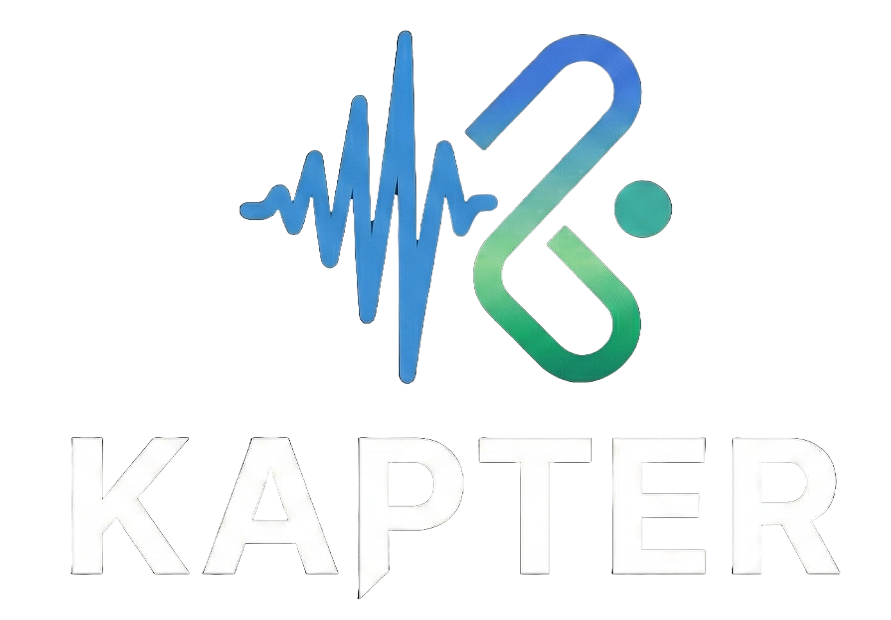

<p align="center">
  
</p>

<h1 align="center">Kapter</h1>

<p align="center">
  <strong>Bilingual subtitle platform with word-level karaoke timing</strong>
</p>

<p align="center">
  <a href="#-architecture">Architecture</a> &bull;
  <a href="#-tech-stack">Tech Stack</a> &bull;
  <a href="#-quick-start">Quick Start</a> &bull;
  <a href="#-project-structure">Project Structure</a> &bull;
  <a href="#-how-it-works">How It Works</a> &bull;
  <a href="#-documentation">Documentation</a>
</p>

<p align="center">
  
  
  
  
  
</p>

---

## Overview

Kapter is a SaaS bilingual subtitle platform that generates high-accuracy subtitles with word-level karaoke timing. Users upload audio/video or submit YouTube links, and the system produces source-language transcription, target-language translation, and phonetic annotations — all synchronized to word-level timestamps for karaoke-style playback.

Key capabilities:

- **Bilingual subtitles** with source text, translation, and phonetic layer (pinyin, etc.)
- **Word-level karaoke timing** from ASR word timestamps with forced-alignment refinement
- **Progressive playback** — start watching from translated batches before full processing completes
- **Socket-first UX** — real-time processing progress without aggressive polling
- **Kapter Explain** — AI-powered language learning chat anchored to subtitle segments
- **Vocabulary lookup** — tap any word for contextual definitions with save/bookmark support
- **Quota-aware SaaS** — subscription tiers, per-file limits, monthly usage tracking, AI credit pools

## Architecture

```text
Mobile App (Expo / React Native)
  |
  | authenticated REST + WebSocket
  v
Backend API (NestJS)
  |\
  | \-- PostgreSQL (users, subscriptions, media, usage, tokens)
  | \-- MinIO presigned upload -> raw bucket
  |
  +-> Redis / BullMQ: transcription queue
          |
          v
     Backend Worker (validation, YouTube ingestion, quota re-check)
          |
          +-> Redis / BullMQ: ai-processing queue
                    |
                    v
               AI Engine (Python GPU worker)
                    |
                    +-> MinIO artifacts: chunks/, translated_batches/, final.json
                    +-> PostgreSQL progress + status updates
                    +-> Redis Pub/Sub -> Backend socket mirror -> Mobile
```

### Module Responsibilities

| Module | Path | Role |
|--------|------|------|
| **Backend API** | `apps/backend-api` | Auth, subscriptions, media APIs, presigned upload, queue production, validation worker |
| **AI Engine** | `apps/ai-engine` | ASR, VAD, alignment, NMT translation, streaming artifacts, final subtitle export |
| **Mobile App** | `apps/mobile-app` | Upload UX, socket-first processing feedback, incremental bilingual player, Explain & Lookup |
| **Dashboard** | `apps/dashboard` | Admin control plane for plans, users, monitoring, AI Explain metrics |

## Tech Stack

### Backend API

- **Runtime:** NestJS 11, TypeScript, Node.js
- **Database:** PostgreSQL via Prisma 7
- **Queue:** BullMQ on Redis
- **Storage:** MinIO (S3-compatible)
- **Auth:** JWT access + rotated refresh tokens
- **AI Provider:** OpenAI SDK (for Explain & Lookup)
- **Testing:** Jest, Supertest

### AI Engine

- **Runtime:** Python 3.12, asyncio
- **ASR:** faster-whisper (Distil-Whisper, Whisper turbo/full), FunASR (SenseVoice, Paraformer)
- **VAD:** Silero VAD
- **Translation:** NLLB-200-3.3B via CTranslate2
- **Alignment:** Qwen3 forced alignment (CPU overlay)
- **Optional:** Ollama for Chinese LLM rescue, OpenAI for Explain/Lookup
- **Testing:** Pytest

### Mobile App

- **Framework:** Expo 54, React Native 0.81
- **Routing:** Expo Router 6
- **State:** Zustand, TanStack Query 5
- **Styling:** react-native-unistyles, design token system
- **i18n:** i18next (Vietnamese default, English fallback)
- **Networking:** Axios with token interceptors, Socket.io client

### Dashboard

- **Framework:** Vite 7, React 19, React Router 7
- **Data:** TanStack Query 5
- **UI:** shadcn/ui, Tailwind CSS v4
- **Auth:** JWT stored in localStorage

### Infrastructure

- **PostgreSQL** — relational data store
- **Redis** — BullMQ queues, Pub/Sub events, caching, rate limiting
- **MinIO** — S3-compatible object storage for raw uploads and processed artifacts

## Quick Start

### Prerequisites

- Node.js 20+
- pnpm
- Python 3.12+
- Docker & Docker Compose
- GPU (recommended for AI Engine, CPU fallback available)

### 1. Start infrastructure

```bash
# Terminal 1 — PostgreSQL
cd infra/postgres && docker-compose up -d

# Terminal 2 — Redis
cd infra/redis && docker-compose up -d

# Terminal 3 — MinIO
cd infra/minio && docker-compose up -d
```

### 2. Set up Backend API

```bash
cd apps/backend-api
cp .env.example .env          # configure database, Redis, MinIO, JWT, SMTP, OpenAI credentials
pnpm install
pnpm pgen                     # generate Prisma client
pnpm pmigrate:dev init        # run database migrations
npx tsx prisma/seed.ts        # seed default plans and admin user
pnpm start:dev                # start API server
```

In a separate terminal:

```bash
pnpm worker:dev               # start the validation worker
```

### 3. Set up AI Engine

```bash
cd apps/ai-engine
python -m venv venv
source venv/bin/activate       # Windows: venv\Scripts\activate
pip install -r requirements.txt
cp .env.example .env           # configure MinIO, PostgreSQL, Redis, OpenAI/Ollama credentials
python -m src.main             # start the GPU worker
```

### 4. Set up Mobile App

```bash
cd apps/mobile-app
pnpm install
pnpm start                     # start Expo dev server
```

### 5. Set up Dashboard (optional)

```bash
cd apps/dashboard
pnpm install
pnpm dev                       # starts on localhost:5173
```

> For all available commands, validation checks, and detailed setup, see [COMMANDS.md](COMMANDS.md).

## Project Structure

```text
kapter/
├── apps/
│   ├── backend-api/           # NestJS HTTP API + validation worker
│   │   ├── src/
│   │   │   ├── modules/       # auth, media, admin, chat, queue, minio, redis, mail, otp, user
│   │   │   ├── prisma/        # PrismaModule and PrismaService
│   │   │   ├── main.ts        # HTTP API entry point
│   │   │   └── worker.ts      # BullMQ worker entry point
│   │   ├── prisma/            # schema, migrations, seed
│   │   └── scripts/           # E2E benchmark harness
│   │
│   ├── ai-engine/             # Python GPU subtitle pipeline
│   │   ├── src/
│   │   │   ├── core/          # ASR providers, VAD, aligner, NMT, merger, LLM rescue
│   │   │   ├── utils/         # audio processing, vocal isolation
│   │   │   ├── scripts/       # benchmark suite
│   │   │   ├── main.py        # BullMQ consumer entry point
│   │   │   └── async_pipeline.py  # Active V2.2 async pipeline
│   │   ├── tests/             # Pytest suite
│   │   └── Dockerfile         # GPU worker container
│   │
│   ├── mobile-app/            # Expo / React Native client
│   │   ├── src/
│   │   │   ├── app/           # Expo Router pages (auth, library, upload, player, settings)
│   │   │   ├── components/    # Reusable UI primitives
│   │   │   ├── services/      # Axios client, token storage
│   │   │   ├── stores/        # Zustand stores
│   │   │   ├── hooks/         # Custom hooks
│   │   │   ├── theme/         # Design tokens, Unistyles config
│   │   │   ├── i18n/          # i18next locale files
│   │   │   └── validations/   # Zod schemas
│   │   └── assets/            # Fonts, icons, logos
│   │
│   └── dashboard/             # Admin web control plane
│       ├── src/
│       │   ├── features/      # auth, overview, plans, users, monitoring, ai-explain
│       │   ├── components/    # shadcn/ui components
│       │   ├── shared/        # http-client, query-client
│       │   └── app/           # router, guards, layouts
│       └── index.html
│
├── infra/
│   ├── postgres/              # PostgreSQL Docker Compose
│   ├── redis/                 # Redis Docker Compose
│   └── minio/                 # MinIO Docker Compose
│
├── scripts/                   # Cross-module utility scripts
├── docs/                      # Archive and ideas
│
├── AGENTS.md                  # Agent behavior rules and startup protocol
├── INSTRUCTION.md             # Product vision and architecture overview
├── PROJECT_MAP.md             # Repository navigation map
├── CONTRACTS.md               # Cross-module contract source of truth
├── COMMANDS.md                # Command reference and validation strategy
├── DECISIONS.md               # Architecture decision records
└── LICENSE                    # MIT
```

## How It Works

### Upload Flow

1. User selects a local file or submits a YouTube link in the mobile app
2. For local video, audio is extracted client-side before upload
3. Backend issues a presigned MinIO URL for direct upload
4. Client uploads to MinIO and confirms with the backend
5. Backend worker validates media (duration, format, quota)
6. Validated job is dispatched to the AI Engine via BullMQ

### Processing Pipeline (AI Engine)

1. **Audio prep** — FFmpeg normalization, optional vocal isolation
2. **Inspection** — music/speech classification
3. **VAD** — Silero voice activity detection
4. **ASR routing** — language-aware provider selection (Distil-Whisper for English, SenseVoice for Chinese)
5. **Alignment** — word-level timestamps with semantic merging
6. **Translation** — NLLB NMT with optional LLM refinement for Chinese
7. **Artifacts** — streaming `chunks/`, `translated_batches/`, and `final.json` to MinIO

### Playback Flow

1. Mobile fetches media status and artifact inventory
2. Player opens as soon as translated batches exist (progressive hydration)
3. Source + translation + phonetic subtitles render with karaoke word timing
4. Incoming batches extend the session without full reload
5. Word taps drive vocabulary lookup; sentence selection drives Kapter Explain

### Kapter Explain (AI Language Learning)

- Tap a subtitle segment to open a chat session
- Backend resolves context from server-owned artifacts (mobile sends no subtitle text)
- Initial explain covers every token block in the sentence sequentially
- Follow-up questions maintain session context
- AI credit pool is separate from processing quota

### Vocabulary Lookup

- Tap any word in the active subtitle for an instant contextual definition
- Backend resolves the canonical word span from subtitle artifacts
- Free users: 20 lookups per rolling 24 hours; paid users: unlimited
- Explicit Save Word persists a server-verified snapshot to the user's vocabulary

## Documentation

| Document | Purpose |
|----------|---------|
| [AGENTS.md](AGENTS.md) | Agent behavior rules, startup protocol, and global guardrails |
| [INSTRUCTION.md](INSTRUCTION.md) | Product vision, architecture overview, and main use cases |
| [PROJECT_MAP.md](PROJECT_MAP.md) | Repository navigation map for humans and agents |
| [CONTRACTS.md](CONTRACTS.md) | Cross-module contracts (queues, APIs, artifacts, sockets, auth, quota) |
| [COMMANDS.md](COMMANDS.md) | Command reference and validation strategy |
| [DECISIONS.md](DECISIONS.md) | Architecture decision records (16 ADRs) |
| [apps/backend-api/INSTRUCTION.md](apps/backend-api/INSTRUCTION.md) | Backend-specific rules |
| [apps/ai-engine/INSTRUCTION.md](apps/ai-engine/INSTRUCTION.md) | AI Engine pipeline and contract rules |
| [apps/mobile-app/INSTRUCTION.md](apps/mobile-app/INSTRUCTION.md) | Mobile UI and workflow rules |
| [apps/dashboard/INSTRUCTION.md](apps/dashboard/INSTRUCTION.md) | Dashboard-specific rules |

## License

[MIT](LICENSE) &copy; 2026 sondoannam
