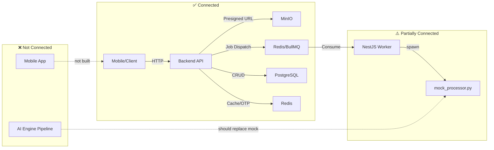

# 📂 PROJECT CHECKPOINT: BILINGUAL SUBTITLE SYSTEM

> **Last Updated:** 2026-02-12
> **Primary Docs:** `apps/INSTRUCTION.md` (root), per-app `INSTRUCTION.md` files
> **Package Manager (Backend):** pnpm

---

## 1. Project Overview

**Goal:** Build a SaaS platform that generates bilingual subtitles (Source + Target + Phonetic/Pinyin) with word-level ("Karaoke") timestamps for videos/audio — aimed at enhancing language learning experiences.

**Core Philosophy:** "Client-side Optimization & Async Processing"
- Mobile App handles audio extraction client-side to save server bandwidth.
- Backend is a lightweight API Gateway + Job Producer.
- AI Engine is an independent Python Worker for heavy GPU processing.
- Worker entry point is a standalone NestJS app (no HTTP) that spawns Python child processes.

---

## 2. Monorepo Structure

```text
bilingual-subtitle-system/
├── apps/
│   ├── backend-api/         # NestJS v11+ (TypeScript) — API Gateway + Worker
│   │   ├── src/
│   │   │   ├── main.ts             # HTTP API entry point
│   │   │   ├── worker.ts           # Standalone NestJS Worker entry point (no HTTP)
│   │   │   ├── app.module.ts       # API module (all modules, guards, pipes)
│   │   │   ├── worker.module.ts    # Lean worker module (BullMQ consumer only)
│   │   │   ├── prisma/             # PrismaService + PrismaModule (global)
│   │   │   ├── common/             # Shared: decorators, guards, constants, DTOs, services
│   │   │   │   ├── decorators/     # @Public, @Roles, @CurrentUser, @SkipThrottle
│   │   │   │   ├── guards/         # RolesGuard, JwtAuthGuard
│   │   │   │   └── constants/      # Error messages
│   │   │   └── modules/
│   │   │       ├── auth/           # Register, Verify OTP, Login, Refresh, Logout
│   │   │       ├── admin/          # CRUD SubscriptionPlans + PlanVariants (ADMIN role)
│   │   │       ├── media/          # Presigned URL, Confirm Upload, YouTube Submit
│   │   │       │   ├── workers/    # MediaProcessor (BullMQ @Processor)
│   │   │       │   └── scripts/    # mock_processor.py (placeholder)
│   │   │       ├── queue/          # QueueService (BullMQ producer), queue types
│   │   │       ├── minio/          # MinioService wrapper (@aws-sdk/client-s3 style)
│   │   │       ├── redis/          # RedisService (ioredis)
│   │   │       ├── mail/           # MailService (nodemailer + handlebars templates)
│   │   │       ├── otp/            # OTP generation & verification
│   │   │       └── user/           # User profile, UserSubscriptionService
│   │   ├── prisma/
│   │   │   ├── schema.prisma       # 12 models, 262 lines
│   │   │   ├── seed.ts             # Seeds 3 plans (Free/Basic/Pro) with 6 variants
│   │   │   ├── migrations/         # 4 migrations applied
│   │   │   └── generated/          # Prisma Client output
│   │   └── package.json            # Scripts: start:dev, worker:dev, pgen, pmigrate:dev
│   │
│   ├── ai-engine/               # Python 3.12 (CUDA) — AI Processing Worker
│   │   ├── src/
│   │   │   ├── config.py           # Settings: AI_PERF_MODE (LOW/MEDIUM/HIGH), paths, VAD config
│   │   │   ├── schemas.py          # Pydantic: VADSegment, Word, Sentence, SegmentType
│   │   │   ├── core/
│   │   │   │   ├── pipeline.py           # PipelineOrchestrator  (7-step E2E flow)
│   │   │   │   ├── audio_inspector.py    # AudioInspector (AST model: music vs standard)
│   │   │   │   ├── vad_manager.py        # VADManager (Silero VAD + greedy merge)
│   │   │   │   ├── smart_aligner.py      # SmartAligner (Faster-Whisper Large-v3, Karaoke)
│   │   │   │   ├── semantic_merger.py    # SemanticMerger (LLM-based line grouping + homophone fix)
│   │   │   │   ├── translator_engine.py  # TranslatorEngine (2-pass: Analyze→Correct→Translate)
│   │   │   │   ├── llm_provider.py       # LLMProvider (Ollama — qwen2.5:7b-instruct)
│   │   │   │   └── prompts.py            # System prompts for LLM tasks
│   │   │   ├── utils/
│   │   │   │   ├── audio_processor.py    # AudioProcessor (FFmpeg → 16kHz WAV mono)
│   │   │   │   └── vocal_isolator.py     # VocalIsolator (BS-Roformer / MDX ONNX)
│   │   │   └── scripts/                  # Test/debug scripts
│   │   ├── requirements.txt              # 20+ deps (faster-whisper, stable-ts, silero-vad, etc.)
│   │   └── venv/                         # Python virtual environment
│   │
│   ├── mobile-app/             # ❌ NOT YET CREATED (planned: React Native / Expo)
│   └── test-media/             # Test audio/video files for pipeline testing
│
├── infra/                      # Docker Compose per service
│   ├── postgres/               # PostgreSQL 16 Alpine (port 5432)
│   ├── redis/                  # Redis 7 Alpine (port 6379, password-protected, AOF on)
│   └── minio/                  # MinIO (API port 9000, console 9001)
│                                 # Buckets: "raw", "processed"
│                                 # Cloudflare Tunnel: bilingual-minio.sondndev.id.vn
│
├── .agent/                     # AI agent configuration
│   ├── skills/                 # nestjs-backend-dev, powershell-windows, creating-skills
│   └── workflows/              # /debug workflow
└── checkpoint.md               # ← THIS FILE
```

---

## 3. Infrastructure Details

| Service    | Container              | Image              | Port(s)     | Config                                             |
|------------|------------------------|---------------------|-------------|-----------------------------------------------------|
| PostgreSQL | `bilingual-postgres`   | `postgres:16-alpine`| 5432        | env vars (`POSTGRES_USER/PASSWORD/DB`)              |
| Redis      | `bilingual-redis`      | `redis:7-alpine`    | 6379        | password, `maxmemory 256mb`, `allkeys-lru`, AOF     |
| MinIO      | `bilingual-minio`      | `minio/minio:latest`| 9000, 9001  | Cloudflare Tunnel, buckets `raw`+`processed` auto-created |

- **Queue:** BullMQ on Redis. Queue name: `transcription`. Prefix: `bilingual`.
- **Storage Strategy:** Presigned URLs. Backend replaces internal Docker URL with public domain.
- **Database URL:** Switched to local PostgreSQL for dev (previously cloud).

---

## 4. Database Schema (Prisma)

**12 Models, 4 Migrations Applied:**

| Model             | Purpose                                       | Key Fields / Notes                                           |
|--------------------|-----------------------------------------------|--------------------------------------------------------------|
| `User`             | Core user with subscription tracking          | `email`, `passwordHash`, `role`, `quotaUsageCurrentMonth`, `currentSubscriptionId` |
| `SubscriptionPlan` | Product definition (FREE, BASIC, PRO)         | `code`, `name`, `features` (JSON), `tierLevel`, `isActive`   |
| `PlanVariant`      | Pricing/limits per plan                       | `price`, `billingCycleType`, `maxDurationPerFile`, `monthlyQuotaSeconds` |
| `Subscription`     | User↔Plan binding with price/quota SNAPSHOT   | `priceSnapshot`, `monthlyQuotaSecondsSnapshot` (immutable)   |
| `UsageHistory`     | Monthly usage audit trail                     | `cycleStartDate`, `totalSecondsUsed`, `quotaLimitAtThatTime` |
| `MediaItem`        | Media library entry                           | `originType` (LOCAL/YOUTUBE), `audioS3Key`, `subtitleS3Key`, `status` (QUEUED→PROCESSING→COMPLETED/FAILED), `countedInQuota`, soft delete |
| `Vocabulary`       | Global word dictionary                        | `word` (unique), `meaning`, `pronunciation`, `lookupCount`   |
| `UserVocabulary`   | Per-user saved words                          | Links `User` ↔ `Vocabulary` ↔ `MediaItem` (context)         |
| `Otp`              | OTP for registration & forgot password        | `email`, `code`, `type` (REGISTER/FORGOT_PASSWORD), `expiresAt` |
| `RefreshToken`     | JWT refresh tokens with rotation              | `token` (unique), `deviceInfo`, `ip`, `expiresAt`, cascade delete |

**Seed Data:** 3 plans × 6 variants (Free Monthly, Basic Monthly/Yearly, Pro Monthly/Yearly/Lifetime). Currency: VND.

---

## 5. Backend API — Module Status

### ✅ Authentication (`/auth`) — DONE
- **Strategy:** "Verify-First" — registration data cached in Redis, user created in DB only after OTP verification
- **Endpoints:** `POST /auth/register`, `POST /auth/verify`, `POST /auth/login`, `POST /auth/refresh`, `POST /auth/logout`
- **Security:** JWT-based, global `JwtAuthGuard`, `@Public()` decorator for open routes, rate limiting via `@Throttle()`
- **Token Flow:** Access token (short-lived JWT) + Refresh token (UUID wrapped in signed JWT, stored in DB, rotated on refresh)

### ✅ Admin — Subscription Management (`/admin`) — DONE
- **CRUD** for `SubscriptionPlan` and `PlanVariant`
- **Guards:** `RolesGuard` + `@Roles(ADMIN)` 
- **Smart Delete:** Soft-deactivation; checks for active subscribers before delete
- **Variant Versioning:** If variant has subscribers and price/limits change → new variant version created

### ✅ Media Library (`/media`) — API DONE, Worker is Mock
- **Endpoints:**
  - `POST /media/presigned-url` — Generate presigned PUT URL (optimistic quota check)
  - `POST /media/confirm-upload` — Verify file in MinIO → create `MediaItem` → dispatch BullMQ job
  - `POST /media/youtube` — Submit YouTube URL → create `MediaItem` → dispatch job
- **Quota Logic:** Aggregates `durationSeconds` of `MediaItem` for current month, checks against subscription snapshot

### ✅ Worker Entry Point (`worker.ts` + `worker.module.ts`) — DONE (Mock)
- Standalone NestJS app: `NestFactory.createApplicationContext(WorkerModule)`
- No HTTP, no auth guards, no mail — only BullMQ consumer + PrismaService
- `MediaProcessor` (@Processor): receives job → sets PROCESSING → spawns Python → sets COMPLETED/FAILED
- **Currently:** Spawns `mock_processor.py` (placeholder). **Not yet connected to real AI Engine.**
- Scripts: `pnpm worker:dev` (watch mode), `pnpm worker` (production)

### ✅ Supporting Modules — DONE
- **MinioService:** Presigned URL generation, object verification, URL domain replacement
- **RedisService:** ioredis wrapper for caching (registration data, etc.)
- **MailService:** nodemailer + handlebars templates for OTP emails
- **OtpService:** Generate & verify OTPs (REGISTER, FORGOT_PASSWORD types)
- **UserSubscriptionService:** Auto-assign FREE_TIER on registration
- **QueueService:** BullMQ producer, typed `TranscriptionJobPayload`

---

## 6. AI Engine — Module Status

### ✅ Full Pipeline — RUNNABLE (standalone, file-based input)

**7-Step Pipeline (`PipelineOrchestrator.process_video()`):**

| Step | Class                | Description                                        | Status |
|------|----------------------|----------------------------------------------------|--------|
| 1    | `AudioProcessor`     | Convert input to 16kHz WAV mono (FFmpeg)            | ✅ Done |
| 2    | `AudioInspector`     | Classify audio as `music` or `standard` (HF AST model) | ✅ Done |
| 3    | `VADManager`         | Silero VAD → speech segments → greedy merge (5-15s targets) | ✅ Done |
| 3b   | `VocalIsolator`      | Separate vocals for music (BS-Roformer / MDX ONNX)  | ✅ Done |
| 4    | `SmartAligner`       | Faster-Whisper Large-v3 transcription, word-level timestamps, CJK split, phonemes (Pinyin/IPA) | ✅ Done |
| 5    | `SemanticMerger`     | LLM-based line grouping + homophone correction (safe version: preserves char count) | ✅ Done |
| 6    | `TranslatorEngine`   | 2-pass: Analyze context→Correct ASR→Translate (via LLMProvider/Ollama qwen2.5:7b) | ✅ Done |
| 7    | Export               | Save final JSON to `outputs/` directory             | ✅ Done |

**Key Design Decisions:**
- **Singleton Pattern:** `SmartAligner` and `VADManager` use `__new__` singleton to keep GPU models loaded
- **Performance Profiles:** LOW/MEDIUM/HIGH → controls `compute_type`, `beam_size`, `batch_size`
- **LLM:** Ollama with `qwen2.5:7b-instruct` for semantic merging, context analysis, correction, and translation
- **Debug Artifacts:** Each pipeline step saves intermediate JSON to `outputs/debug/{stem}/`
- **Graceful Fallback:** All steps catch exceptions and fall back (e.g., vocal isolation fails → use original audio)

### ❌ Redis/BullMQ Listener (`main.py`) — NOT YET IMPLEMENTED
- The AI engine currently runs as a standalone Python script
- No `main.py` entry point that listens to Redis for job consumption
- **Bridge Gap:** The NestJS worker spawns `mock_processor.py`, not the real pipeline

---

## 7. Mobile App — NOT STARTED
- Directory `apps/mobile-app/` does **not exist** yet
- Planned: React Native (Expo)
- Intended features: Audio extraction, presigned upload, media library, bilingual player with Karaoke effect

---

## 8. What's Connected vs. What's NOT



### Critical Integration Gap:
The **NestJS Worker** (`MediaProcessor`) spawns `mock_processor.py` instead of invoking the real **AI Engine pipeline**. Bridging this is the next major milestone. Two approaches from `prompt.md`:
1. **Node-Python Hybrid:** NestJS worker spawns Python child process pointing to real pipeline script
2. **Python native BullMQ:** AI Engine has its own `main.py` that directly consumes from Redis (Python `bullmq` library)

---

## 9. Job Payload Contract (Redis → Worker)

```typescript
interface TranscriptionJobPayload {
  mediaId: string;          // MediaItem DB ID
  type: 'LOCAL' | 'YOUTUBE';
  filePath?: string;        // S3 key (LOCAL uploads)
  url?: string;             // YouTube URL
  userId: string;           // For quota tracking
}
```

Queue: `transcription` | Prefix: `bilingual` | Retries: 3 (exponential backoff 5s)

---

## 10. AI Engine Output Format

```json
[
  {
    "text": "Source language sentence",
    "start": 33.9,
    "end": 38.24,
    "translation": "Translated sentence",
    "words": [
      { "word": "Word", "start": 33.9, "end": 34.2, "confidence": 0.9, "phoneme": "wǒ" }
    ]
  }
]
```

---

## 11. Development Commands

| Action                     | Command                                | Location         |
|----------------------------|-----------------------------------------|------------------|
| Start API (dev)            | `pnpm start:dev`                        | `apps/backend-api` |
| Start Worker (dev)         | `pnpm worker:dev`                       | `apps/backend-api` |
| Start all infra            | `pnpm start:local`                      | `apps/backend-api` |
| Generate Prisma Client     | `pnpm pgen`                             | `apps/backend-api` |
| Run migration              | `pnpm pmigrate:dev <name>`              | `apps/backend-api` |
| Seed database              | `npx tsx prisma/seed.ts`                | `apps/backend-api` |
| Run AI pipeline (standalone)| `python -m src.scripts.test_pipeline`   | `apps/ai-engine` (venv) |
| Start infra (individual)   | `docker-compose up -d`                  | `infra/{service}` |

---

## 12. Priority TODO (Next Steps)

1. **🔴 Bridge Worker↔AI Engine:** Replace `mock_processor.py` with real pipeline invocation
2. **🔴 AI Engine `main.py`:** Implement Redis/BullMQ job listener in Python
3. **🟡 MinIO Integration in Pipeline:** Worker needs to download from MinIO → process → upload result JSON back to MinIO
4. **🟡 YouTube Download:** Worker needs `yt-dlp` integration for YOUTUBE origin type
5. **🟡 Pipeline Output → DB:** Save `subtitleS3Key` and `durationSeconds` back to `MediaItem` after processing
6. **🟢 Mobile App:** Create React Native (Expo) project in `apps/mobile-app/`
7. **🟢 Client Status Updates:** Polling/WebSocket for real-time job status
8. **🟢 Vocabulary Feature:** Dictionary lookup + word save endpoints

---

## 13. Tech Stack Summary

| Layer         | Technology                                                 |
|---------------|-------------------------------------------------------------|
| **Backend**   | NestJS v11, TypeScript, Prisma 7, BullMQ, ioredis, Passport JWT |
| **AI Engine** | Python 3.12, CUDA, Faster-Whisper, Silero VAD, Ollama (qwen2.5:7b), stable-ts, audio-separator |
| **Database**  | PostgreSQL 16                                               |
| **Queue**     | Redis 7 + BullMQ                                           |
| **Storage**   | MinIO (S3-compatible) + Cloudflare Tunnel                   |
| **Mobile**    | React Native (Expo) — planned                               |
| **Infra**     | Docker Compose (per-service), local dev                     |