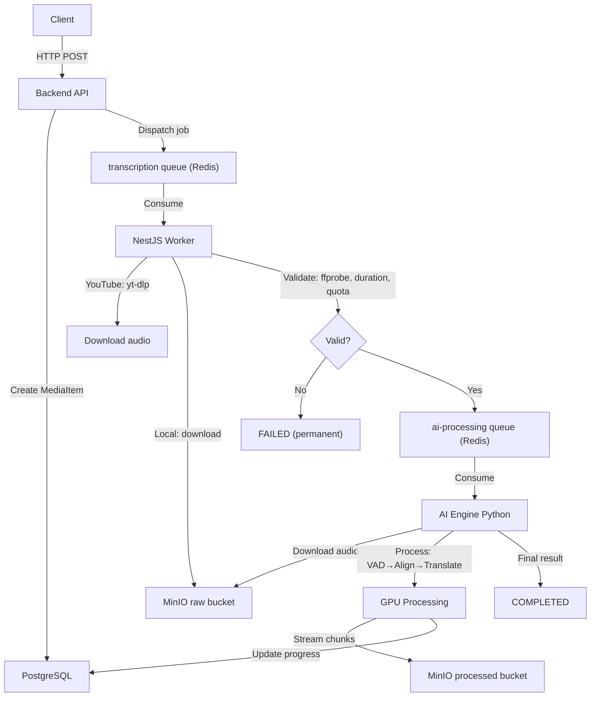

# 📂 PROJECT CHECKPOINT: BILINGUAL SUBTITLE SYSTEM

> **Last Updated:** 2026-03-15
> **Primary Docs:** `apps/INSTRUCTION.md` (root), per-app `INSTRUCTION.md` files
> **Package Manager (Backend):** pnpm

---

## 1. Project Overview

**Goal:** Build a SaaS platform that generates bilingual subtitles (Source + Target + Phonetic/Pinyin) with word-level ("Karaoke") timestamps for videos/audio — aimed at enhancing language learning experiences.

**Core Philosophy:** "Client-side Optimization & Async Processing"

- Mobile App handles audio extraction client-side to save server bandwidth.
- Backend is a lightweight API Gateway + Job Producer.
- NestJS Worker validates and prepares media (I/O-bound), then dispatches to AI Engine.
- AI Engine is an independent Python BullMQ Worker for heavy GPU processing.

**Architecture:** Two-Queue Pipeline

```
Client → API → [transcription queue] → NestJS Worker (validate) → [ai-processing queue] → AI Engine (GPU)
```

---

## 2. Monorepo Structure

```text
bilingual-subtitle-system/
├── apps/
│   ├── backend-api/         # NestJS v11+ (TypeScript) — API Gateway + Worker
│   │   ├── src/
│   │   │   ├── main.ts             # HTTP API entry point
│   │   │   ├── worker.ts           # Standalone NestJS Worker entry point (no HTTP)
│   │   │   ├── app.module.ts       # API module (all modules, guards, pipes)
│   │   │   ├── worker.module.ts    # Lean worker module (BullMQ consumer + MinIO)
│   │   │   ├── prisma/             # PrismaService + PrismaModule (global)
│   │   │   ├── common/             # Shared: decorators, guards, constants, DTOs, services
│   │   │   │   ├── decorators/     # @Public, @Roles, @CurrentUser, @SkipThrottle
│   │   │   │   ├── guards/         # RolesGuard, JwtAuthGuard
│   │   │   │   └── constants/      # Error messages
│   │   │   └── modules/
│   │   │       ├── auth/           # Register, Verify OTP, Login, Refresh, Logout
│   │   │       ├── admin/          # CRUD SubscriptionPlans + PlanVariants (ADMIN role)
│   │   │       ├── media/          # Presigned URL, Confirm Upload, YouTube Submit, Status, Library
│   │   │       │   └── workers/    # MediaProcessor (validation + AI queue dispatch)
│   │   │       ├── queue/          # QueueService (BullMQ producer), queue types
│   │   │       ├── minio/          # MinioService (presigned URLs, download, upload)
│   │   │       ├── redis/          # RedisService (ioredis)
│   │   │       ├── mail/           # MailService (nodemailer + handlebars templates)
│   │   │       ├── otp/            # OTP generation & verification
│   │   │       └── user/           # User profile, UserSubscriptionService
│   │   ├── prisma/
│   │   │   ├── schema.prisma       # 12 models, ~280 lines
│   │   │   ├── seed.ts             # Seeds 3 plans (Free/Basic/Pro) with 6 variants
│   │   │   ├── migrations/         # 5 migrations applied (latest: add_processing_fields)
│   │   │   └── generated/          # Prisma Client output
│   │   ├── scripts/
│   │   │   └── clean-test-env.ts   # Flush queues + MinIO + DB media items
│   │   └── package.json            # Scripts: start:dev, worker:dev, clean:env, pgen, pmigrate:dev
│   │
│   ├── ai-engine/               # Python 3.12 (CUDA) — AI Processing Worker
│   │   ├── src/
│   │   │   ├── main.py              # Thin BullMQ consumer entry point (process_job + main)
│   │   │   ├── db.py                # Direct PostgreSQL helpers (update_media_status, mark_quota_counted)
│   │   │   ├── events.py            # Redis Pub/Sub event publishers (progress, chunk_ready, batch_ready, etc.)
│   │   │   ├── pipelines.py         # Pipeline runners (run_transcribe_pipeline, run_transcribe_translate_pipeline)
│   │   │   ├── incremental_pipeline.py # IncrementalPipeline class (background-threaded merge+translate)
│   │   │   ├── config.py            # Settings: AI_PERF_MODE, WHISPER_MODEL_*, WORKER_MODEL_MODE, Redis, MinIO, DB
│   │   │   ├── minio_client.py      # MinIO operations (download audio, upload chunks/batches/final)
│   │   │   ├── schemas.py           # ALL Pydantic models (Sentence, SubtitleOutput, TranslatedBatch, etc.)
│   │   │   ├── core/
│   │   │   │   ├── pipeline.py           # PipelineOrchestrator (component registry only — no business logic)
│   │   │   │   ├── audio_inspector.py    # AudioInspector (multi-segment AST: music vs standard)
│   │   │   │   ├── vad_manager.py        # VADManager (Silero VAD + greedy merge)
│   │   │   │   ├── smart_aligner.py      # SmartAligner (dual-model, batched inference, Tier 1 chunk streaming)
│   │   │   │   ├── semantic_merger.py    # SemanticMerger (language-aware line grouping + CJK homophone fix + needs_merge)
│   │   │   │   ├── translator_engine.py  # TranslatorEngine (Analyze-Once, Translate-Streaming with Sliding Context)
│   │   │   │   ├── llm_provider.py       # LLMProvider (Ollama — qwen2.5:7b-instruct, timeout=120s)
│   │   │   │   └── prompts.py            # All LLM prompt templates (analysis, translation vi/en/generic)
│   │   │   ├── utils/
│   │   │   │   ├── audio_processor.py    # AudioProcessor (FFmpeg → 16kHz WAV mono)
│   │   │   │   ├── vocal_isolator.py     # VocalIsolator (BS-Roformer / MDX ONNX)
│   │   │   │   └── hardware_profiler.py  # HardwareProfiler (background CPU/RAM/GPU sampler)
│   │   │   └── scripts/                  # Test/debug scripts
│   │   ├── tests/                        # Unit tests (pytest)
│   │   │   └── test_two_tier_streaming.py # 19 tests: Two-Tier Streaming, partial failure, output contract
│   │   ├── outputs/debug/               # Per-batch debug JSON snapshots (auto-generated per job)
│   │   ├── requirements.txt              # 25+ deps (faster-whisper, bullmq, minio, psycopg2, pynvml, etc.)
│   │   ├── Dockerfile                    # CUDA 12.1 + cuDNN 8 image
│   │   ├── docker-compose.yml            # Profile-based scaling (auto/turbo/full)
│   │   └── venv/                         # Python virtual environment (local dev)
│   │
│   ├── mobile-app/             # 🟡 IN PROGRESS — React Native / Expo 54 (stable)
│   │   ├── src/
│   │   │   ├── entry.ts              # Custom entry: init Unistyles + i18n before routing
│   │   │   ├── app/                  # Expo Router pages (auth-guarded route groups)
│   │   │   │   ├── _layout.tsx       # Root auth guard (hydrate session, redirect to /(auth) or /(app))
│   │   │   │   ├── (auth)/
│   │   │   │   │   ├── _layout.tsx   # Auth group layout
│   │   │   │   │   ├── index.tsx     # Segmented Login/Register screen
│   │   │   │   │   └── verify-otp.tsx# OTP verify + resend countdown
│   │   │   │   └── (app)/
│   │   │   │       ├── _layout.tsx   # App group layout
│   │   │   │       └── index.tsx     # Temporary home/demo screen + logout
│   │   │   ├── components/
│   │   │   │   ├── auth/             # LoginForm, RegisterForm
│   │   │   │   ├── TextInput.tsx
│   │   │   │   ├── Button.tsx
│   │   │   │   ├── SegmentedControl.tsx
│   │   │   │   ├── OtpInput.tsx
│   │   │   │   └── KeyboardAvoidingWrapper.tsx
│   │   │   ├── services/
│   │   │   │   ├── api.ts            # Axios instance + refresh interceptor + platform URL normalization
│   │   │   │   ├── token-storage.ts  # expo-secure-store token persistence
│   │   │   │   └── auth/index.ts     # authApi wrapper
│   │   │   ├── stores/
│   │   │   │   └── auth.store.ts     # Zustand auth state + hydrate/login/register/verify/logout
│   │   │   ├── constants/
│   │   │   │   ├── endpoint.ts       # /auth endpoint constants
│   │   │   │   └── routes.ts         # /(auth), /(app) route constants
│   │   │   ├── validations/
│   │   │   │   └── auth.ts           # zod login/register/otp schemas (PASSWORD_REGEX aligned)
│   │   │   ├── types/
│   │   │   │   └── auth.ts           # Auth DTO types
│   │   │   ├── theme/
│   │   │   │   ├── tokens.ts         # Design tokens: brand colors, palette, typography, spacing, radii
│   │   │   │   ├── light.ts          # Light theme + AppTheme interface
│   │   │   │   ├── dark.ts           # Dark theme (same shape, dark-adjusted colors)
│   │   │   │   ├── unistyles.ts      # Unistyles config (adaptiveThemes, breakpoints)
│   │   │   │   └── index.ts
│   │   │   ├── i18n/
│   │   │   │   ├── i18n.ts           # i18next init with expo-localization device detection
│   │   │   │   ├── i18next.d.ts      # Type-safe translation keys
│   │   │   │   ├── index.ts
│   │   │   │   └── locales/
│   │   │   │       ├── en/common.json  # English translations (+ auth namespace)
│   │   │   │       └── vi/common.json  # Vietnamese translations (+ auth namespace)
│   │   │   └── hooks/
│   │   │       ├── useThemePreference.ts   # system/light/dark + AsyncStorage persistence
│   │   │       ├── useLanguagePreference.ts # en/vi + AsyncStorage persistence
│   │   │       └── index.ts
│   │   ├── babel.config.js           # Babel config (babel-preset-expo)
│   │   ├── app.json                  # Expo config (orientation, icons, plugins)
│   │   ├── expo-env.d.ts             # Expo env typings
│   │   ├── .env                      # EXPO_PUBLIC_API_URL
│   │   └── package.json              # See tech stack below
│   └── test-media/             # Test audio/video files for pipeline testing
│
├── infra/                      # Docker Compose per service
│   ├── postgres/               # PostgreSQL 16 Alpine (port 5432)
│   ├── redis/                  # Redis 7 Alpine (port 6379, password-protected, AOF on)
│   └── minio/                  # MinIO (API port 9000, console 9001)
│                                 # Buckets: "raw", "processed"
│                                 # Cloudflare Tunnel: bilingual-minio.sondndev.id.vn
│
├── .agent/                     # AI agent configuration
│   ├── skills/                 # nestjs-backend-dev, powershell-windows, creating-skills
│   └── workflows/              # /debug workflow
└── checkpoint.md               # ← THIS FILE
```

---

## 3. Infrastructure Details

| Service    | Container            | Image                | Port(s)    | Config                                                    |
| ---------- | -------------------- | -------------------- | ---------- | --------------------------------------------------------- |
| PostgreSQL | `bilingual-postgres` | `postgres:16-alpine` | 5432       | env vars (`POSTGRES_USER/PASSWORD/DB`)                    |
| Redis      | `bilingual-redis`    | `redis:7-alpine`     | 6379       | password, `maxmemory 256mb`, `allkeys-lru`, AOF           |
| MinIO      | `bilingual-minio`    | `minio/minio:latest` | 9000, 9001 | Cloudflare Tunnel, buckets `raw`+`processed` auto-created |

- **Queues:** BullMQ on Redis. Two queues:
  - `transcription` — NestJS Worker (validation + I/O)
  - `ai-processing` — Python AI Engine (GPU processing)
  - Prefix: `bilingual`
- **Storage Strategy:** Presigned URLs. Backend replaces internal Docker URL with public domain.
- **Database URL:** Local PostgreSQL for dev (previously cloud).

---

## 4. Database Schema (Prisma)

**12 Models, 5 Migrations Applied (latest: `add_processing_fields`):**

| Model              | Purpose                                     | Key Fields / Notes                                                                                                                                                                                                                                      |
| ------------------ | ------------------------------------------- | ------------------------------------------------------------------------------------------------------------------------------------------------------------------------------------------------------------------------------------------------------- |
| `User`             | Core user with subscription tracking        | `email`, `passwordHash`, `role`, `quotaUsageCurrentMonth`, `currentSubscriptionId`                                                                                                                                                                      |
| `SubscriptionPlan` | Product definition (FREE, BASIC, PRO)       | `code`, `name`, `features` (JSON), `tierLevel`, `isActive`                                                                                                                                                                                              |
| `PlanVariant`      | Pricing/limits per plan                     | `price`, `billingCycleType`, `maxDurationPerFile`, `monthlyQuotaSeconds`                                                                                                                                                                                |
| `Subscription`     | User↔Plan binding with price/quota SNAPSHOT | `priceSnapshot`, `monthlyQuotaSecondsSnapshot` (immutable)                                                                                                                                                                                              |
| `UsageHistory`     | Monthly usage audit trail                   | `cycleStartDate`, `totalSecondsUsed`, `quotaLimitAtThatTime`                                                                                                                                                                                            |
| `MediaItem`        | Media library entry                         | `originType`, `audioS3Key`, `subtitleS3Key`, `status` (QUEUED→VALIDATING→PROCESSING→COMPLETED/FAILED), `processingMode` (TRANSCRIBE/TRANSCRIBE_TRANSLATE), `progress`, `failReason`, `transcriptS3Key`, `sourceLanguage`, `countedInQuota`, soft delete |
| `Vocabulary`       | Global word dictionary                      | `word` (unique), `meaning`, `pronunciation`, `lookupCount`                                                                                                                                                                                              |
| `UserVocabulary`   | Per-user saved words                        | Links `User` ↔ `Vocabulary` ↔ `MediaItem` (context)                                                                                                                                                                                                     |
| `Otp`              | OTP for registration & forgot password      | `email`, `code`, `type` (REGISTER/FORGOT_PASSWORD), `expiresAt`                                                                                                                                                                                         |
| `RefreshToken`     | JWT refresh tokens with rotation            | `token` (unique), `deviceInfo`, `ip`, `expiresAt`, cascade delete                                                                                                                                                                                       |

**Enums Added:**

- `ProcessingMode`: `TRANSCRIBE` | `TRANSCRIBE_TRANSLATE`
- `MediaStatus`: `QUEUED` | `VALIDATING` | `PROCESSING` | `COMPLETED` | `FAILED`

**Seed Data:** 3 plans × 6 variants (Free Monthly, Basic Monthly/Yearly, Pro Monthly/Yearly/Lifetime). Currency: VND.

---

## 5. Backend API — Module Status

### ✅ Authentication (`/auth`) — DONE

- **Strategy:** "Verify-First" — registration data cached in Redis, user created in DB only after OTP verification
- **Endpoints:** `POST /auth/register`, `POST /auth/verify`, `POST /auth/login`, `POST /auth/refresh`, `POST /auth/logout`
- **Security:** JWT-based, global `JwtAuthGuard`, `@Public()` decorator for open routes, rate limiting via `@Throttle()`
- **Token Flow:** Access token (short-lived JWT) + Refresh token (UUID wrapped in signed JWT, stored in DB, rotated on refresh)

### ✅ Admin — Subscription Management (`/admin`) — DONE

- **CRUD** for `SubscriptionPlan` and `PlanVariant`
- **Guards:** `RolesGuard` + `@Roles(ADMIN)`
- **Smart Delete:** Soft-deactivation; checks for active subscribers before delete
- **Variant Versioning:** If variant has subscribers and price/limits change → new variant version created

### ✅ Media Library (`/media`) — DONE (Full Production Flow)

- **Endpoints:**
  - `POST /media/presigned-url` — Generate presigned PUT URL (optimistic quota check)
  - `POST /media/confirm-upload` — Verify file in MinIO → create `MediaItem` → dispatch BullMQ job
  - `POST /media/youtube` — Submit YouTube URL → create `MediaItem` → dispatch job
  - `GET /media/:id/status` — Poll processing progress (progress %, status, failReason)
  - `GET /media` — User's media library listing
- **Quota Logic:** Aggregates `durationSeconds` of `MediaItem` for current month, checks against subscription snapshot
- **Processing Modes:** Both `TRANSCRIBE` and `TRANSCRIBE_TRANSLATE` are supported, but in the mobile app, `TRANSCRIBE_TRANSLATE` is hardcoded for all API calls as bilingual rendering is the core value proposition.

### ✅ Worker — Validation Pipeline (`MediaProcessor`) — DONE

- Standalone NestJS app: `NestFactory.createApplicationContext(WorkerModule)`
- Consumes from `transcription` queue, produces to `ai-processing` queue
- **YouTube flow:** `yt-dlp` metadata fetch → duration check → audio download → MinIO upload
- **Local flow:** MinIO download → `ffprobe` verify → duration check
- **Quota checks:** Per-file duration limit + monthly aggregate re-check
- **Error handling:** Validation failures → `FAILED` status (no retries, permanent errors)
- Scripts: `pnpm worker:dev` (watch mode), `pnpm worker` (production)

### ✅ Supporting Modules — DONE

- **MinioService:** Presigned URLs, object verification, download, upload, URL domain replacement
- **RedisService:** ioredis wrapper for caching (registration data, etc.)
- **MailService:** nodemailer + handlebars templates for OTP emails
- **OtpService:** Generate & verify OTPs (REGISTER, FORGOT_PASSWORD types)
- **UserSubscriptionService:** Auto-assign FREE_TIER on registration
- **QueueService:** BullMQ producer, typed `TranscriptionJobPayload` + `AiProcessingJobPayload`
- **CORS:** `main.ts` now includes `OPTIONS` and explicit preflight headers (`Origin`, `X-Requested-With`) for frontend compatibility

---

## 6. AI Engine — Module Status

### ✅ Full Pipeline — PRODUCTION READY (connected via BullMQ)

**Entry Point:** `main.py` — thin BullMQ consumer (~175 lines) listening on `ai-processing` queue. Delegates to `pipelines.py` for pipeline execution.

**7-Step Pipeline (`PipelineOrchestrator`) — now with Incremental Merge+Translate:**

| Step | Class                 | Description                                                                                                | Status        |
| ---- | --------------------- | ---------------------------------------------------------------------------------------------------------- | ------------- |
| 1    | `AudioProcessor`      | Convert input to 16kHz WAV mono (FFmpeg)                                                                   | ✅ Done       |
| 2    | `AudioInspector`      | Multi-segment AST classification (3 samples at 10/50/90%, weighted vote)                                   | ✅ Done       |
| 3    | `VADManager`          | Silero VAD → speech segments → greedy merge (5-15s targets)                                                | ✅ Done       |
| 3b   | `VocalIsolator`       | Separate vocals for music (BS-Roformer / MDX ONNX)                                                         | ✅ Done       |
| 4    | `SmartAligner`        | Faster-Whisper Large-v3, word-level timestamps, CJK split, phonemes, **Tier 1 chunk streaming**            | ✅ Done       |
| 5    | `SemanticMerger`      | Language-aware LLM line grouping (CJK: grouping + homophone fix; non-CJK: grouping only), batched (30 seg) | ✅ Refactored |
| 5b   | `needs_merge()`       | **NEW:** Skip merge for well-formed sentences (Option D — merge-only-when-needed)                          | ✅ New        |
| 6    | `TranslatorEngine`    | Analyze-Once + Translate-Streaming with Sliding Context (batch=15, window=3), **Tier 2 batch streaming**   | ✅ Rebuilt    |
| 6b   | `IncrementalPipeline` | **NEW:** Accumulates ~30 sentences, flushes merge→translate in background thread (Option B)                | ✅ New        |
| 7    | Export                | Upload `SubtitleOutput` as `final.json` to MinIO `processed` bucket                                        | ✅ Updated    |

**BullMQ Consumer (`main.py`):**

- Listens on `ai-processing` queue with prefix `bilingual`
- Lock duration: 10 minutes (prevents stale-lock retries for long audio)
- Stalled interval: 5 minutes
- Concurrency: 1 (single GPU)
- Progress updates: direct PostgreSQL via `psycopg2` (strips Prisma's `?schema=public` from DSN)
- MinIO integration: `minio_client.py` handles download/upload of audio and subtitle data

**Two-Tier Streaming Protocol:**

Tier 1 — Raw Transcription (during SmartAligner):

- `SmartAligner.process()` accepts `on_chunk(batch, total_so_far)` callback
- Flushes every 20 sentences during alignment — client sees partial results in real-time
- Uploads to `processed/{mediaId}/chunks/{chunkIndex}.json`
- Mobile app can **start media playback** as soon as the first chunk arrives

Tier 2 — Bilingual Translation (during IncrementalPipeline):

- `IncrementalPipeline` accumulates sentences from SmartAligner into a buffer
- When buffer reaches `MERGE_ACCUMULATOR_THRESHOLD` (30), flushes through merge→translate in a **background thread**
- Each completed batch uploaded to `processed/{mediaId}/translated_batches/{batchIndex}.json`
- Mobile app **progressively replaces** raw source-only display with full bilingual subtitles
- **Merge-only-when-needed (Option D):** `needs_merge()` checks fragment ratio — well-formed batches skip SemanticMerger entirely

Final — Complete Output:

- `processed/{mediaId}/final.json` — full `SubtitleOutput` with metadata + all bilingual segments
- Uploaded once pipeline finishes; mobile uses this as the canonical source

Progress semantics (TRANSCRIBE_TRANSLATE): `0.05` AUDIO_PREP → `0.10` INSPECTING → `0.15` VAD → `0.15–0.60` PROCESSING (transcription portion) → `0.60–0.90` PROCESSING (merge+translate interleaved) → `0.90` FINALIZING → `0.95` EXPORTING → `1.00` COMPLETED

Progress semantics (TRANSCRIBE): `0.05` AUDIO_PREP → `0.10` INSPECTING → `0.15` VAD → `0.25–0.85` TRANSCRIBING → `0.95` EXPORTING → `1.00` COMPLETED

**Debug Output:**

- Every IncrementalPipeline flush writes a per-batch JSON snapshot to `outputs/debug/{mediaId}/batch_NNN.json`
- Contains: raw input, merged output, and translated output for each batch — useful for diagnosing LLM quality issues

**Key Design Decisions:**

- **Singleton Pattern:** `SmartAligner` and `VADManager` use `__new__` singleton to keep GPU models loaded
- **Dual Model Architecture:** `large-v3-turbo` for EN/VI/common languages, `large-v3` for CJK (zh/ja/ko)
- **WORKER_MODEL_MODE:** `auto` (both models, ~8 GB VRAM) | `turbo_only` (~3 GB) | `full_only` (~5 GB) — set via `.env`
- **Batched Inference:** `BatchedInferencePipeline` wraps each model; `batch_size` driven by `AI_PERF_MODE` (LOW=1, MEDIUM=4, HIGH=8)
- **Model Routing:** First segment detects anchor language → routes subsequent segments to correct model; logs which model was selected
- **Performance Profiles:** LOW/MEDIUM/HIGH → controls `compute_type`, `beam_size`, `batch_size`
- **LLM:** Ollama with `qwen2.5:7b-instruct` for semantic merging, context analysis, and translation
- **TranslatorEngine Architecture:** Analyze-Once (smart-sampled context analysis) + Translate-Streaming (batched with sliding window). `TRANSLATION_BATCH_SIZE=15`, `SLIDING_WINDOW_SIZE=3`. Partial failure → `[Translation Pending]` markers (no data loss). Language config registry — adding a new target language = one prompt template + one `LanguageConfig` entry. Public methods `analyze_context()` and `translate_single_batch()` exposed for incremental pipeline use.
- **IncrementalPipeline (Option B + D):** Runs merge+translate as a **background thread** (single-worker `ThreadPoolExecutor`) while SmartAligner continues transcription. Accumulates `MERGE_ACCUMULATOR_THRESHOLD=30` sentences before flushing. `needs_merge()` heuristic (Option D) skips SemanticMerger when <20% of sentences are fragments (<6 words). Constants: `MERGE_MIN_WORD_COUNT=6`, `MERGE_FRAGMENT_RATIO=0.2`.
- **LLM Timeout Fix:** `LLMProvider` now uses `ollama.Client(timeout=120)` instead of bare `ollama.chat()` — prevents engine freezing on slow LLM responses.
- **Dict-Keys Parser Fix:** `llm_provider._extract_list_from_parsed()` detects when LLM returns `{"text": "", ...}` dicts (translations in keys, empty values) and returns keys instead of empty values.
- **Output Contract:** `SubtitleOutput` = `SubtitleMetadata` + `List[Sentence]`. Every `Sentence` has `translation: str` (never None, `""` default) and `phonetic: str` (CJK pinyin from word phonemes, empty for non-CJK).
- **Multi-Segment Inspector:** Samples 3 positions (10%, 50%, 90%) with weighted voting to prevent music intro bias
- **Graceful Fallback:** All steps catch exceptions and fall back (e.g., vocal isolation fails → use original audio)
- **Hardware Profiler:** `HardwareProfiler` runs as background thread per job — writes CPU/RAM/GPU stats to `outputs/profiles/` as `.txt` + `.csv`

**Competing Consumers (Horizontal Scaling):**

- Each `main.py` instance performs a blocking pop (`BRPOPLPUSH`) on Redis — whichever instance pops first gets the job
- Redis atomic operations + BullMQ per-job locks provide at-least-once delivery and reduce duplicates; keep workers idempotent
- Multiple instances can run on same machine with different `WORKER_MODEL_MODE` for GPU memory splitting

---

## 6b. AI Engine — Docker Deployment

| File                                | Purpose                                                    |
| ----------------------------------- | ---------------------------------------------------------- |
| `apps/ai-engine/Dockerfile`         | CUDA 12.1 + cuDNN 8 image; installs PyTorch + all pip deps |
| `apps/ai-engine/docker-compose.yml` | Profile-based scaling with NVIDIA GPU reservation          |

**Running Docker instances:**

```bash
# Build image
docker compose build

# Single instance — auto mode (both models, ~8 GB VRAM)
docker compose --profile auto up

# Scale to N identical instances (all share same GPU)
docker compose --profile auto up --scale ai-engine=N

# Dual-worker split (turbo ~3 GB + full ~5 GB = ~8 GB total)
docker compose --profile turbo --profile full up
```

**Key Docker details:**

- `REDIS_HOST` + `MINIO_ENDPOINT` automatically overridden to `host.docker.internal` so containers reach host services
- Whisper model cache mounted as `whisper_cache` volume — models downloaded once, reused across restarts
- `WORKER_MODEL_MODE` set per service in compose file (overrides `.env`)
- All `outputs/` and `temp/` are Docker volumes (persistent across container restarts)



---

## 7. AI Engine — Refactoring Progress (Translation Step Cleanup)

**Plan:** `plan-refactorAiEngineTranslationStepCleanup.prompt.md`

| Phase | Description                                       | Status      | Files Modified                                                                                      |
| ----- | ------------------------------------------------- | ----------- | --------------------------------------------------------------------------------------------------- |
| 1     | Cleanup — remove dead code & legacy paths         | ✅ Complete | `pipeline.py`, `translator_engine.py` (deleted), `llm_provider.py`, `prompts.py`, `schemas.py`      |
| 2     | Refactor SemanticMerger (language-aware)          | ✅ Complete | `semantic_merger.py`, `prompts.py`, `main.py`                                                       |
| 3     | Build new TranslatorEngine                        | ✅ Complete | New `translator_engine.py`, `llm_provider.py`, `prompts.py`, `schemas.py`, `pipeline.py`, `main.py` |
| 4     | Fix output contract                               | ✅ Complete | `schemas.py`, `minio_client.py`, `main.py`                                                          |
| 5     | Backend job payload update                        | ✅ Complete | `queue.types.ts`, `request.dto.ts`, `media.service.ts`, `media.processor.ts`, `main.py`             |
| 6     | Incremental Merge+Translate Pipeline (Option B+D) | ✅ Complete | `semantic_merger.py`, `translator_engine.py`, `llm_provider.py`, `main.py`                          |
| 7     | Module Refactor — split monolithic `main.py`      | ✅ Complete | New `db.py`, `events.py`, `pipelines.py`, `incremental_pipeline.py`; rewritten `main.py`            |

**Key Changes Summary:**

- **`schemas.py`:** `Sentence` now has `translation: str = ""` and `phonetic: str = ""`. New models: `SubtitleMetadata`, `SubtitleOutput`, `TranslatedBatch`, `ContextAnalysis`, `LanguageConfig`. `TranslatedSentence = Sentence` (alias for backward compat).
- **`translator_engine.py`:** Rebuilt from scratch. Analyze-Once (smart-sampled context: 5 begin + 5 middle + 5 end), Translate-Streaming (batch=15, sliding window=3). Language config registry (`vi`, `en`, generic fallback). Partial failure → `[Translation Pending]` markers, continues processing.
- **`minio_client.py`:** Typed uploads: `upload_chunk()` (Tier 1), `upload_translated_batch(TranslatedBatch)` (Tier 2), `upload_final_result(SubtitleOutput)` (final). Path convention: `{mediaId}/chunks/`, `{mediaId}/translated_batches/`, `{mediaId}/final.json`.
- **`main.py`:** Both pipeline functions return `SubtitleOutput`. Tier 2 callback builds `TranslatedBatch` per batch. Reads `targetLanguage` from job data (default `"vi"`). `_populate_segment_phonetics()` for CJK pinyin.
- **Backend DTOs:** `targetLanguage?: string` added to `ConfirmUploadDto`, `SubmitYoutubeDto`, both job payload types, and wired through `media.service.ts` → `media.processor.ts`.

**Phase 6 — Incremental Merge+Translate (plan-incrementalPipeline.prompt.md):**

- **Option B — Incremental pipeline:** `IncrementalPipeline` class accumulates sentences, flushes merge→translate in a `ThreadPoolExecutor(max_workers=1)` background thread while `SmartAligner` continues transcription. Eliminates serial bottleneck.
- **Option D — Merge-only-when-needed:** `SemanticMerger.needs_merge()` checks fragment ratio before merging. If <20% of sentences are fragments (<6 words), merge is skipped entirely. Constants: `MERGE_MIN_WORD_COUNT=6`, `MERGE_FRAGMENT_RATIO=0.2`.
- **Bug fix — LLM timeout:** `llm_provider.py` now creates `ollama.Client(timeout=120)` — prevents engine from freezing on slow model responses.
- **Bug fix — Empty translations:** `_extract_list_from_parsed()` in `llm_provider.py` detects when LLM puts translations in dict keys with empty values, returns keys instead of empty strings.
- **Debug output:** `IncrementalPipeline._dump_debug()` writes per-batch JSON snapshots to `outputs/debug/{mediaId}/batch_NNN.json` for diagnosing LLM quality issues.

**Phase 7 — Module Refactor (main.py split):**

- **Before:** `main.py` was ~1200 lines — BullMQ consumer + DB helpers + Redis pub/sub + pipeline runners + IncrementalPipeline all in one file.
- **After:** Split into 5 focused modules:
  - `main.py` (~175 lines) — thin BullMQ consumer entry point
  - `db.py` — Postgres pool + `update_media_status()` + `mark_quota_counted()`
  - `events.py` — Redis pub/sub client + `publish_progress()` / `publish_chunk_ready()` / `publish_batch_ready()` / `publish_completed()` / `publish_failed()`
  - `pipelines.py` — `run_transcribe_pipeline()` + `run_transcribe_translate_pipeline()` + helpers
  - `incremental_pipeline.py` — `IncrementalPipeline` class + debug helper

**MinIO Storage Convention:**

```
processed/{mediaId}/
├── chunks/                    # Tier 1: raw transcription (from SmartAligner)
│   ├── 0.json
│   └── ...
├── translated_batches/        # Tier 2: bilingual batches (from TranslatorEngine)
│   ├── 0.json
│   └── ...
└── final.json                 # Complete SubtitleOutput (canonical)
```

**Unit Tests:** `tests/test_two_tier_streaming.py` — 19 tests (pytest). Imports updated from `src.main` to `src.pipelines` after Phase 7 refactor:

| Test Class                      | Tests | Coverage                                                                          |
| ------------------------------- | ----- | --------------------------------------------------------------------------------- |
| `TestTier2StreamingBatches`     | 3     | Batch ordering, translations populated, correct segment counts                    |
| `TestTierOrdering`              | 1     | Tier 1 chunks complete before any Tier 2 batch                                    |
| `TestOllamaCrashPartialFailure` | 4     | Partial crash → `[Translation Pending]`, all-fail, count mismatch, empty response |
| `TestSlidingWindowContinuity`   | 1     | Failed batch doesn't poison sliding window — recovery on next batch               |
| `TestMinIOPathConvention`       | 3     | Tier 1/Tier 2/final paths match convention                                        |
| `TestOutputContract`            | 3     | `SubtitleOutput` JSON structure, `translation`/`phonetic` never None              |
| `TestPhoneticPopulation`        | 4     | CJK pinyin assembled, English no-op, Japanese, missing phoneme skipped            |

Run: `cd apps/ai-engine && .\venv\Scripts\Activate.ps1 && python -m pytest tests/ -v`

---

## 8. Job Payload Contracts (Redis)

### Queue 1: `transcription` (API → NestJS Worker)

```typescript
interface TranscriptionJobPayload {
  mediaId: string;
  type: "LOCAL" | "YOUTUBE";
  filePath?: string; // S3 key (LOCAL uploads)
  url?: string; // YouTube URL
  userId: string;
  processingMode: "TRANSCRIBE" | "TRANSCRIBE_TRANSLATE";
  targetLanguage?: string; // Default: "vi" — passed through to AI Engine
}
```

### Queue 2: `ai-processing` (NestJS Worker → AI Engine)

```typescript
interface AiProcessingJobPayload {
  mediaId: string;
  audioS3Key: string; // Validated audio in MinIO
  processingMode: "TRANSCRIBE" | "TRANSCRIBE_TRANSLATE";
  durationSeconds: number;
  userId: string;
  targetLanguage?: string; // Default: "vi" — target translation language
}
```

---

## 9. Mobile App — IN PROGRESS

**Brand Name:** Kapter _(wordplay: "capture" + "chapter")_

### ✅ Phase 1: UI/UX Foundations — DONE

**Tech Stack:**
| Layer | Technology | Version |
|-------|-----------|--------|
| Framework | Expo (stable) | 54.0.33 |
| Navigation | expo-router | ~6.0.23 |
| Language | React Native | 0.81.5 |
| Styling | react-native-unistyles | ^3.0.24 |
| i18n | i18next + react-i18next + expo-localization | ^25 / ^16 / ^17 |
| Persistence | @react-native-async-storage/async-storage | ^2.2.0 |
| Animations | react-native-reanimated | ~4.1.6 |
| Icons | @expo/vector-icons | ^15.0.2 |

**What was built:**

- **Theme system:** Design tokens (brand blue `#208AEF`, palette, typography, spacing, radii) → light/dark themes → adaptive to system preference via `UnistylesRuntime`
- **Dark mode:** System auto-detect + manual override (`useThemePreference` hook), persisted via AsyncStorage
- **i18n:** Vietnamese (default) + English, device locale detection, type-safe translation keys (`i18next.d.ts`), persisted via AsyncStorage (`useLanguagePreference` hook)
- **Custom entry point:** `src/entry.ts` — initializes Unistyles + i18n before expo-router loads any component
- **Demo screen:** Theme toggle (system/light/dark) + language toggle (en/vi) + color palette preview

### ✅ Phase 2: Auth Flow + Route Guard — DONE

**What was built:**

- **Auth state:** Zustand store (`auth.store.ts`) with `hydrate`, `login`, `register`, `verifyOtp`, `logout`
- **Secure tokens:** `expo-secure-store` wrapper (`token-storage.ts`) for access/refresh token persistence
- **API layer:** Axios instance with request auth header injection + 401 refresh interceptor + queueing while refresh is in-flight
- **Endpoint constants:** centralized `/auth/*` routes in `constants/endpoint.ts`
- **Cross-platform API URL handling:** mobile API base URL normalization for emulator loopback (`localhost`/`127.0.0.1`/`[::1]` → `10.0.2.2` on Android)
- **Validation:** zod schemas for login/register/otp, including backend-aligned `PASSWORD_REGEX`
- **Auth UI:**
  - Login/Register segmented screen (`/(auth)/index.tsx`)
  - Verify OTP screen with resend countdown (`/(auth)/verify-otp.tsx`)
  - Reusable UI components (`TextInput`, `Button`, `SegmentedControl`, `OtpInput`, `KeyboardAvoidingWrapper`)
- **Navigation guard:** root layout hydrates auth and redirects between `/(auth)` and `/(app)` groups
- **i18n auth strings:** English/Vietnamese translations for auth labels/errors/logout

### ⚠️ Known Issues & Workarounds

**react-native-unistyles — Windows CMake path-length error:**

- `react-native-unistyles` v3 uses native C++ modules (CMake build). On Windows, CMake has a hard limit on path lengths.
- **Symptom:** `expo run:android` fails with CMake errors deep in `node_modules`.
- **Workaround:** Clone/move the project to a directory with a **shorter absolute path** (e.g., `C:\kapter\` instead of `C:\Users\...\KMA\billingual_project\`).
- **Cannot test via Expo Go** — requires a development build (`expo run:android` / `expo-dev-client`).

### ✅ Phase 3: Upload Flow (Media Pipeline Integration) — DONE

- Extracted local upload (presigned URL PUT → Confirm)
- Added YouTube modal ingestion
- Wired TanStack Query for caching and auto-polling
- Fixed TypeScript differences with the backend APIs

### 🔲 Phase 4: Processing Status

- Processing status screen (polling/SSE progress)
- Bilingual subtitle player with Karaoke word-highlight effect
- Forgot-password and social login (future, optional)

---

## 10. Development Commands

| Action                       | Command                                                | Location                |
| ---------------------------- | ------------------------------------------------------ | ----------------------- |
| Start API (dev)              | `pnpm start:dev`                                       | `apps/backend-api`      |
| Start Worker (dev)           | `pnpm worker:dev`                                      | `apps/backend-api`      |
| Start all infra              | `pnpm start:local`                                     | `apps/backend-api`      |
| Start AI Engine (dev)        | `python -m src.main`                                   | `apps/ai-engine` (venv) |
| Start AI Engine (Docker)     | `docker compose --profile auto up`                     | `apps/ai-engine`        |
| Scale N AI Engine instances  | `docker compose --profile auto up --scale ai-engine=N` | `apps/ai-engine`        |
| Dual-worker split            | `docker compose --profile turbo --profile full up`     | `apps/ai-engine`        |
| Build AI Engine image        | `docker compose build`                                 | `apps/ai-engine`        |
| Generate Prisma Client       | `pnpm pgen`                                            | `apps/backend-api`      |
| Run migration                | `pnpm pmigrate:dev <name>`                             | `apps/backend-api`      |
| Seed database                | `npx tsx prisma/seed.ts`                               | `apps/backend-api`      |
| Clean test environment       | `pnpm clean:env`                                       | `apps/backend-api`      |
| Run AI pipeline (standalone) | `python -m src.scripts.test_pipeline`                  | `apps/ai-engine` (venv) |
| Start infra (individual)     | `docker-compose up -d`                                 | `infra/{service}`       |

---

## 11. Priority TODO (Next Steps)

1. **� AI Engine — Translation Quality:** LLM qwen2.5:7b model occasionally produces garbled or low-quality translations. Investigate prompt tuning, model swaps, or post-processing filters. _(Acknowledged — deferred for now)_
2. **🟡 AI Engine — Dead Code Cleanup:** Old `translate_batch()` method + `TRANSLATION_SYSTEM_PROMPT` in `llm_provider.py` are unused after TranslatorEngine rebuild. Low severity but should be removed.
3. **🟡 Mobile App — App Shell:** Implement production tab/stack structure to replace demo home screen
4. **🟡 Mobile App — Processing UX:** Status polling/SSE UI for queued/processing/completed states
5. **🟡 Mobile App — Subtitle Player:** Bilingual playback + Karaoke word-highlight effect
6. **🟡 Mobile App — Two-Tier Streaming Consumption:** Poll `chunks/` → render source subtitles (Tier 1), poll `translated_batches/` → merge bilingual data (Tier 2), switch to `final.json` when complete
7. **🟡 True Language-Based Routing:** Detect language during NestJS Worker validation → add `sourceLanguage` to `AiProcessingJobPayload` → route CJK jobs to `full_only` queue/worker and others to `turbo_only`
8. **🟡 AI Engine — Integration Test:** End-to-end test with real Ollama + MinIO to verify Two-Tier Streaming in a live environment
9. **🟢 Vocabulary Feature:** Dictionary lookup + word save endpoints
10. **🟢 Inspector Tuning:** Further refinement of multi-segment audio inspector with real-world audio
11. **🟢 VAD Performance:** Investigate VAD processing time on long music files
12. **🟢 Monitoring:** Set up basic monitoring/alerting for AI Engine and Worker processes

---

## 12. Tech Stack Summary

| Layer         | Technology                                                                                                                                                                                |
| ------------- | ----------------------------------------------------------------------------------------------------------------------------------------------------------------------------------------- |
| **Backend**   | NestJS v11, TypeScript, Prisma 7, BullMQ, ioredis, Passport JWT                                                                                                                           |
| **AI Engine** | Python 3.12, CUDA 12.1, Faster-Whisper (large-v3 + large-v3-turbo), Silero VAD, BatchedInferencePipeline, BullMQ (Python), MinIO SDK, psycopg2, Ollama (qwen2.5:7b), nvidia-ml-py, psutil |
| **Database**  | PostgreSQL 16                                                                                                                                                                             |
| **Queue**     | Redis 7 + BullMQ (two queues: `transcription`, `ai-processing`)                                                                                                                           |
| **Storage**   | MinIO (S3-compatible) + Cloudflare Tunnel                                                                                                                                                 |
| **Mobile**    | React Native 0.81.5, Expo 54 (stable), expo-router, react-native-unistyles, i18next                                                                                                       |
| **Infra**     | Docker Compose (per-service + AI Engine with NVIDIA GPU support)                                                                                                                          |
