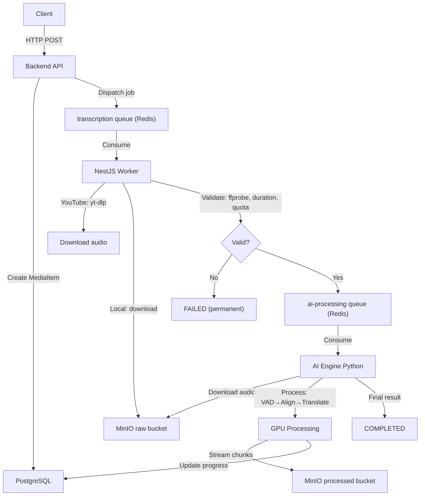

# 📂 PROJECT CHECKPOINT: BILINGUAL SUBTITLE SYSTEM

> **Last Updated:** 2026-04-10
> **Primary Docs:** `apps/INSTRUCTION.md` (root), per-app `INSTRUCTION.md` files
> **Package Manager (Backend):** pnpm

---

## 1. Project Overview

**Goal:** Build a SaaS platform that generates bilingual subtitles (Source + Target + Phonetic/Pinyin) with word-level ("Karaoke") timestamps for videos/audio — aimed at enhancing language learning experiences.

**Core Philosophy:** "Client-side Optimization & Async Processing"

- Mobile App handles audio extraction client-side to save server bandwidth.
- Backend is a lightweight API Gateway + Job Producer.
- NestJS Worker validates and prepares media (I/O-bound), then dispatches to AI Engine.
- AI Engine is an independent Python BullMQ Worker for heavy GPU processing.

**Architecture:** Two-Queue Pipeline

```
Client → API → [transcription queue] → NestJS Worker (validate) → [ai-processing queue] → AI Engine (GPU)
```

---

## 2. Monorepo Structure

```text
bilingual-subtitle-system/
├── apps/
│   ├── backend-api/         # NestJS v11+ (TypeScript) — API Gateway + Worker
│   │   ├── src/
│   │   │   ├── main.ts             # HTTP API entry point
│   │   │   ├── worker.ts           # Standalone NestJS Worker entry point (no HTTP)
│   │   │   ├── app.module.ts       # API module (all modules, guards, pipes)
│   │   │   ├── worker.module.ts    # Lean worker module (BullMQ consumer + MinIO)
│   │   │   ├── prisma/             # PrismaService + PrismaModule (global)
│   │   │   ├── common/             # Shared: decorators, guards, constants, DTOs, services
│   │   │   │   ├── decorators/     # @Public, @Roles, @CurrentUser, @SkipThrottle
│   │   │   │   ├── guards/         # RolesGuard, JwtAuthGuard
│   │   │   │   └── constants/      # Error messages
│   │   │   └── modules/
│   │   │       ├── auth/           # Register, Verify OTP, Login, Refresh, Logout
│   │   │       ├── admin/          # CRUD SubscriptionPlans + PlanVariants (ADMIN role)
│   │   │       ├── media/          # Presigned URL, Confirm Upload, YouTube Submit, Status, Library
│   │   │       │   └── workers/    # MediaProcessor (validation + AI queue dispatch)
│   │   │       ├── queue/          # QueueService (BullMQ producer), queue types
│   │   │       ├── minio/          # MinioService (presigned URLs, download, upload)
│   │   │       ├── redis/          # RedisService (ioredis)
│   │   │       ├── mail/           # MailService (nodemailer + handlebars templates)
│   │   │       ├── otp/            # OTP generation & verification
│   │   │       └── user/           # User profile, UserSubscriptionService
│   │   ├── prisma/
│   │   │   ├── schema.prisma       # 12 models, ~280 lines
│   │   │   ├── seed.ts             # Seeds 3 plans (Free/Basic/Pro) with 6 variants
│   │   │   ├── migrations/         # 7 migrations applied (latest: remove_processing_mode)
│   │   │   └── generated/          # Prisma Client output
│   │   ├── scripts/
│   │   │   └── clean-test-env.ts   # Flush queues + MinIO + DB media items
│   │   └── package.json            # Scripts: start:dev, worker:dev, clean:env, pgen, pmigrate:dev
│   │
│   ├── ai-engine/               # Python 3.12 (CUDA) — AI Processing Worker
│   │   ├── src/
│   │   │   ├── main.py              # Thin BullMQ consumer entry point (process_job + main)
│   │   │   ├── db.py                # Direct PostgreSQL helpers (update_media_status, mark_quota_counted)
│   │   │   ├── events.py            # Redis Pub/Sub event publishers (progress, chunk_ready, batch_ready, etc.)
│   │   │   ├── pipelines.py         # V2 pipeline entry point (run_v2_pipeline only)
│   │   │   ├── async_pipeline.py    # V2 asyncio producer-consumer (NMT translation + optional LLM refinement)
│   │   │   ├── config.py            # Settings: AI_PERF_MODE, WHISPER_MODEL_*, WORKER_MODEL_MODE, NMT_*, AI_ENABLE_LLM_REFINEMENT, Redis, MinIO, DB
│   │   │   ├── minio_client.py      # MinIO operations (download audio, upload chunks/batches/final, public-endpoint presign)
│   │   │   ├── schemas.py           # ALL Pydantic models (Sentence, SubtitleOutput, TranslatedBatch, etc.)
│   │   │   ├── core/
│   │   │   │   ├── pipeline.py           # PipelineOrchestrator (component registry only — no business logic)
│   │   │   │   ├── audio_inspector.py    # AudioInspector (multi-segment AST: music vs standard)
│   │   │   │   ├── vad_manager.py        # VADManager (Silero VAD + greedy merge)
│   │   │   │   ├── smart_aligner.py      # SmartAligner (dual-model, batched inference, Tier 1 chunk streaming)
│   │   │   │   ├── semantic_merger.py    # SemanticMerger (language-aware line grouping + CJK homophone fix + needs_merge)
│   │   │   │   ├── nmt_translator.py     # NMTTranslator (NLLB-200-3.3B via CTranslate2, singleton)
│   │   │   │   ├── llm_provider.py       # LLMProvider (Ollama — qwen2.5:7b-instruct, NMT refinement + merge + analysis)
│   │   │   │   └── prompts.py            # LLM prompt templates (analysis, merge CJK/non-CJK, phonetic correction, NMT refinement)
│   │   │   ├── utils/
│   │   │   │   ├── audio_processor.py    # AudioProcessor (FFmpeg → 16kHz WAV mono)
│   │   │   │   ├── vocal_isolator.py     # VocalIsolator (BS-Roformer / MDX ONNX)
│   │   │   │   └── hardware_profiler.py  # HardwareProfiler (background CPU/RAM/GPU sampler)
│   │   │   └── scripts/                  # Test/debug scripts
│   │   ├── tests/                        # Unit tests (pytest)
│   │   │   ├── test_event_discipline.py   # Event ordering + monotonic progress
│   │   │   ├── test_first_batch_streaming.py # Refinement on/off + first-batch output behavior
│   │   │   ├── test_prewarm_startup.py    # Startup/prewarm behavior
│   │   │   └── test_streaming_contracts.py # Streaming artifact/output contract
│   │   ├── outputs/debug/               # Per-batch debug JSON snapshots (auto-generated per job)
│   │   ├── requirements.txt              # 25+ deps (faster-whisper, bullmq, minio, psycopg2, pynvml, etc.)
│   │   ├── Dockerfile                    # CUDA 12.1 + cuDNN 8 image
│   │   ├── docker-compose.yml            # Profile-based scaling (auto/turbo/full)
│   │   └── venv/                         # Python virtual environment (local dev)
│   │
│   ├── mobile-app/             # React Native / Expo 54 client
│   │   ├── src/
│   │   │   ├── entry.ts              # Custom entry: init Unistyles + i18n before routing
│   │   │   ├── app/                  # Expo Router pages (auth-guarded route groups)
│   │   │   │   ├── _layout.tsx       # Root auth guard (hydrate session, redirect to /(auth) or /(app))
│   │   │   │   ├── (auth)/
│   │   │   │   │   ├── _layout.tsx   # Auth group layout
│   │   │   │   │   ├── index.tsx     # Segmented Login/Register screen
│   │   │   │   │   └── verify-otp.tsx# OTP verify + resend countdown
│   │   │   │   └── (app)/
│   │   │   │       ├── _layout.tsx   # App shell + global socket sync
│   │   │   │       ├── index.tsx     # Media library / home screen
│   │   │   │       ├── upload.tsx    # Upload flow entry
│   │   │   │       ├── media-picker.tsx # Local file / YouTube ingestion
│   │   │   │       ├── processing.tsx# Live processing + completed detail screen
│   │   │   │       ├── player.tsx    # Incremental bilingual player (translated-batch streaming + optimistic seek state)
│   │   │   │       └── settings.tsx  # Preferences + logout
│   │   │   ├── components/
│   │   │   │   ├── auth/             # LoginForm, RegisterForm
│   │   │   │   ├── TextInput.tsx
│   │   │   │   ├── Button.tsx
│   │   │   │   ├── SegmentedControl.tsx
│   │   │   │   ├── OtpInput.tsx
│   │   │   │   └── KeyboardAvoidingWrapper.tsx
│   │   │   ├── services/
│   │   │   │   ├── api.ts            # Axios instance + refresh interceptor + platform URL normalization
│   │   │   │   ├── token-storage.ts  # expo-secure-store token persistence
│   │   │   │   └── auth/index.ts     # authApi wrapper
│   │   │   ├── stores/
│   │   │   │   └── auth.store.ts     # Zustand auth state + hydrate/login/register/verify/logout
│   │   │   ├── constants/
│   │   │   │   ├── endpoint.ts       # /auth endpoint constants
│   │   │   │   └── routes.ts         # /(auth), /(app) route constants
│   │   │   ├── validations/
│   │   │   │   └── auth.ts           # zod login/register/otp schemas (PASSWORD_REGEX aligned)
│   │   │   ├── types/
│   │   │   │   └── auth.ts           # Auth DTO types
│   │   │   ├── theme/
│   │   │   │   ├── tokens.ts         # Design tokens: brand colors, palette, typography, spacing, radii
│   │   │   │   ├── light.ts          # Light theme + AppTheme interface
│   │   │   │   ├── dark.ts           # Dark theme (same shape, dark-adjusted colors)
│   │   │   │   ├── unistyles.ts      # Unistyles config (adaptiveThemes, breakpoints)
│   │   │   │   └── index.ts
│   │   │   ├── i18n/
│   │   │   │   ├── i18n.ts           # i18next init with expo-localization device detection
│   │   │   │   ├── i18next.d.ts      # Type-safe translation keys
│   │   │   │   ├── index.ts
│   │   │   │   └── locales/
│   │   │   │       ├── en/common.json  # English translations (+ auth namespace)
│   │   │   │       └── vi/common.json  # Vietnamese translations (+ auth namespace)
│   │   │   └── hooks/
│   │   │       ├── useThemePreference.ts   # system/light/dark + AsyncStorage persistence
│   │   │       ├── useLanguagePreference.ts # en/vi + AsyncStorage persistence
│   │   │       └── index.ts
│   │   ├── babel.config.js           # Babel config (babel-preset-expo)
│   │   ├── app.json                  # Expo config (orientation, icons, plugins)
│   │   ├── expo-env.d.ts             # Expo env typings
│   │   ├── .env                      # EXPO_PUBLIC_API_URL
│   │   └── package.json              # See tech stack below
│   └── test-media/             # Test audio/video files for pipeline testing
│
├── infra/                      # Docker Compose per service
│   ├── postgres/               # PostgreSQL 16 Alpine (port 5432)
│   ├── redis/                  # Redis 7 Alpine (port 6379, password-protected, AOF on)
│   └── minio/                  # MinIO (API port 9000, console 9001)
│                                 # Buckets: "raw", "processed"
│                                 # Cloudflare Tunnel: bilingual-minio.sondndev.id.vn
│
├── .agent/                     # AI agent configuration
│   ├── skills/                 # nestjs-backend-dev, powershell-windows, creating-skills
│   └── workflows/              # /debug workflow
└── checkpoint.md               # ← THIS FILE
```

---

## 3. Infrastructure Details

| Service    | Container            | Image                | Port(s)    | Config                                                    |
| ---------- | -------------------- | -------------------- | ---------- | --------------------------------------------------------- |
| PostgreSQL | `bilingual-postgres` | `postgres:16-alpine` | 5432       | env vars (`POSTGRES_USER/PASSWORD/DB`)                    |
| Redis      | `bilingual-redis`    | `redis:7-alpine`     | 6379       | password, `maxmemory 256mb`, `allkeys-lru`, AOF           |
| MinIO      | `bilingual-minio`    | `minio/minio:latest` | 9000, 9001 | Cloudflare Tunnel, buckets `raw`+`processed` auto-created |

- **Queues:** BullMQ on Redis. Two queues:
  - `transcription` — NestJS Worker (validation + I/O)
  - `ai-processing` — Python AI Engine (GPU processing)
  - Prefix: `bilingual`
- **Storage Strategy:** Presigned URLs. Public client URLs must be signed directly against the public MinIO endpoint; never sign an internal host and rewrite it afterward.
- **Database URL:** Local PostgreSQL for dev (previously cloud).

---

## 4. Database Schema (Prisma)

**12 Models, 7 Migrations Applied (latest: `remove_processing_mode`):**

| Model              | Purpose                                     | Key Fields / Notes                                                                                                                                                                                                                           |
| ------------------ | ------------------------------------------- | -------------------------------------------------------------------------------------------------------------------------------------------------------------------------------------------------------------------------------------------- |
| `User`             | Core user with subscription tracking        | `email`, `passwordHash`, `role`, `quotaUsageCurrentMonth`, `currentSubscriptionId`                                                                                                                                                           |
| `SubscriptionPlan` | Product definition (FREE, BASIC, PRO)       | `code`, `name`, `features` (JSON), `tierLevel`, `isActive`                                                                                                                                                                                   |
| `PlanVariant`      | Pricing/limits per plan                     | `price`, `billingCycleType`, `maxDurationPerFile`, `monthlyQuotaSeconds`                                                                                                                                                                     |
| `Subscription`     | User↔Plan binding with price/quota SNAPSHOT | `priceSnapshot`, `monthlyQuotaSecondsSnapshot` (immutable)                                                                                                                                                                                   |
| `UsageHistory`     | Monthly usage audit trail                   | `cycleStartDate`, `totalSecondsUsed`, `quotaLimitAtThatTime`                                                                                                                                                                                 |
| `MediaItem`        | Media library entry                         | `originType`, `audioS3Key`, `subtitleS3Key`, `status` (QUEUED→VALIDATING→PROCESSING→COMPLETED/FAILED), `progress`, `currentStep`, `estimatedTimeRemaining`, `failReason`, `transcriptS3Key`, `sourceLanguage`, `countedInQuota`, soft delete |
| `Vocabulary`       | Global word dictionary                      | `word` (unique), `meaning`, `pronunciation`, `lookupCount`                                                                                                                                                                                   |
| `UserVocabulary`   | Per-user saved words                        | Links `User` ↔ `Vocabulary` ↔ `MediaItem` (context)                                                                                                                                                                                          |
| `Otp`              | OTP for registration & forgot password      | `email`, `code`, `type` (REGISTER/FORGOT_PASSWORD), `expiresAt`                                                                                                                                                                              |
| `RefreshToken`     | JWT refresh tokens with rotation            | `token` (unique), `deviceInfo`, `ip`, `expiresAt`, cascade delete                                                                                                                                                                            |

**Enums / Status Fields:**

- `MediaStatus`: `QUEUED` | `VALIDATING` | `PROCESSING` | `COMPLETED` | `FAILED`
- `MediaItem.currentStep` stores the active pipeline stage string: `AUDIO_PREP`, `INSPECTING`, `VAD`, `PROCESSING`, `TRANSLATING`, `EXPORTING`
- Legacy `processingMode` was removed in migration `20260321103000_remove_processing_mode`

**Seed Data:** 3 plans × 6 variants (Free Monthly, Basic Monthly/Yearly, Pro Monthly/Yearly/Lifetime). Currency: VND.

---

## 5. Backend API — Module Status

### ✅ Authentication (`/auth`) — DONE

- **Strategy:** "Verify-First" — registration data cached in Redis, user created in DB only after OTP verification
- **Endpoints:** `POST /auth/register`, `POST /auth/verify`, `POST /auth/login`, `POST /auth/refresh`, `POST /auth/logout`
- **Security:** JWT-based, global `JwtAuthGuard`, `@Public()` decorator for open routes, rate limiting via `@Throttle()`
- **Token Flow:** Access token (short-lived JWT) + Refresh token (UUID wrapped in signed JWT, stored in DB, rotated on refresh)

### ✅ Admin — Subscription Management (`/admin`) — DONE

- **CRUD** for `SubscriptionPlan` and `PlanVariant`
- **Guards:** `RolesGuard` + `@Roles(ADMIN)`
- **Smart Delete:** Soft-deactivation; checks for active subscribers before delete
- **Variant Versioning:** If variant has subscribers and price/limits change → new variant version created

### ✅ Media Library (`/media`) — DONE (Full Production Flow)

- **Endpoints:**
  - `POST /media/presigned-url` — Generate presigned PUT URL (optimistic quota check)
  - `POST /media/confirm-upload` — Verify file in MinIO → create `MediaItem` → dispatch BullMQ job
  - `POST /media/youtube` — Submit YouTube URL → create `MediaItem` → dispatch job
  - `GET /media/:id/status` — Hydrate processing progress (progress, `currentStep`, ETA, failReason)
  - `GET /media/:id/artifacts` — Durable processed-object inventory (`chunks/`, `translated_batches/`, `final.json`)
  - `GET /media` — User's media library listing
- **Quota Logic:** Aggregates `durationSeconds` of `MediaItem` for current month, checks against subscription snapshot
- **Translation Contract:** Active flows are bilingual subtitle generation only. Backend carries `targetLanguage` where needed; `processingMode` is no longer part of the API or queue payloads.
- **Library DTOs:** List/detail responses include MinIO artifact summaries so the mobile app can show readiness state without re-deriving storage inventory client-side.

### ✅ Worker — Validation Pipeline (`MediaProcessor`) — DONE

- Standalone NestJS app: `NestFactory.createApplicationContext(WorkerModule)`
- Consumes from `transcription` queue, produces to `ai-processing` queue
- **YouTube flow:** `yt-dlp` metadata/title fetch → duration check → audio download → MinIO upload
- **Local flow:** MinIO download → `ffprobe` verify → duration check
- **Quota checks:** Per-file duration limit + monthly aggregate re-check
- **Error handling:** Validation failures → `FAILED` status (no retries, permanent errors)
- Scripts: `pnpm worker:dev` (watch mode), `pnpm worker` (production)

### ✅ Supporting Modules — DONE

- **MinioService:** Presigned URLs, object verification, download, upload, public-host-safe artifact access
- **RedisService:** ioredis wrapper for caching (registration data, etc.)
- **MailService:** nodemailer + handlebars templates for OTP emails
- **OtpService:** Generate & verify OTPs (REGISTER, FORGOT_PASSWORD types)
- **UserSubscriptionService:** Auto-assign FREE_TIER on registration
- **QueueService:** BullMQ producer, typed `TranscriptionJobPayload` + `AiProcessingJobPayload`
- **CORS:** `main.ts` now includes `OPTIONS` and explicit preflight headers (`Origin`, `X-Requested-With`) for frontend compatibility

---

## 6. AI Engine — Module Status

### ✅ Full Pipeline — PRODUCTION READY (connected via BullMQ)

**Entry Point:** `main.py` — thin BullMQ consumer (~175 lines) listening on `ai-processing` queue. Delegates to `pipelines.py` for pipeline execution.

**7-Step Pipeline (`PipelineOrchestrator`) — V2 Async NMT-based:**

> **V1→V2 Migration:** The original V1 pipeline used `TranslatorEngine` (LLM-only, Ollama qwen2.5:7b) + `IncrementalPipeline` (threaded merge→translate). V2 replaces this with an asyncio producer-consumer architecture using NLLB-200-3.3B via CTranslate2 for fast GPU-native translation, with optional LLM refinement for quality. This eliminated the serial TranslatorEngine bottleneck and removed ~700 lines of dead code.

| Step | Class            | Description                                                                                                                | Status       |
| ---- | ---------------- | -------------------------------------------------------------------------------------------------------------------------- | ------------ |
| 1    | `AudioProcessor` | Convert input to 16kHz WAV mono (FFmpeg)                                                                                   | ✅ Done      |
| 2    | `AudioInspector` | Multi-segment AST classification (3 samples at 10/50/90%, weighted vote)                                                   | ✅ Done      |
| 3    | `VADManager`     | Silero VAD → speech segments → greedy merge (5-15s targets)                                                                | ✅ Done      |
| 3b   | `VocalIsolator`  | Separate vocals for music (BS-Roformer / MDX ONNX)                                                                         | ✅ Done      |
| 4    | `SmartAligner`   | Faster-Whisper Large-v3, word-level timestamps, CJK split, phonemes, **Tier 1 chunk streaming**                            | ✅ Done      |
| 5    | `SemanticMerger` | Language-aware LLM line grouping (CJK: grouping + homophone fix; non-CJK: grouping only), via `needs_merge()` heuristic    | ✅ Done      |
| 6    | `NMTTranslator`  | **V2:** NLLB-200-3.3B via CTranslate2 (GPU, float16). Singleton with async `translate_batch()`. Replaces TranslatorEngine. | ✅ V2 Active |
| 6b   | LLM Refinement   | **V2:** Optional post-NMT pass via Ollama (`NMT_REFINEMENT_PROMPT`), controlled by `AI_ENABLE_LLM_REFINEMENT`.             | ✅ V2 Active |
| 7    | Export           | Upload `SubtitleOutput` as `final.json` to MinIO `processed` bucket                                                        | ✅ Done      |

**BullMQ Consumer (`main.py`):**

- Listens on `ai-processing` queue with prefix `bilingual`
- Lock duration: 10 minutes (prevents stale-lock retries for long audio)
- Stalled interval: 5 minutes
- Concurrency: 1 (single GPU)
- Progress updates: direct PostgreSQL via `psycopg2` (strips Prisma's `?schema=public` from DSN)
- MinIO integration: `minio_client.py` handles download/upload of audio and subtitle data

**Two-Tier Streaming Protocol:**

Tier 1 — Raw Transcription (during SmartAligner):

- `SmartAligner.process()` accepts `on_chunk(batch, total_so_far)` callback
- Flushes every 20 sentences during alignment — client sees partial results in real-time
- Uploads to `processed/{mediaId}/chunks/{chunkIndex}.json`
- Mobile app can hydrate durable progress data from chunk artifacts before `final.json` exists

Tier 2 — Bilingual Translation (during V2 async consumer):

- `async_pipeline.py` consumer reads from asyncio.Queue, runs NMT translation + optional LLM refinement
- Each completed batch uploaded to `processed/{mediaId}/translated_batches/{batchIndex}.json`
- Mobile app uses translated-batch availability to unlock the Player CTA and completed-job readiness indicators
- CJK languages: batches pass through SemanticMerger before NMT; non-CJK bypass merge entirely

Final — Complete Output:

- `processed/{mediaId}/final.json` — full `SubtitleOutput` with metadata + all bilingual segments
- Uploaded once pipeline finishes; mobile uses this as the canonical source

Progress semantics (V2 pipeline): `0.05` AUDIO_PREP → `0.10` INSPECTING → `0.15` VAD → `0.15–0.60` PROCESSING → `0.60–0.90` TRANSLATING → `0.98` EXPORTING → `1.00` COMPLETED. Both the in-memory reservation logic and DB writes keep progress monotonic to avoid client-side rollback.

**Debug Output:**

- V2 async consumer writes per-batch debug snapshots to `outputs/debug/{mediaId}/` for diagnosing NMT/LLM quality issues

**Key Design Decisions:**

- **Singleton Pattern:** `SmartAligner` and `VADManager` use `__new__` singleton to keep GPU models loaded
- **Dual Model Architecture:** `large-v3-turbo` for EN/VI/common languages, `large-v3` for CJK (zh/ja/ko)
- **WORKER_MODEL_MODE:** `auto` (both models, ~8 GB VRAM) | `turbo_only` (~3 GB) | `full_only` (~5 GB) — set via `.env`
- **Batched Inference:** `BatchedInferencePipeline` wraps each model; `batch_size` driven by `AI_PERF_MODE` (LOW=1, MEDIUM=4, HIGH=8)
- **Model Routing:** First segment detects anchor language → routes subsequent segments to correct model; logs which model was selected
- **Performance Profiles:** LOW/MEDIUM/HIGH → controls `compute_type`, `beam_size`, `batch_size`
- **LLM:** Ollama with `qwen2.5:7b-instruct` for semantic merging, context analysis, and optional NMT refinement
- **NMTTranslator (V2):** NLLB-200-3.3B via CTranslate2 (`float16`, singleton). Async `translate_batch()` method. Settings: `NMT_MODEL_DIR`, `NMT_TOKENIZER_NAME`, `NMT_COMPUTE_TYPE`, `NMT_BEAM_SIZE`. Replaces V1 `TranslatorEngine`.
- **V2 Async Pipeline (`async_pipeline.py`):** asyncio producer-consumer. Producer = SmartAligner transcription → `asyncio.Queue`. Consumer = [CJK: SemanticMerger] → NMTTranslator → [optional LLM refinement] → Tier 2 upload. Natural backpressure via bounded queue. Replaces V1 `IncrementalPipeline` + `ThreadPoolExecutor`.
- **LLM Refinement:** Optional post-NMT pass using `NMT_REFINEMENT_PROMPT`. Fixes CJK particle errors, pronoun consistency, style drift. Controlled by `AI_ENABLE_LLM_REFINEMENT` in `config.py`.
- **SemanticMerger `needs_merge()` heuristic:** Skips merge when <20% of sentences are fragments (<6 words for non-CJK, <8 chars for CJK). Constants: `MERGE_MIN_WORD_COUNT=6`, `MERGE_FRAGMENT_RATIO=0.2`.
- **Output Contract:** `SubtitleOutput` = `SubtitleMetadata` + `List[Sentence]`. Every `Sentence` has `translation: str` (never None, `""` default) and `phonetic: str` (CJK pinyin from word phonemes, empty for non-CJK).
- **Multi-Segment Inspector:** Samples 3 positions (10%, 50%, 90%) with weighted voting to prevent music intro bias
- **Graceful Fallback:** All steps catch exceptions and fall back (e.g., vocal isolation fails → use original audio)
- **Hardware Profiler:** `HardwareProfiler` runs as background thread per job — writes CPU/RAM/GPU stats to `outputs/profiles/` as `.txt` + `.csv`

**Competing Consumers (Horizontal Scaling):**

- Each `main.py` instance performs a blocking pop (`BRPOPLPUSH`) on Redis — whichever instance pops first gets the job
- Redis atomic operations + BullMQ per-job locks provide at-least-once delivery and reduce duplicates; keep workers idempotent
- Multiple instances can run on same machine with different `WORKER_MODEL_MODE` for GPU memory splitting

---

### 🚀 Pipeline Performance Benchmarks

| Date       | Change                          | Wall Time  | Speedup   | Notes                                                       |
|------------|---------------------------------|------------|-----------|-------------------------------------------------------------|
| 2026-04-02 | Baseline (before optimization)  | 217.8s     | 1.00×     | 565s video; producer-bound, transcription bottleneck ~175s  |
| 2026-04-10 | **P0 + P1a + P1b** (see below)  | **101.8s** | **2.14×** | transcription=82.6s, phonemes=12.0s, NMT consumer=87.3s    |

**Changes applied in P0 + P1:**
- **P0 (bug fix):** `clip_timestamps` corrected from `list[float]` → `list[dict]` (`{"start": float, "end": float}`) to match `BatchedInferencePipeline.transcribe()` API
- **P1a:** `SMART_ALIGNER_GROUP_SIZE` increased `4 → 8` (`config.py`)
- **P1b:** Turbo model `beam_size` set to `1` (`smart_aligner.py`)

**Post-P1 Timing Breakdown (565s video):**
- SmartAligner (producer): **95.9s** total (transcription=82.6s, phonemes=12.0s, overhead=1.3s)
- NMT consumer: **87.3s** total — GPU contention: 5/18 batches spiked 7–19s due to simultaneous Whisper+NMT GPU sharing; net wall impact ~6s
- Producer-bound confirmed: `producer_wait=0.007s`

**Remaining Bottleneck:** 82.6s transcription (~86% of producer time) — primary target for next optimization phase (P2).

**GPU/CPU Trade-off Decision:** CPU NMT (Ryzen 7700 INT8) evaluated — ~6s wall gain with risk of consumer-bound regression. **Decision: keep NMT on GPU.**

---

## 6b. AI Engine — Docker Deployment

| File                                | Purpose                                                    |
| ----------------------------------- | ---------------------------------------------------------- |
| `apps/ai-engine/Dockerfile`         | CUDA 12.1 + cuDNN 8 image; installs PyTorch + all pip deps |
| `apps/ai-engine/docker-compose.yml` | Profile-based scaling with NVIDIA GPU reservation          |

**Running Docker instances:**

```bash
# Build image
docker compose build

# Single instance — auto mode (both models, ~8 GB VRAM)
docker compose --profile auto up

# Scale to N identical instances (all share same GPU)
docker compose --profile auto up --scale ai-engine=N

# Dual-worker split (turbo ~3 GB + full ~5 GB = ~8 GB total)
docker compose --profile turbo --profile full up
```

**Key Docker details:**

- `REDIS_HOST` + `MINIO_ENDPOINT` automatically overridden to `host.docker.internal` so containers reach host services
- Whisper model cache mounted as `whisper_cache` volume — models downloaded once, reused across restarts
- `WORKER_MODEL_MODE` set per service in compose file (overrides `.env`)
- All `outputs/` and `temp/` are Docker volumes (persistent across container restarts)



---

## 7. AI Engine — Refactoring Progress (Translation Step Cleanup)

**Plan:** `plan-refactorAiEngineTranslationStepCleanup.prompt.md`

| Phase | Description                                       | Status      | Files Modified                                                                                      |
| ----- | ------------------------------------------------- | ----------- | --------------------------------------------------------------------------------------------------- |
| 1     | Cleanup — remove dead code & legacy paths         | ✅ Complete | `pipeline.py`, `translator_engine.py` (deleted), `llm_provider.py`, `prompts.py`, `schemas.py`      |
| 2     | Refactor SemanticMerger (language-aware)          | ✅ Complete | `semantic_merger.py`, `prompts.py`, `main.py`                                                       |
| 3     | Build new TranslatorEngine                        | ✅ Complete | New `translator_engine.py`, `llm_provider.py`, `prompts.py`, `schemas.py`, `pipeline.py`, `main.py` |
| 4     | Fix output contract                               | ✅ Complete | `schemas.py`, `minio_client.py`, `main.py`                                                          |
| 5     | Backend job payload update                        | ✅ Complete | `queue.types.ts`, `request.dto.ts`, `media.service.ts`, `media.processor.ts`, `main.py`             |
| 6     | Incremental Merge+Translate Pipeline (Option B+D) | ✅ Complete | `semantic_merger.py`, `translator_engine.py`, `llm_provider.py`, `main.py`                          |
| 7     | Module Refactor — split monolithic `main.py`      | ✅ Complete | New `db.py`, `events.py`, `pipelines.py`, `incremental_pipeline.py`; rewritten `main.py`            |

**V2 Pipeline Rebuild (plan-v2-pipeline-architecture.prompt.md):**

| Phase | Description                        | Status      | Files Modified                                                                                                                                                                          |
| ----- | ---------------------------------- | ----------- | --------------------------------------------------------------------------------------------------------------------------------------------------------------------------------------- |
| 0     | NLLB Evaluation Scripts            | ✅ Complete | `scripts/eval_nllb.py`, `scripts/eval_nllb_bilingual.py`                                                                                                                                |
| 1     | NMTTranslator Singleton            | ✅ Complete | New `core/nmt_translator.py`                                                                                                                                                            |
| 2     | Async Pipeline (producer-consumer) | ✅ Complete | New `async_pipeline.py`, `pipelines.py` updated                                                                                                                                         |
| 3     | LLM Refinement Wiring              | ✅ Complete | `llm_provider.py`, `prompts.py` (NMT_REFINEMENT_PROMPT), `async_pipeline.py`                                                                                                            |
| 4     | Test Script                        | ✅ Complete | `scripts/test_v2_pipeline.py`                                                                                                                                                           |
| 5     | V1 Dead Code Cleanup               | ✅ Complete | Deleted: `translator_engine.py`, `incremental_pipeline.py`, V1 test scripts. Cleaned: `prompts.py`, `llm_provider.py`, `pipeline.py`, `pipelines.py`, `main.py`, `schemas.py`, `tests/` |

**Key Changes Summary (V1 Refactor — Phases 1-7):**

- **`schemas.py`:** `Sentence` now has `translation: str = ""` and `phonetic: str = ""`. Models: `SubtitleMetadata`, `SubtitleOutput`, `TranslatedBatch`, `ContextAnalysisResult`.
- **`minio_client.py`:** Typed uploads: `upload_chunk()` (Tier 1), `upload_translated_batch(TranslatedBatch)` (Tier 2), `upload_final_result(SubtitleOutput)` (final). Path convention: `{mediaId}/chunks/`, `{mediaId}/translated_batches/`, `{mediaId}/final.json`. Public artifact URLs are signed against `MINIO_PUBLIC_ENDPOINT` directly.
- **Backend DTOs:** `targetLanguage?: string` added to `ConfirmUploadDto`, `SubmitYoutubeDto`, both job payload types, and wired through `media.service.ts` → `media.processor.ts`.

**Key Changes Summary (V2 Pipeline — Phases 0-5):**

- **`nmt_translator.py` (NEW):** NLLB-200-3.3B via CTranslate2. Singleton with lazy model load. `translate_batch(texts, src_lang, tgt_lang)` async method. Settings: `NMT_MODEL_DIR`, `NMT_TOKENIZER_NAME`, `NMT_COMPUTE_TYPE` (float16), `NMT_BEAM_SIZE` (4).
- **`async_pipeline.py` (NEW):** asyncio producer-consumer. Producer = SmartAligner → `asyncio.Queue`. Consumer = [CJK: SemanticMerger] → NMTTranslator → [LLM Refinement] → Tier 2 upload. Replaces `IncrementalPipeline` + `ThreadPoolExecutor`.
- **`pipelines.py` (REWRITTEN):** Single entry point `run_v2_pipeline()` (~47 lines). Delegates to `async_pipeline.run_v2_pipeline_async()`.
- **`main.py` (SIMPLIFIED):** Always calls V2 pipeline. No more `processingMode` branching or V1 imports.
- **`prompts.py` (CLEANED):** V1 translation prompts (`TRANSLATION_SYSTEM_PROMPT`, per-language prompts) deleted. Kept: `ANALYSIS_SYSTEM_PROMPT`, `PHONETIC_CORRECTION_SYSTEM_PROMPT`, `SAFE_MERGE_CJK_PROMPT`, `SAFE_MERGE_NON_CJK_PROMPT`, `NMT_REFINEMENT_PROMPT`.
- **`llm_provider.py` (CLEANED):** `translate_batch()` and `translate_raw()` deleted. `refine_nmt_translations()` is the only translation-related method.
- **Deleted files:** `translator_engine.py`, `incremental_pipeline.py`, `scripts/test_phase1.py`, `scripts/test_phase2.py`, `scripts/test_phase2_real.py`.
- **Tests (REWRITTEN):** 6 tests remain (MinIO paths + output contract). V1-specific tests (TranslatorEngine, sliding window, partial failure, phonetics) removed.

**MinIO Storage Convention:**

```
processed/{mediaId}/
├── chunks/                    # Tier 1: raw transcription (from SmartAligner)
│   ├── 0.json
│   └── ...
├── translated_batches/        # Tier 2: bilingual batches (from NMTTranslator)
│   ├── 0.json
│   └── ...
└── final.json                 # Complete SubtitleOutput (canonical)
```

**Verification Coverage:**

- `tests/test_two_tier_streaming.py` validates MinIO path conventions and final output contract.
- `tests/test_event_discipline.py` validates event publishing behavior, including monotonic progress expectations.

Run: `cd apps/ai-engine && .\venv\Scripts\Activate.ps1 && python -m pytest tests/ -v`

**AI Engine — Current V2 State:**

The V2 pipeline is the only active production path.

- `main.py` is a thin BullMQ consumer and delegates processing to `run_v2_pipeline()` in `pipelines.py`.
- `async_pipeline.py` owns the producer-consumer flow, stage-progress publishing, and the Tier 1 / Tier 2 artifact uploads.
- `core/nmt_translator.py` is the active translation runtime. The old `translator_engine.py` and `incremental_pipeline.py` paths are gone.
- Queue payloads are bilingual-by-default and only carry `targetLanguage`; there is no runtime branching on `processingMode` anymore.
- Progress is protected twice: `_reserve_progress()` prevents in-memory rollback, and `db.py` writes `progress = GREATEST(COALESCE(progress, 0), incoming)` to keep persisted status monotonic.

---

## 8. Job Payload Contracts (Redis)

### Queue 1: `transcription` (API → NestJS Worker)

```typescript
interface TranscriptionJobPayload {
  mediaId: string;
  type: "LOCAL" | "YOUTUBE";
  filePath?: string; // S3 key (LOCAL uploads)
  url?: string; // YouTube URL
  userId: string;
  targetLanguage?: string; // Default: "vi" — passed through to AI Engine
}
```

### Queue 2: `ai-processing` (NestJS Worker → AI Engine)

```typescript
interface AiProcessingJobPayload {
  mediaId: string;
  audioS3Key: string; // Validated audio in MinIO
  durationSeconds: number;
  userId: string;
  targetLanguage?: string; // Default: "vi" — target translation language
}
```

---

## 9. Mobile App — Current Status

**Brand Name:** Kapter _(wordplay: "capture" + "chapter")_

### ✅ Phase 1: UI/UX Foundations — DONE

**Tech Stack:**
| Layer | Technology | Version |
|-------|-----------|--------|
| Framework | Expo (stable) | 54.0.33 |
| Navigation | expo-router | ~6.0.23 |
| Language | React Native | 0.81.5 |
| Styling | react-native-unistyles | ^3.0.24 |
| i18n | i18next + react-i18next + expo-localization | ^25 / ^16 / ^17 |
| Persistence | @react-native-async-storage/async-storage | ^2.2.0 |
| Animations | react-native-reanimated | ~4.1.6 |
| Icons | @expo/vector-icons | ^15.0.2 |

**What was built:**

- **Theme system:** Design tokens (brand blue `#208AEF`, palette, typography, spacing, radii) → light/dark themes → adaptive to system preference via `UnistylesRuntime`
- **Dark mode:** System auto-detect + manual override (`useThemePreference` hook), persisted via AsyncStorage
- **i18n:** Vietnamese (default) + English, device locale detection, type-safe translation keys (`i18next.d.ts`), persisted via AsyncStorage (`useLanguagePreference` hook)
- **Custom entry point:** `src/entry.ts` — initializes Unistyles + i18n before expo-router loads any component
- **Demo screen:** Theme toggle (system/light/dark) + language toggle (en/vi) + color palette preview

### ✅ Phase 2: Auth Flow + Route Guard — DONE

**What was built:**

- **Auth state:** Zustand store (`auth.store.ts`) with `hydrate`, `login`, `register`, `verifyOtp`, `logout`
- **Secure tokens:** `expo-secure-store` wrapper (`token-storage.ts`) for access/refresh token persistence
- **API layer:** Axios instance with request auth header injection + 401 refresh interceptor + queueing while refresh is in-flight
- **Endpoint constants:** centralized `/auth/*` routes in `constants/endpoint.ts`
- **Cross-platform API URL handling:** mobile API base URL normalization for emulator loopback (`localhost`/`127.0.0.1`/`[::1]` → `10.0.2.2` on Android)
- **Validation:** zod schemas for login/register/otp, including backend-aligned `PASSWORD_REGEX`
- **Auth UI:**
  - Login/Register segmented screen (`/(auth)/index.tsx`)
  - Verify OTP screen with resend countdown (`/(auth)/verify-otp.tsx`)
  - Reusable UI components (`TextInput`, `Button`, `SegmentedControl`, `OtpInput`, `KeyboardAvoidingWrapper`)
- **Navigation guard:** root layout hydrates auth and redirects between `/(auth)` and `/(app)` groups
- **i18n auth strings:** English/Vietnamese translations for auth labels/errors/logout

### ⚠️ Known Issues & Workarounds

**react-native-unistyles — Windows CMake path-length error:**

- `react-native-unistyles` v3 uses native C++ modules (CMake build). On Windows, CMake has a hard limit on path lengths.
- **Symptom:** `expo run:android` fails with CMake errors deep in `node_modules`.
- **Workaround:** Clone/move the project to a directory with a **shorter absolute path** (e.g., `C:\kapter\` instead of `C:\Users\...\KMA\billingual_project\`).
- **Cannot test via Expo Go** — requires a development build (`expo run:android` / `expo-dev-client`).

### ✅ Phase 3: Upload Flow (Media Pipeline Integration) — DONE

- Extracted local upload (presigned URL PUT → Confirm)
- Added YouTube modal ingestion
- Wired TanStack Query for library caching and socket-first status hydration
- Fixed TypeScript differences with the backend APIs

### ✅ Phase 4: Processing Detail + Artifact Flow — DONE

- App layout mounts a global `useSocketSync()` listener that patches TanStack Query caches from live processing events
- Processing screen hydrates status once via REST, then relies on socket updates instead of aggressive refetching
- Durable artifact endpoint (`GET /media/:id/artifacts`) powers completed-output summary, final JSON access, and resumed state
- Library cards show a small readiness badge when at least one translated batch exists
- "Open Player" CTA appears as soon as translated output exists

### ✅ Phase 5: Incremental Player Screen — DONE

- `/(app)/player` now hydrates from `translated_batches/` before `final.json` exists, so playback can start on the first translated batch
- Incoming translated-batch refreshes preserve the existing subtitle session and avoid full-screen reloads while the player is open
- Seek/loading logic uses optimistic player time so scrubbing back into already-covered ranges clears the pending state immediately
- Translation layer defaults on and only auto-disables when subtitle metadata says source and target languages are the same
- YouTube submissions preserve preview titles on mobile, with backend `yt-dlp` metadata fallback when the client does not send one

### 🟡 Still Pending

- Karaoke playback polish and richer subtitle rendering inside the player
- Forgot-password and social login (future, optional)

---

## 10. Development Commands

| Action                       | Command                                                | Location                |
| ---------------------------- | ------------------------------------------------------ | ----------------------- |
| Start API (dev)              | `pnpm start:dev`                                       | `apps/backend-api`      |
| Start Worker (dev)           | `pnpm worker:dev`                                      | `apps/backend-api`      |
| Start all infra              | `pnpm start:local`                                     | `apps/backend-api`      |
| Start AI Engine (dev)        | `python -m src.main`                                   | `apps/ai-engine` (venv) |
| Start AI Engine (Docker)     | `docker compose --profile auto up`                     | `apps/ai-engine`        |
| Scale N AI Engine instances  | `docker compose --profile auto up --scale ai-engine=N` | `apps/ai-engine`        |
| Dual-worker split            | `docker compose --profile turbo --profile full up`     | `apps/ai-engine`        |
| Build AI Engine image        | `docker compose build`                                 | `apps/ai-engine`        |
| Generate Prisma Client       | `pnpm pgen`                                            | `apps/backend-api`      |
| Run migration                | `pnpm pmigrate:dev <name>`                             | `apps/backend-api`      |
| Seed database                | `npx tsx prisma/seed.ts`                               | `apps/backend-api`      |
| Clean test environment       | `pnpm clean:env`                                       | `apps/backend-api`      |
| Run AI pipeline (standalone) | `python -m src.scripts.test_v2_pipeline`               | `apps/ai-engine` (venv) |
| Start infra (individual)     | `docker-compose up -d`                                 | `infra/{service}`       |

---

## 11. Priority TODO (Next Steps)

1. **🟡 Mobile App — Player Polish:** Continue improving karaoke rendering, layer toggles, and long-session player UX now that incremental playback is shipped.
2. **🟡 Mobile App — Final Preview Cleanup:** Remove or repurpose any remaining unused preview-only helpers now that the processing screen is artifact-summary-first.
3. **🟡 Backend — Artifact Summary Performance:** `GET /media` currently derives artifact summaries per item from MinIO; revisit if library latency becomes noticeable.
4. **🟡 AI Engine — NMT Quality Tuning:** Continue tuning `NMT_BEAM_SIZE`, `NMT_COMPUTE_TYPE`, and refinement prompts per language pair.
5. **🔴 [P2] AI Engine — Transcription Speed:** 82.6s transcription remains the primary bottleneck post-P1 (2.14× achieved). Candidates: dynamic batching, VAD chunk overlap tuning, INT8 quantization for turbo model, CUDA stream priority scheduling to reduce GPU contention (5/18 NMT batches currently spike 7–19s).
6. **🟡 True Language-Based Routing:** Detect language earlier and route CJK-heavy jobs to the appropriate worker profile when horizontal scaling becomes necessary.
7. **🟡 AI Engine — Integration Test:** Add an end-to-end test with real Redis + MinIO + Ollama to validate the full streaming contract.
8. **🟢 Vocabulary Feature:** Dictionary lookup + word save endpoints.
9. **🟢 Inspector Tuning:** Further refine the multi-segment audio inspector with real-world audio.
10. **🟢 VAD Performance:** Investigate VAD processing time on long music files.
11. **🟢 Monitoring:** Set up basic monitoring and alerting for AI Engine and Worker processes.

---

## 12. Tech Stack Summary

| Layer         | Technology                                                                                                                                                                   |
| ------------- | ---------------------------------------------------------------------------------------------------------------------------------------------------------------------------- |
| **Backend**   | NestJS v11, TypeScript, Prisma 7, BullMQ, ioredis, Passport JWT                                                                                                              |
| **AI Engine** | Python 3.12, CUDA 12.1, Faster-Whisper (large-v3 + large-v3-turbo), Silero VAD, CTranslate2, BullMQ (Python), MinIO SDK, psycopg2, Ollama (qwen2.5:7b), nvidia-ml-py, psutil |
| **Database**  | PostgreSQL 16                                                                                                                                                                |
| **Queue**     | Redis 7 + BullMQ (two queues: `transcription`, `ai-processing`)                                                                                                              |
| **Storage**   | MinIO (S3-compatible) + Cloudflare Tunnel                                                                                                                                    |
| **Mobile**    | React Native 0.81.5, Expo 54 (stable), expo-router, react-native-unistyles, i18next                                                                                          |
| **Infra**     | Docker Compose (per-service + AI Engine with NVIDIA GPU support)                                                                                                             |
