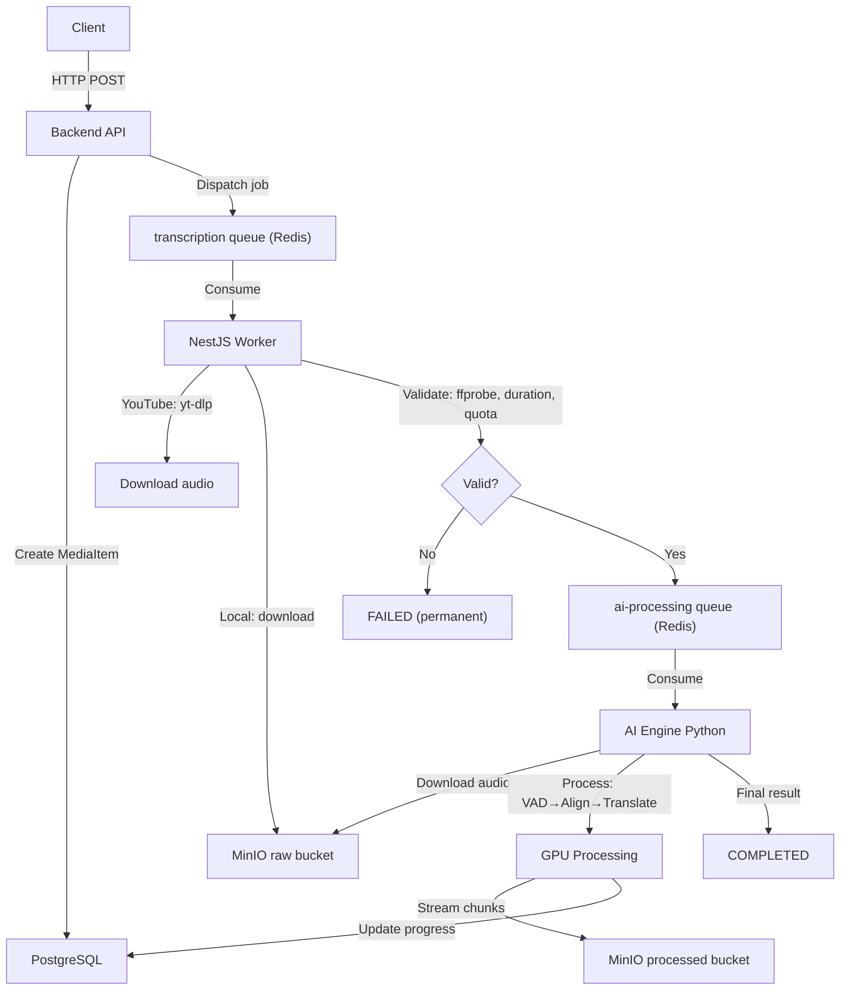

# 📂 PROJECT CHECKPOINT: BILINGUAL SUBTITLE SYSTEM

> **Last Updated:** 2026-02-22
> **Primary Docs:** `apps/INSTRUCTION.md` (root), per-app `INSTRUCTION.md` files
> **Package Manager (Backend):** pnpm

---

## 1. Project Overview

**Goal:** Build a SaaS platform that generates bilingual subtitles (Source + Target + Phonetic/Pinyin) with word-level ("Karaoke") timestamps for videos/audio — aimed at enhancing language learning experiences.

**Core Philosophy:** "Client-side Optimization & Async Processing"
- Mobile App handles audio extraction client-side to save server bandwidth.
- Backend is a lightweight API Gateway + Job Producer.
- NestJS Worker validates and prepares media (I/O-bound), then dispatches to AI Engine.
- AI Engine is an independent Python BullMQ Worker for heavy GPU processing.

**Architecture:** Two-Queue Pipeline
```
Client → API → [transcription queue] → NestJS Worker (validate) → [ai-processing queue] → AI Engine (GPU)
```

---

## 2. Monorepo Structure

```text
bilingual-subtitle-system/
├── apps/
│   ├── backend-api/         # NestJS v11+ (TypeScript) — API Gateway + Worker
│   │   ├── src/
│   │   │   ├── main.ts             # HTTP API entry point
│   │   │   ├── worker.ts           # Standalone NestJS Worker entry point (no HTTP)
│   │   │   ├── app.module.ts       # API module (all modules, guards, pipes)
│   │   │   ├── worker.module.ts    # Lean worker module (BullMQ consumer + MinIO)
│   │   │   ├── prisma/             # PrismaService + PrismaModule (global)
│   │   │   ├── common/             # Shared: decorators, guards, constants, DTOs, services
│   │   │   │   ├── decorators/     # @Public, @Roles, @CurrentUser, @SkipThrottle
│   │   │   │   ├── guards/         # RolesGuard, JwtAuthGuard
│   │   │   │   └── constants/      # Error messages
│   │   │   └── modules/
│   │   │       ├── auth/           # Register, Verify OTP, Login, Refresh, Logout
│   │   │       ├── admin/          # CRUD SubscriptionPlans + PlanVariants (ADMIN role)
│   │   │       ├── media/          # Presigned URL, Confirm Upload, YouTube Submit, Status, Library
│   │   │       │   └── workers/    # MediaProcessor (validation + AI queue dispatch)
│   │   │       ├── queue/          # QueueService (BullMQ producer), queue types
│   │   │       ├── minio/          # MinioService (presigned URLs, download, upload)
│   │   │       ├── redis/          # RedisService (ioredis)
│   │   │       ├── mail/           # MailService (nodemailer + handlebars templates)
│   │   │       ├── otp/            # OTP generation & verification
│   │   │       └── user/           # User profile, UserSubscriptionService
│   │   ├── prisma/
│   │   │   ├── schema.prisma       # 12 models, ~280 lines
│   │   │   ├── seed.ts             # Seeds 3 plans (Free/Basic/Pro) with 6 variants
│   │   │   ├── migrations/         # 5 migrations applied (latest: add_processing_fields)
│   │   │   └── generated/          # Prisma Client output
│   │   ├── scripts/
│   │   │   └── clean-test-env.ts   # Flush queues + MinIO + DB media items
│   │   └── package.json            # Scripts: start:dev, worker:dev, clean:env, pgen, pmigrate:dev
│   │
│   ├── ai-engine/               # Python 3.11/3.12 (CUDA) — AI Processing Worker
│   │   ├── src/
│   │   │   ├── main.py              # BullMQ consumer entry point (ai-processing queue)
│   │   │   ├── config.py            # Settings: AI_PERF_MODE, WHISPER_MODEL_*, WORKER_MODEL_MODE, Redis, MinIO, DB
│   │   │   ├── minio_client.py      # MinIO operations (download audio, upload chunks/results)
│   │   │   ├── schemas.py           # Pydantic: VADSegment, Word, Sentence, SegmentType
│   │   │   ├── core/
│   │   │   │   ├── pipeline.py           # PipelineOrchestrator (7-step E2E flow)
│   │   │   │   ├── audio_inspector.py    # AudioInspector (multi-segment AST: music vs standard)
│   │   │   │   ├── vad_manager.py        # VADManager (Silero VAD + greedy merge)
│   │   │   │   ├── smart_aligner.py      # SmartAligner (dual-model, batched inference, streaming chunks)
│   │   │   │   ├── semantic_merger.py    # SemanticMerger (LLM-based line grouping + homophone fix)
│   │   │   │   ├── translator_engine.py  # TranslatorEngine (2-pass: Analyze→Correct→Translate)
│   │   │   │   ├── llm_provider.py       # LLMProvider (Ollama — qwen2.5:7b-instruct)
│   │   │   │   └── prompts.py            # System prompts for LLM tasks
│   │   │   ├── utils/
│   │   │   │   ├── audio_processor.py    # AudioProcessor (FFmpeg → 16kHz WAV mono)
│   │   │   │   ├── vocal_isolator.py     # VocalIsolator (BS-Roformer / MDX ONNX)
│   │   │   │   └── hardware_profiler.py  # HardwareProfiler (background CPU/RAM/GPU sampler)
│   │   │   └── scripts/                  # Test/debug scripts
│   │   ├── requirements.txt              # 25+ deps (faster-whisper, bullmq, minio, psycopg2, pynvml, etc.)
│   │   ├── Dockerfile                    # CUDA 12.1 + cuDNN 8 image
│   │   ├── docker-compose.yml            # Profile-based scaling (auto/turbo/full)
│   │   └── venv/                         # Python virtual environment (local dev)
│   │
│   ├── mobile-app/             # ❌ NOT YET CREATED (planned: React Native / Expo)
│   └── test-media/             # Test audio/video files for pipeline testing
│
├── infra/                      # Docker Compose per service
│   ├── postgres/               # PostgreSQL 16 Alpine (port 5432)
│   ├── redis/                  # Redis 7 Alpine (port 6379, password-protected, AOF on)
│   └── minio/                  # MinIO (API port 9000, console 9001)
│                                 # Buckets: "raw", "processed"
│                                 # Cloudflare Tunnel: bilingual-minio.sondndev.id.vn
│
├── .agent/                     # AI agent configuration
│   ├── skills/                 # nestjs-backend-dev, powershell-windows, creating-skills
│   └── workflows/              # /debug workflow
└── checkpoint.md               # ← THIS FILE
```

---

## 3. Infrastructure Details

| Service    | Container              | Image              | Port(s)     | Config                                             |
|------------|------------------------|---------------------|-------------|-----------------------------------------------------|
| PostgreSQL | `bilingual-postgres`   | `postgres:16-alpine`| 5432        | env vars (`POSTGRES_USER/PASSWORD/DB`)              |
| Redis      | `bilingual-redis`      | `redis:7-alpine`    | 6379        | password, `maxmemory 256mb`, `allkeys-lru`, AOF     |
| MinIO      | `bilingual-minio`      | `minio/minio:latest`| 9000, 9001  | Cloudflare Tunnel, buckets `raw`+`processed` auto-created |

- **Queues:** BullMQ on Redis. Two queues:
  - `transcription` — NestJS Worker (validation + I/O)
  - `ai-processing` — Python AI Engine (GPU processing)
  - Prefix: `bilingual`
- **Storage Strategy:** Presigned URLs. Backend replaces internal Docker URL with public domain.
- **Database URL:** Local PostgreSQL for dev (previously cloud).

---

## 4. Database Schema (Prisma)

**12 Models, 5 Migrations Applied (latest: `add_processing_fields`):**

| Model             | Purpose                                       | Key Fields / Notes                                           |
|--------------------|-----------------------------------------------|--------------------------------------------------------------|
| `User`             | Core user with subscription tracking          | `email`, `passwordHash`, `role`, `quotaUsageCurrentMonth`, `currentSubscriptionId` |
| `SubscriptionPlan` | Product definition (FREE, BASIC, PRO)         | `code`, `name`, `features` (JSON), `tierLevel`, `isActive`   |
| `PlanVariant`      | Pricing/limits per plan                       | `price`, `billingCycleType`, `maxDurationPerFile`, `monthlyQuotaSeconds` |
| `Subscription`     | User↔Plan binding with price/quota SNAPSHOT   | `priceSnapshot`, `monthlyQuotaSecondsSnapshot` (immutable)   |
| `UsageHistory`     | Monthly usage audit trail                     | `cycleStartDate`, `totalSecondsUsed`, `quotaLimitAtThatTime` |
| `MediaItem`        | Media library entry                           | `originType`, `audioS3Key`, `subtitleS3Key`, `status` (QUEUED→VALIDATING→PROCESSING→COMPLETED/FAILED), `processingMode` (TRANSCRIBE/TRANSCRIBE_TRANSLATE), `progress`, `failReason`, `transcriptS3Key`, `sourceLanguage`, `countedInQuota`, soft delete |
| `Vocabulary`       | Global word dictionary                        | `word` (unique), `meaning`, `pronunciation`, `lookupCount`   |
| `UserVocabulary`   | Per-user saved words                          | Links `User` ↔ `Vocabulary` ↔ `MediaItem` (context)         |
| `Otp`              | OTP for registration & forgot password        | `email`, `code`, `type` (REGISTER/FORGOT_PASSWORD), `expiresAt` |
| `RefreshToken`     | JWT refresh tokens with rotation              | `token` (unique), `deviceInfo`, `ip`, `expiresAt`, cascade delete |

**Enums Added:**
- `ProcessingMode`: `TRANSCRIBE` | `TRANSCRIBE_TRANSLATE`
- `MediaStatus`: `QUEUED` | `VALIDATING` | `PROCESSING` | `COMPLETED` | `FAILED`

**Seed Data:** 3 plans × 6 variants (Free Monthly, Basic Monthly/Yearly, Pro Monthly/Yearly/Lifetime). Currency: VND.

---

## 5. Backend API — Module Status

### ✅ Authentication (`/auth`) — DONE
- **Strategy:** "Verify-First" — registration data cached in Redis, user created in DB only after OTP verification
- **Endpoints:** `POST /auth/register`, `POST /auth/verify`, `POST /auth/login`, `POST /auth/refresh`, `POST /auth/logout`
- **Security:** JWT-based, global `JwtAuthGuard`, `@Public()` decorator for open routes, rate limiting via `@Throttle()`
- **Token Flow:** Access token (short-lived JWT) + Refresh token (UUID wrapped in signed JWT, stored in DB, rotated on refresh)

### ✅ Admin — Subscription Management (`/admin`) — DONE
- **CRUD** for `SubscriptionPlan` and `PlanVariant`
- **Guards:** `RolesGuard` + `@Roles(ADMIN)` 
- **Smart Delete:** Soft-deactivation; checks for active subscribers before delete
- **Variant Versioning:** If variant has subscribers and price/limits change → new variant version created

### ✅ Media Library (`/media`) — DONE (Full Production Flow)
- **Endpoints:**
  - `POST /media/presigned-url` — Generate presigned PUT URL (optimistic quota check)
  - `POST /media/confirm-upload` — Verify file in MinIO → create `MediaItem` → dispatch BullMQ job
  - `POST /media/youtube` — Submit YouTube URL → create `MediaItem` → dispatch job
  - `GET /media/:id/status` — Poll processing progress (progress %, status, failReason)
  - `GET /media` — User's media library listing
- **Quota Logic:** Aggregates `durationSeconds` of `MediaItem` for current month, checks against subscription snapshot
- **Processing Modes:** `TRANSCRIBE` (fast, no translation) and `TRANSCRIBE_TRANSLATE` (full bilingual)

### ✅ Worker — Validation Pipeline (`MediaProcessor`) — DONE
- Standalone NestJS app: `NestFactory.createApplicationContext(WorkerModule)`
- Consumes from `transcription` queue, produces to `ai-processing` queue
- **YouTube flow:** `yt-dlp` metadata fetch → duration check → audio download → MinIO upload
- **Local flow:** MinIO download → `ffprobe` verify → duration check
- **Quota checks:** Per-file duration limit + monthly aggregate re-check
- **Error handling:** Validation failures → `FAILED` status (no retries, permanent errors)
- Scripts: `pnpm worker:dev` (watch mode), `pnpm worker` (production)

### ✅ Supporting Modules — DONE
- **MinioService:** Presigned URLs, object verification, download, upload, URL domain replacement
- **RedisService:** ioredis wrapper for caching (registration data, etc.)
- **MailService:** nodemailer + handlebars templates for OTP emails
- **OtpService:** Generate & verify OTPs (REGISTER, FORGOT_PASSWORD types)
- **UserSubscriptionService:** Auto-assign FREE_TIER on registration
- **QueueService:** BullMQ producer, typed `TranscriptionJobPayload` + `AiProcessingJobPayload`

---

## 6. AI Engine — Module Status

### ✅ Full Pipeline — PRODUCTION READY (connected via BullMQ)

**Entry Point:** `main.py` — Python BullMQ consumer listening on `ai-processing` queue.

**7-Step Pipeline (`PipelineOrchestrator`):**

| Step | Class                | Description                                        | Status |
|------|----------------------|----------------------------------------------------|--------|
| 1    | `AudioProcessor`     | Convert input to 16kHz WAV mono (FFmpeg)            | ✅ Done |
| 2    | `AudioInspector`     | Multi-segment AST classification (3 samples at 10/50/90%, weighted vote) | ✅ Done |
| 3    | `VADManager`         | Silero VAD → speech segments → greedy merge (5-15s targets) | ✅ Done |
| 3b   | `VocalIsolator`      | Separate vocals for music (BS-Roformer / MDX ONNX)  | ✅ Done |
| 4    | `SmartAligner`       | Faster-Whisper Large-v3, word-level timestamps, CJK split, phonemes, **streaming chunk callback** | ✅ Done |
| 5    | `SemanticMerger`     | LLM-based line grouping + homophone correction (safe version: preserves char count) | ✅ Done |
| 6    | `TranslatorEngine`   | 2-pass: Analyze context→Correct ASR→Translate (via LLMProvider/Ollama qwen2.5:7b) | ✅ Done |
| 7    | Export               | Upload final JSON to MinIO `processed` bucket       | ✅ Done |

**BullMQ Consumer (`main.py`):**
- Listens on `ai-processing` queue with prefix `bilingual`
- Lock duration: 10 minutes (prevents stale-lock retries for long audio)
- Stalled interval: 5 minutes
- Concurrency: 1 (single GPU)
- Progress updates: direct PostgreSQL via `psycopg2` (strips Prisma's `?schema=public` from DSN)
- MinIO integration: `minio_client.py` handles download/upload of audio and subtitle data

**Streaming Chunk Uploads:**
- `SmartAligner.process()` accepts `on_chunk(batch, total_so_far)` callback
- Flushes every 20 sentences during alignment — client sees partial results in real-time
- TRANSCRIBE mode: chunks are final
- TRANSCRIBE_TRANSLATE mode: preview chunks during alignment → overwritten with translated results

**Key Design Decisions:**
- **Singleton Pattern:** `SmartAligner` and `VADManager` use `__new__` singleton to keep GPU models loaded
- **Dual Model Architecture:** `large-v3-turbo` for EN/VI/common languages, `large-v3` for CJK (zh/ja/ko)
- **WORKER_MODEL_MODE:** `auto` (both models, ~8 GB VRAM) | `turbo_only` (~3 GB) | `full_only` (~5 GB) — set via `.env`
- **Batched Inference:** `BatchedInferencePipeline` wraps each model; `batch_size` driven by `AI_PERF_MODE` (LOW=1, MEDIUM=4, HIGH=8)
- **Model Routing:** First segment detects anchor language → routes subsequent segments to correct model; logs which model was selected
- **Performance Profiles:** LOW/MEDIUM/HIGH → controls `compute_type`, `beam_size`, `batch_size`
- **LLM:** Ollama with `qwen2.5:7b-instruct` for semantic merging, context analysis, correction, and translation
- **Multi-Segment Inspector:** Samples 3 positions (10%, 50%, 90%) with weighted voting to prevent music intro bias
- **Graceful Fallback:** All steps catch exceptions and fall back (e.g., vocal isolation fails → use original audio)
- **Hardware Profiler:** `HardwareProfiler` runs as background thread per job — writes CPU/RAM/GPU stats to `outputs/profiles/` as `.txt` + `.csv`

**Competing Consumers (Horizontal Scaling):**
- Each `main.py` instance performs a blocking pop (`BRPOPLPUSH`) on Redis — whichever instance pops first gets the job
- Redis atomic operations + BullMQ per-job locks provide at-least-once delivery and reduce duplicates; keep workers idempotent
- Multiple instances can run on same machine with different `WORKER_MODEL_MODE` for GPU memory splitting

---

## 6b. AI Engine — Docker Deployment

| File | Purpose |
|------|---------|
| `apps/ai-engine/Dockerfile` | CUDA 12.1 + cuDNN 8 image; installs PyTorch + all pip deps |
| `apps/ai-engine/docker-compose.yml` | Profile-based scaling with NVIDIA GPU reservation |

**Running Docker instances:**

```bash
# Build image
docker compose build

# Single instance — auto mode (both models, ~8 GB VRAM)
docker compose --profile auto up

# Scale to N identical instances (all share same GPU)
docker compose --profile auto up --scale ai-engine=N

# Dual-worker split (turbo ~3 GB + full ~5 GB = ~8 GB total)
docker compose --profile turbo --profile full up
```

**Key Docker details:**
- `REDIS_HOST` + `MINIO_ENDPOINT` automatically overridden to `host.docker.internal` so containers reach host services
- Whisper model cache mounted as `whisper_cache` volume — models downloaded once, reused across restarts
- `WORKER_MODEL_MODE` set per service in compose file (overrides `.env`)
- All `outputs/` and `temp/` are Docker volumes (persistent across container restarts)



---

## 8. Job Payload Contracts (Redis)

### Queue 1: `transcription` (API → NestJS Worker)
```typescript
interface TranscriptionJobPayload {
  mediaId: string;
  type: 'LOCAL' | 'YOUTUBE';
  filePath?: string;        // S3 key (LOCAL uploads)
  url?: string;             // YouTube URL
  userId: string;
  processingMode: 'TRANSCRIBE' | 'TRANSCRIBE_TRANSLATE';
}
```

### Queue 2: `ai-processing` (NestJS Worker → AI Engine)
```typescript
interface AiProcessingJobPayload {
  mediaId: string;
  audioS3Key: string;       // Validated audio in MinIO
  processingMode: 'TRANSCRIBE' | 'TRANSCRIBE_TRANSLATE';
  durationSeconds: number;
  userId: string;
}
```

---

## 9. Mobile App — NOT STARTED
- Directory `apps/mobile-app/` does **not exist** yet
- Planned: React Native (Expo)
- Intended features: Audio extraction, presigned upload, media library, bilingual player with Karaoke effect

---

## 10. Development Commands

| Action                     | Command                                | Location         |
|----------------------------|-----------------------------------------|------------------|
| Start API (dev)            | `pnpm start:dev`                        | `apps/backend-api` |
| Start Worker (dev)         | `pnpm worker:dev`                       | `apps/backend-api` |
| Start all infra            | `pnpm start:local`                      | `apps/backend-api` |
| Start AI Engine (dev)      | `python -m src.main`                    | `apps/ai-engine` (venv) |
| Start AI Engine (Docker)   | `docker compose --profile auto up`      | `apps/ai-engine` |
| Scale N AI Engine instances| `docker compose --profile auto up --scale ai-engine=N` | `apps/ai-engine` |
| Dual-worker split          | `docker compose --profile turbo --profile full up` | `apps/ai-engine` |
| Build AI Engine image      | `docker compose build`                  | `apps/ai-engine` |
| Generate Prisma Client     | `pnpm pgen`                             | `apps/backend-api` |
| Run migration              | `pnpm pmigrate:dev <name>`              | `apps/backend-api` |
| Seed database              | `npx tsx prisma/seed.ts`                | `apps/backend-api` |
| Clean test environment     | `pnpm clean:env`                        | `apps/backend-api` |
| Run AI pipeline (standalone)| `python -m src.scripts.test_pipeline`   | `apps/ai-engine` (venv) |
| Start infra (individual)   | `docker-compose up -d`                  | `infra/{service}` |

---

## 11. Priority TODO (Next Steps)

1. **🟡 Mobile App:** Create React Native (Expo) project in `apps/mobile-app/`
2. **🟡 True Language-Based Routing:** Detect language during NestJS Worker validation → add `sourceLanguage` to `AiProcessingJobPayload` → route CJK jobs to `full_only` queue/worker and others to `turbo_only`. Requires separate BullMQ queues or job priority tagging.
3. **🟡 Client Status Updates:** SSE or polling endpoint for real-time job progress on mobile
4. **🟡 Subtitle Player:** Bilingual player with Karaoke word-highlight effect
5. **🟢 Vocabulary Feature:** Dictionary lookup + word save endpoints
6. **🟢 Inspector Tuning:** Further refinement of multi-segment audio inspector with real-world audio
7. **🟢 VAD Performance:** Investigate VAD processing time on long music files
8. **🟢 Monitoring:** Set up basic monitoring/alerting for AI Engine and Worker processes

---

## 12. Tech Stack Summary

| Layer         | Technology                                                 |
|---------------|-------------------------------------------------------------|
| **Backend**   | NestJS v11, TypeScript, Prisma 7, BullMQ, ioredis, Passport JWT |
| **AI Engine** | Python 3.11, CUDA 12.1, Faster-Whisper (large-v3 + large-v3-turbo), Silero VAD, BatchedInferencePipeline, BullMQ (Python), MinIO SDK, psycopg2, Ollama (qwen2.5:7b), nvidia-ml-py, psutil |
| **Database**  | PostgreSQL 16                                               |
| **Queue**     | Redis 7 + BullMQ (two queues: `transcription`, `ai-processing`) |
| **Storage**   | MinIO (S3-compatible) + Cloudflare Tunnel                   |
| **Mobile**    | React Native (Expo) — planned                               |
| **Infra**     | Docker Compose (per-service + AI Engine with NVIDIA GPU support) |