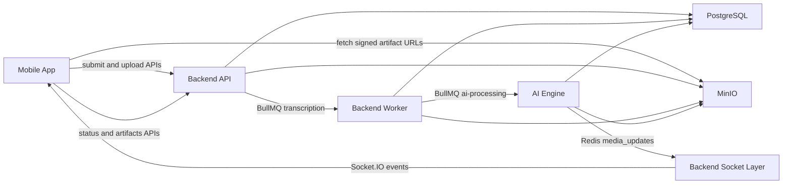
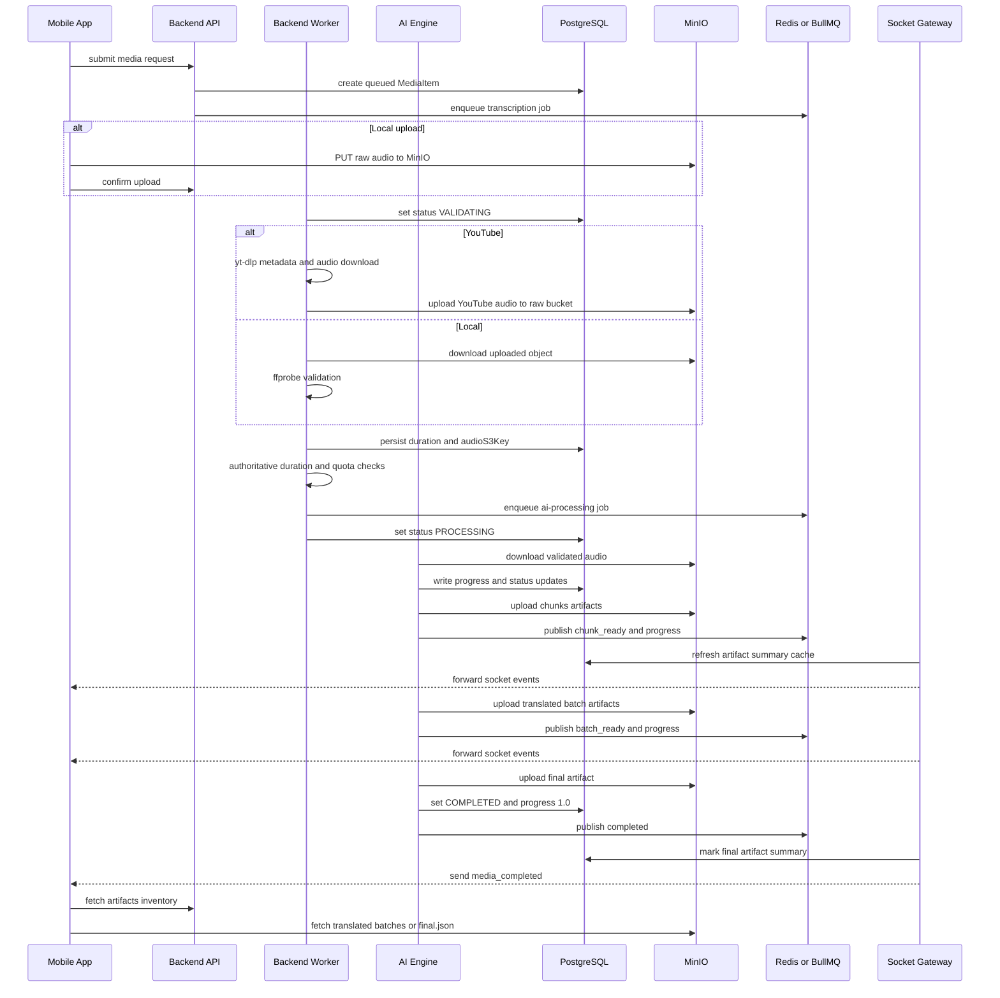
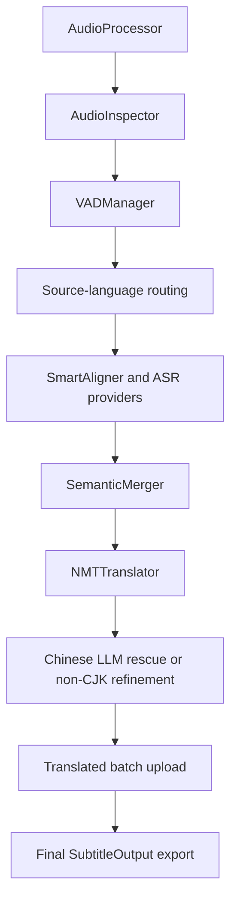
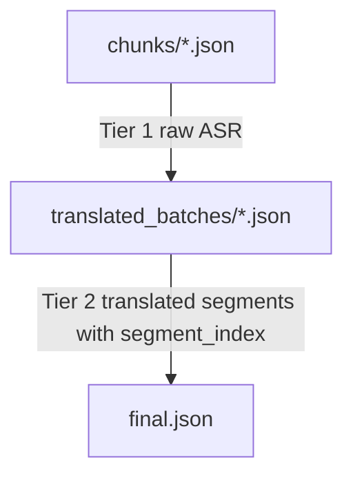
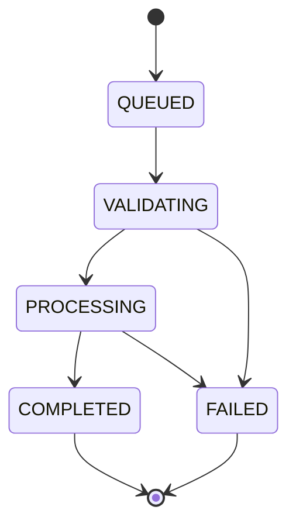

# Core Media Processing Flow

> Updated: 2026-06-08  
> Scope: luồng runtime thực tế đi qua `apps/mobile-app`, `apps/backend-api`, và `apps/ai-engine` cho media ingestion, validation, GPU processing, artifact streaming, event propagation, và player hydration.

## 1. Mục đích

Tài liệu này giải thích luồng core media-processing thực tế của dự án, từ lúc người dùng submit media cho tới lúc player phát được bilingual subtitles.

Tài liệu bám theo source code hiện tại, không chỉ dựa vào checkpoint hay contract docs.

Mục tiêu chính:

- giải thích module nào sở hữu stage nào
- chỉ ra các điểm handoff dữ liệu trong runtime
- mô tả cách các progressive artifacts (`chunks/`, `translated_batches/`, `final.json`) được tạo ra và tiêu thụ
- làm rõ cách status, progress, và socket events giữ được tính nhất quán
- ghi lại các chi tiết implementation quan trọng cho debugging và maintain

## 2. Kiến trúc tổng quan



## 3. Ownership theo từng stage

| Stage | Owner | Trách nhiệm chính |
| --- | --- | --- |
| Submit local file / YouTube URL | Mobile + Backend API | capture intent, request presigned URL, confirm upload, create `MediaItem`, enqueue job |
| Validation / ingestion | Backend Worker | verify uploaded object hoặc download YouTube audio, tính duration thật, enforce duration/quota, emit validated AI job |
| GPU subtitle pipeline | AI Engine | audio prep, inspection, VAD, ASR, semantic merge, translation, optional rescue/refinement, artifact upload |
| Durable artifact inventory | Backend API | list/sign MinIO objects và expose reconnect-safe inventory |
| Real-time updates | AI Engine + Backend Socket | publish Redis events, validate shape, update artifact summary cache, forward sang socket clients |
| Progressive playback | Mobile App | đọc status/artifacts, sau đó hydrate từ translated batches trước khi `final.json` xuất hiện |

## 4. End-to-end sequence



## 5. Stage 1: Submission và queue creation

### 5.1 Local upload flow

Mobile app dùng direct-to-MinIO upload model:

1. gọi backend để xin presigned PUT URL
2. upload file blob trực tiếp lên MinIO
3. gọi `confirm-upload` để backend tạo DB row và dispatch queue job đầu tiên

Source snippet: `apps/mobile-app/src/hooks/useMedia.ts`

```ts
const { uploadUrl, objectKey, mediaId, thumbnailUploadUrl } =
  await mediaService.getPresignedUrl(...);

await fetch(uploadUrl, {
  method: "PUT",
  body: fileBlob,
  headers: { "Content-Type": file.mimeType },
});

return mediaService.confirmUpload({
  title,
  objectKey,
  targetLanguage: defaultTargetLanguage,
  mediaId,
  hasThumbnail,
});
```

Ở backend, `requestPresignedUrl()` đã cấp trước `mediaId`, raw object key, và cả thumbnail upload URL trong processed bucket nếu source là video.

Source snippet: `apps/backend-api/src/modules/media/media.service.ts`

```ts
const mediaId = randomUUID();
const objectKey = `audio/${userId}/${mediaId}/${dto.fileName}`;

const uploadUrl = await this.minioService.generatePresignedPutUrl(objectKey);
const thumbnailKey = `${mediaId}/thumbnail.jpg`;
const thumbnailUploadUrl = await this.minioService.generatePresignedPutUrl(
  thumbnailKey,
  PRESIGNED_URL_EXPIRY_SECONDS,
  this.minioService.getProcessedBucketName(),
);
```

### 5.2 YouTube submit flow

Với YouTube, mobile app không upload lên MinIO. Nó chỉ submit metadata cho backend. Sau đó backend tạo một `MediaItem` ở trạng thái `QUEUED` với placeholder audio key, còn worker sẽ làm ingestion thật ở bước sau.

Source snippet: `apps/backend-api/src/modules/media/media.service.ts`

```ts
const placeholderKey = `audio/${userId}/${randomUUID()}/youtube-pending`;

const mediaItem = await this.prisma.mediaItem.create({
  data: {
    originType: MediaOriginType.YOUTUBE,
    originUrl: dto.url,
    audioS3Key: placeholderKey,
    status: "QUEUED",
    sourceLanguage: dto.sourceLanguage || null,
    targetLanguage,
  },
});
```

### 5.3 Dispatch queue đầu tiên

Cả local upload và YouTube đều kết thúc bằng việc dispatch một BullMQ `transcription` job.

Source snippet: `apps/backend-api/src/modules/queue/queue.service.ts`

```ts
const job = await this.transcriptionQueue.add("process", payload, {
  attempts: 3,
  backoff: { type: "exponential", delay: 5000 },
  removeOnComplete: { count: 100 },
  removeOnFail: { count: 500 },
});
```

## 6. Stage 2: Backend Worker validation

NestJS worker là trust boundary giữa raw submission và GPU processing.

Trách nhiệm của nó:

- set `MediaItem.status = VALIDATING`
- lấy được audio object thật
- tính duration authoritative
- enforce duration limits và monthly quota từ backend data
- chỉ dispatch `ai-processing` sau khi validation pass

Source snippet: `apps/backend-api/src/modules/media/workers/media.processor.ts`

```ts
await this.updateMedia(mediaId, {
  status: "VALIDATING",
  failCode: null,
  failReason: null,
});

await this.assertQuotaWithDuration(userId, durationSeconds, mediaId);

const aiPayload: AiProcessingJobPayload = {
  mediaId,
  audioS3Key,
  durationSeconds,
  userId,
  targetLanguage: job.data.targetLanguage,
  sourceLanguage: job.data.sourceLanguage,
};

await this.aiQueue.add("process", aiPayload, ...);

await this.updateMedia(mediaId, {
  status: "PROCESSING",
  failCode: null,
  failReason: null,
});
```

### 6.1 Local file validation

Local uploads được download lại từ raw bucket và verify bằng `ffprobe`.

Source snippet: `apps/backend-api/src/modules/media/workers/media.processor.ts`

```ts
await this.minioService.downloadObject(objectKey, localPath);
const probeResult = await this.probeAudioFile(localPath);
await this.assertDurationWithinLimit(userId, probeResult.durationSeconds);
```

### 6.2 YouTube validation

YouTube jobs không trust metadata từ phía client. Worker sẽ:

1. lấy title và duration bằng `yt-dlp`
2. check per-file duration limit
3. download audio vào temp folder
4. upload audio đó vào raw bucket với canonical key

Source snippet: `apps/backend-api/src/modules/media/workers/media.processor.ts`

```ts
const metadata = await this.fetchYoutubeMetadata(url);
await this.assertDurationWithinLimit(userId, metadata.durationSeconds);
const downloadResult = await this.ytDlpService.downloadAudio(
  url,
  outputTemplate,
);
const s3Key = `audio/${userId}/${mediaId}/youtube-audio.mp3`;
await this.minioService.uploadFile(s3Key, downloadResult.filePath);
```

### 6.3 Quota được enforce hai lần

Hệ thống cố ý check upload eligibility một lần ở API layer, rồi re-check lần nữa trong worker bằng duration thật.

Vì sao điều này quan trọng:

- duration từ client không được trust
- quota state ở thời điểm upload có thể đã stale
- AI engine chỉ nên nhận những job đã thực sự pass billing/processing gates

Source snippet: `apps/backend-api/src/modules/media/workers/media.processor.ts`

```ts
const usageResult = await this.prisma.mediaItem.aggregate({
  where: {
    userId,
    countedInQuota: true,
    createdAt: { gte: monthStart },
    deletedAt: null,
    id: { not: mediaId },
  },
  _sum: { durationSeconds: true },
});
```

## 7. Stage 3: AI Engine job bootstrap

Python worker consume `ai-processing` với BullMQ prefix `bilingual` và `concurrency = 1`, đúng với single-GPU design hiện tại.

Source snippet: `apps/ai-engine/src/main.py`

```py
worker = Worker(
    AI_PROCESSING_QUEUE,
    process_job,
    {
        "connection": redis_opts,
        "prefix": QUEUE_PREFIX,
        "concurrency": 1,
        "lockDuration": 600000,
        "stalledInterval": 300000,
    },
)
```

Trước mỗi job, AI engine sẽ:

- fetch lightweight media context từ PostgreSQL cho routing heuristics
- release mọi ASR/NMT residency còn sót lại từ job trước
- tạo temp working directory
- download validated audio từ raw bucket

Source snippet: `apps/ai-engine/src/main.py`

```py
media_context = fetch_media_context(media_id)
release_hybrid_residency()
minio_client.download_audio(audio_s3_key, local_audio)
subtitle_output = await run_v2_pipeline(...)
```

## 8. Stage 4: Core AI pipeline

### 8.1 Pipeline topology

`PipelineOrchestrator` chỉ là component registry; flow thực sự nằm trong `async_pipeline.py`.

Source snippet: `apps/ai-engine/src/core/pipeline.py`

```py
self.audio_processor = AudioProcessor()
self.audio_inspector = AudioInspector()
self.vad_manager = VADManager()
self.aligner = SmartAligner()
self.merger = SemanticMerger()
self.llm = LLMProvider()
```

### 8.2 Các pipeline stages



### 8.3 Audio preparation

Bước đầu tiên normalize input media thành WAV format tối ưu cho Whisper:

- `16kHz`
- mono
- `pcm_s16le`

Source snippet: `apps/ai-engine/src/utils/audio_processor.py`

```py
stream = ffmpeg.output(
    stream,
    str(output_path),
    format=self.FORMAT,
    acodec=self.CODEC,
    ar=self.SAMPLE_RATE,
    ac=self.CHANNELS,
)
```

### 8.4 Audio inspection

Pipeline classify audio thành `music` hoặc `standard` bằng multi-segment sampling, để tránh việc intro hoặc outro làm bias các file speech dài.

Source snippet: `apps/ai-engine/src/core/audio_inspector.py`

```py
if duration < 45:
    scores = self._classify_segment(classifier, str(path))
    return self._decide(scores["music"], scores["speech"], "single-segment")

for i, (position, weight) in enumerate(zip(SAMPLE_POSITIONS, SAMPLE_WEIGHTS)):
    ...
    if i > 0 and scores["speech"] > 0.3:
        return "standard"
```

### 8.5 VAD và speech segmentation

VAD chạy trên normalized audio, với một nhánh music-specific có thể isolate vocals trước khi detect speech.

Sau đó raw timestamps được greedy-merge thành các speech segments lớn hơn:

- split nếu đã đủ duration và có silence gap đủ rõ
- force split nếu merge sẽ vượt `20s`
- segment dài hơn `15s` sẽ bị mark là `SPECIAL_CASE`

Source snippet: `apps/ai-engine/src/core/vad_manager.py`

```py
raw_speech_timestamps = get_speech_timestamps(..., return_seconds=True)
segments = self._greedy_merge(raw_speech_timestamps)

if potential_duration >= 20.0:
    should_limit_split = True
should_greedy_split = (current_duration > 5.0 and gap > 0.5)
```

### 8.6 Source-language routing và translation policy

Đây là một trong những phần quan trọng nhất của kiến trúc hiện tại.

Routing signals được chọn theo thứ tự:

1. explicit config hint
2. local source-language hint từ queue payload
3. short probe bằng Whisper Turbo
4. Chinese prior được build từ media context, probe result, và local audio

Sau đó `SmartAligner` quyết định:

- dùng ASR route nào
- requested `during_asr` translation có giữ được hay không
- runtime có phải auto-downgrade sang `after_asr` hay không

Source snippet: `apps/ai-engine/src/async_pipeline.py`

```py
if configured_source_hint:
    selected_source_lang = configured_source_hint
elif local_source_hint:
    selected_source_lang = local_source_hint
elif settings.AI_SOURCE_LANGUAGE_PROBE_ENABLED:
    probe_source_lang = await asyncio.to_thread(
        pipeline.aligner.probe_source_language,
        clean_audio_path,
        segments,
    ) or ""

route_decision = pipeline.aligner.route_decision_for_language(
    selected_source_lang or None,
    requested_policy=translation_start_policy,
    route_override=route_override_zh,
)
```

`SmartAligner` giữ cho public `Sentence` / `Word` contract ổn định trong khi route sang các provider implementations khác nhau.

Source snippet: `apps/ai-engine/src/core/smart_aligner.py`

```py
return {
    "distil_whisper_en": ASRRouteConfig(...),
    "whisper_turbo": ASRRouteConfig(...),
    "whisper_full": ASRRouteConfig(...),
    "sensevoice_small": ASRRouteConfig(...),
    "paraformer_zh": ASRRouteConfig(...),
}
```

### 8.7 Chinese trust gate

Nếu hệ thống nghi ngờ audio thuộc Chinese-family path, nó có thể bật trust-gated mode:

- force `after_asr`
- chạy nhiều candidate ASR routes
- evaluate transcript ownership và cleanliness
- optional repair các bad windows từ alternate candidates
- chỉ publish public artifacts sau khi transcript được trust

Đây là lý do tại sao một số Chinese jobs chạy khác hẳn English jobs dù public contracts nhìn vẫn giống nhau.

Source snippet: `apps/ai-engine/src/async_pipeline.py`

```py
if trust_gate_active and settings.AI_CHINESE_FORCE_AFTER_ASR_ON_RECOVERY:
    effective_translation_policy = "after_asr"
    auto_policy_downgraded = True

for route_index, candidate_route in enumerate(trust_candidate_routes):
    candidate_sentences, candidate_batches, candidate_usage = await _run_candidate_asr(...)
    candidate_decision = trust_gate.evaluate(...)
    if candidate_decision.publish_ready:
        trusted_candidate_sentences = ...
        route_usage = dict(candidate_usage)
        break
```

## 9. Stage 5: Progressive streaming model

### 9.1 Producer-consumer design

Pipeline active hiện tại không phải là một linear loop đơn giản. Nó là một producer-consumer system:

- producer = `SmartAligner`
- queue = `asyncio.Queue`
- consumer = semantic batching + translation + batch upload

Source snippet: `apps/ai-engine/src/async_pipeline.py`

```py
queue_maxsize = 0 if effective_translation_policy == "after_asr" else 4
queue: asyncio.Queue[list[Sentence] | None] = asyncio.Queue(maxsize=queue_maxsize)
```

Ý nghĩa runtime:

- `during_asr`: queue có giới hạn, tạo backpressure và overlap ASR với translation
- `after_asr`: queue unbounded, để ASR finish trước rồi giải phóng GPU trước khi translation bắt đầu

### 9.2 Tier 1 chunk upload

Mỗi ASR chunk được emit sẽ được upload bền vững lên MinIO và announce ngay qua Redis.

Source snippet: `apps/ai-engine/src/async_pipeline.py`

```py
batch_data = [s.model_dump() for s in batch]
_chunk_key, chunk_url = minio_client.upload_chunk(media_id, idx, batch_data)
publish_chunk_ready(
    media_id=media_id,
    user_id=user_id,
    chunk_index=idx,
    url=chunk_url,
    sentence_count=len(batch),
)
```

Các side effects của chunk upload còn gồm:

- infer source language từ first chunk nếu cần
- update DB `source_language`
- advance progress trong khoảng `0.15 -> 0.60`

### 9.3 Translation và semantic batching

Consumer không dịch raw chunks trực tiếp.

Nó sẽ buffer theo language family:

- CJK branch có thể merge fragments và correct homophones
- non-CJK branch dùng streaming lookahead windows để chỉ commit safe prefix

Source snippet: `apps/ai-engine/src/core/semantic_merger.py`

```py
if len(sentences) <= 3 or not self.needs_merge(sentences, source_lang):
    return list(sentences[:core_size]), core_size

emitted, retain_from = merger.process_stream_window(
    buf,
    source_lang=src,
    context_style=context_style,
    core_size=core_size,
)
```

### 9.4 Translation branch selection

Translation behavior phụ thuộc source language và config:

- nếu `src == tgt`, translation bị skip và original text được reuse
- nếu `src in {"zh", "yue"}`, pipeline có thể dùng Chinese batch LLM rescue path
- nếu không thì NMT làm base translation
- optional LLM refinement sau đó chỉ chạy cho non-Chinese source paths

Source snippet: `apps/ai-engine/src/async_pipeline.py`

```py
if src == tgt:
    nmt_translations = list(texts)
elif src in {"zh", "yue"} and settings.AI_CHINESE_LLM_RESCUE_ENABLED:
    llm_rescue_result = chinese_llm_translator.translate_batch(...)
else:
    nmt_translations = _translate_with_nmt(texts)
```

Base translation engine:

Source snippet: `apps/ai-engine/src/core/nmt_translator.py`

```py
results = self.translator.translate_batch(
    tokenized,
    target_prefix=target_prefix,
    beam_size=settings.NMT_BEAM_SIZE,
)
assert len(results) == len(texts)
```

### 9.5 Tier 2 translated batch upload

Translated batches được serialize thành `TranslatedBatch { batch_index, first_segment_index, segments }`.

Source snippet: `apps/ai-engine/src/async_pipeline.py`

```py
tb = TranslatedBatch(
    batch_index=current_batch_index,
    first_segment_index=batch_start_index,
    segments=sentences,
)
_batch_key, batch_url = await asyncio.to_thread(
    minio_client.upload_translated_batch, media_id, tb
)
publish_batch_ready(..., progress=progress)
```

Chính các uploads này làm cho mobile player có thể mở trước khi toàn bộ media item hoàn tất.

## 10. Stage 6: Final export

Sau khi toàn bộ sentences được accumulate:

- source language được finalize
- Chinese pinyin có thể được apply lại
- progress chuyển sang `EXPORTING`
- `SubtitleOutput` được trả về cho `main.py`

Source snippet: `apps/ai-engine/src/async_pipeline.py`

```py
return SubtitleOutput(
    metadata=SubtitleMetadata(
        duration=duration_seconds,
        engine_profile=settings.AI_PERF_MODE.value,
        source_lang=detected_source_lang,
        target_lang=target_lang,
        model_used=model_used,
    ),
    segments=all_sentences,
)
```

Sau đó `main.py` upload `final.json`, mark DB row là completed, emit `completed`, và đánh dấu quota usage đã được tính.

Source snippet: `apps/ai-engine/src/main.py`

```py
transcript_key, final_url = minio_client.upload_final_result(media_id, subtitle_output)

update_media_status(
    media_id,
    user_id=user_id,
    status="COMPLETED",
    progress=1.0,
    transcript_s3_key=transcript_key,
    clear_step=True,
)
publish_completed(..., final_url=final_url, s3_key=transcript_key)
mark_quota_counted(media_id)
```

## 11. Stage 7: Progress, status, và event discipline

### 11.1 Server-side monotonicity

AI engine ngăn progress rollback trong memory, còn DB writes dùng `GREATEST(...)` để chặn persisted regression.

Source snippets:

`apps/ai-engine/src/async_pipeline.py`

```py
effective_progress = max(last_progress, progress)
effective_step = current_step if incoming_rank >= last_rank else str(last_step)
```

`apps/ai-engine/src/db.py`

```py
set_clauses.append("progress = GREATEST(COALESCE(progress, 0), %s)")
```

### 11.2 Event publishing

AI Engine publish 5 event types lên Redis channel `media_updates`:

- `progress`
- `chunk_ready`
- `batch_ready`
- `completed`
- `failed`

Source snippet: `apps/ai-engine/src/events.py`

```py
redis_client.publish(
    "media_updates",
    json.dumps({
        "type": "batch_ready",
        "mediaId": media_id,
        "userId": user_id,
        "batchIndex": batch_index,
        "url": url,
        "segmentCount": segment_count,
        "progress": progress,
    }),
)
```

### 11.3 Backend socket mirroring và artifact summary cache

Backend không chỉ forward events một cách mù quáng.

Nó còn maintain một DB-side artifact summary cache khi events đi qua:

- `chunk_ready` -> tăng chunk summary
- `batch_ready` -> tăng translated batch summary
- `completed` -> mark final artifact key

Source snippet: `apps/backend-api/src/modules/socket/socket.service.ts`

```ts
switch (event.type) {
  case "chunk_ready":
    await this.mediaService.recordChunkArtifact(
      event.mediaId,
      event.chunkIndex,
    );
    break;
  case "batch_ready":
    await this.mediaService.recordTranslatedBatchArtifact(
      event.mediaId,
      event.batchIndex,
    );
    break;
  case "completed":
    await this.mediaService.recordFinalArtifact(
      event.mediaId,
      event.transcriptS3Key,
    );
    break;
}
```

Điểm này quan trọng vì mobile app đọc artifact readiness từ backend-owned inventory, không tự reconstruct MinIO state ở phía client.

## 12. Stage 8: Mobile processing UX và player hydration

### 12.1 Socket-first processing screen

Mobile app fetch status/artifacts một lần, sau đó dựa vào socket updates để patch TanStack Query caches.

Source snippet: `apps/mobile-app/src/hooks/useSocketSync.ts`

```ts
const patch: Partial<MediaItem> = {
  status: "PROCESSING",
  progress: event.progress,
  currentStep: event.currentStep as MediaPipelineStage,
  estimatedTimeRemaining: event.estimatedTimeRemaining,
  sourceLanguage: event.sourceLanguage ?? currentStatus?.sourceLanguage,
};
patchStatus(event.mediaId, patch);
patchList(event.mediaId, patch);
```

Với `media_completed`, mobile cache được update ngay, rồi background refetch mới kéo thêm các server fields còn lại nếu có.

### 12.2 Progressive subtitle preview ở processing screen

Processing screen có thể hiển thị subtitle preview sớm bằng cách merge Tier 1 chunks với Tier 2 translated batches.

Source snippet: `apps/mobile-app/src/hooks/useProcessingSubtitles.ts`

```ts
const base: Sentence[] = (chunkQuery.data ?? []).map(normalizeSentence);
const translated: Sentence[] = (batchQuery.data ?? []).map(normalizeSentence);

return base.slice(0, limit).map((sentence, i) => {
  const lookupKey = sentence.segment_index ?? i;
  const t = translationMap.get(lookupKey);
  if (t) {
    return {
      ...sentence,
      translation: t.translation,
      phonetic: t.phonetic,
    };
  }
  return sentence;
});
```

### 12.3 Player hydration trước khi complete

Player ưu tiên `final.json` nếu đã có. Nếu chưa có, nó sẽ load toàn bộ translated batches, sort theo `segment_index`, rồi tính `readyUntilSec`.

Source snippet: `apps/mobile-app/src/hooks/usePlayerSubtitles.ts`

```ts
if (finalQuery.data) {
  return {
    metadata: finalQuery.data.metadata,
    segments: finalQuery.data.segments,
    isFinal: true,
  };
}

const segmentsByIndex = new Map<number, Sentence>();
for (const batch of translatedBatches) {
  const payload = await fetchArtifactJson<TranslatedBatch>(batch.url);
  for (const segment of payload.segments.map(normalizeSentence)) {
    if (segment.segment_index != null) {
      segmentsByIndex.set(segment.segment_index, segment);
    }
  }
}
```

Player sau đó gate việc scrub theo available coverage:

```ts
return timeSec <= session.readyUntilSec + 0.05;
```

Đây là lý do playback một phần vẫn hoạt động mà không cần chờ toàn bộ media item hoàn tất.

## 13. Artifact contract trong runtime thực tế



### 13.1 Tier 1 `chunks/`

- được upload dưới dạng arrays của `Sentence`
- có thể chưa có canonical `segment_index`
- chủ yếu phục vụ progressive readiness và preview sớm

### 13.2 Tier 2 `translated_batches/`

- durable append-only progressive playback artifacts
- mỗi segment ở đây nên đã có canonical `segment_index`
- được player dùng trực tiếp trước final export

### 13.3 `final.json`

- canonical completed artifact
- chứa `metadata` và ordered `segments`

Source snippet: `apps/ai-engine/src/schemas.py`

```py
class SubtitleOutput(BaseModel):
    metadata: SubtitleMetadata
    segments: List[Sentence]

class TranslatedBatch(BaseModel):
    batch_index: int
    first_segment_index: int
    segments: List[Sentence]
```

## 14. Runtime state machine



Điểm cần lưu ý:

- `PROCESSING` đã có thể cung cấp output hữu dụng vì translated batches có thể xuất hiện trước completion
- `FAILED` có thể xảy ra ở worker validation hoặc ở AI pipeline
- `currentStep` chỉ thực sự có ý nghĩa khi job còn đang live

## 15. Các ghi chú debugging quan trọng

### 15.1 Có hai async boundaries riêng biệt

Không nên gộp chúng lại trong đầu:

1. `transcription` queue = validation và ingestion worker
2. `ai-processing` queue = GPU subtitle worker

Rất nhiều bugs chỉ tồn tại ở một trong hai phase này.

### 15.2 Progress correctness được enforce ở ba lớp

Hệ thống chặn regressions ở ba nơi:

- AI in-memory `_reserve_progress()`
- DB `GREATEST(progress, incoming)`
- mobile `mergeLivePatch()` để từ chối progress thấp hơn hoặc stage sớm hơn

### 15.3 Backend artifact readiness là event-driven, không phải polling-derived

Mobile app có refetch artifact inventory, nhưng readiness summary authoritative được update ở backend khi Redis events đi qua. Vì vậy, nếu `chunk_ready`, `batch_ready`, hoặc `completed` bị thiếu hay malformed, readiness UX có thể hỏng dù file trong MinIO đã tồn tại.

### 15.4 Chinese jobs không chỉ là “cùng pipeline nhưng đổi ngôn ngữ”

Chinese-family paths có thể:

- bias route selection
- activate trust gate
- force `after_asr`
- chạy candidate-route recovery
- chạy LLM rescue
- chạy forced alignment và word regrouping

Đây là một operational mode riêng nằm bên trong cùng public pipeline.

### 15.5 Contract drift cần lưu ý

Runtime queue payloads hiện tại có optional `sourceLanguage` trong cả:

- `TranscriptionJobPayload`
- `AiProcessingJobPayload`

Behavior này có trong code ở `apps/backend-api/src/modules/queue/queue.types.ts` và đang được AI engine consume, dù phần queue sections trong `CONTRACTS.md` ở root hiện chưa phản ánh đầy đủ.

Khi debug hoặc làm future contract cleanup, nên coi code là live behavior.

## 16. File index

Các file chính của flow này:

- `apps/mobile-app/src/hooks/useMedia.ts`
- `apps/mobile-app/src/hooks/useSocketSync.ts`
- `apps/mobile-app/src/hooks/useProcessingSubtitles.ts`
- `apps/mobile-app/src/hooks/usePlayerSubtitles.ts`
- `apps/backend-api/src/modules/media/media.service.ts`
- `apps/backend-api/src/modules/media/workers/media.processor.ts`
- `apps/backend-api/src/modules/queue/queue.service.ts`
- `apps/backend-api/src/modules/minio/minio.service.ts`
- `apps/backend-api/src/modules/socket/socket.service.ts`
- `apps/ai-engine/src/main.py`
- `apps/ai-engine/src/async_pipeline.py`
- `apps/ai-engine/src/db.py`
- `apps/ai-engine/src/events.py`
- `apps/ai-engine/src/minio_client.py`
- `apps/ai-engine/src/core/smart_aligner.py`
- `apps/ai-engine/src/core/semantic_merger.py`
- `apps/ai-engine/src/core/nmt_translator.py`

