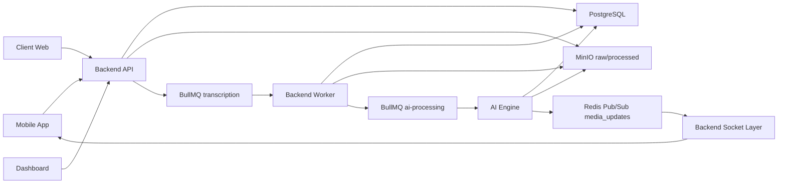
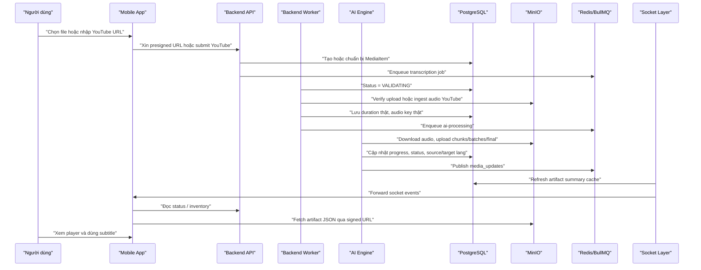

# Tài liệu kỹ thuật chi tiết hệ thống hiện tại

## 1. Mục đích và phạm vi

Tài liệu này mô tả **toàn bộ hệ thống đang có trong mã nguồn hiện tại** của dự án `billingual_project`. Mục tiêu của tài liệu không phải là cô đọng để lên slide, mà là giải thích rõ:

- hệ thống gồm những thành phần nào
- mỗi thành phần sở hữu trách nhiệm gì
- dữ liệu đi qua các lớp ra sao
- những logic vận hành quan trọng đang được implement như thế nào
- các giới hạn thực tế của hệ thống hiện tại là gì

Tài liệu này bám theo source code hiện tại trong repo, đặc biệt là:

- `apps/backend-api`
- `apps/ai-engine`
- `apps/mobile-app`
- `apps/dashboard`
- `apps/client-web`
- `packages/contracts`
- `apps/backend-api/prisma/schema.prisma`

Nguyên tắc trình bày của tài liệu:

1. Chỉ mô tả những gì đang thấy trong code hiện tại.
2. Không giả định tính năng chưa implement.
3. Không overclaim đây là live simultaneous interpreting.
4. Không claim hệ thống có huấn luyện hoặc fine-tuning mô hình mới.
5. Ưu tiên giải thích logic và luồng dữ liệu hơn là phân tích chi tiết từng code block.

## 2. Cách đọc tài liệu này

Tài liệu được tổ chức theo kiểu `Hybrid`.

- Phần đầu mô tả **bản đồ hệ thống** và **luồng runtime end-to-end** để người đọc có khung tổng thể.
- Phần giữa đi sâu vào **từng module** và **các mặt cắt kỹ thuật xuyên suốt** như auth, quota, queue, artifact, socket, player, billing.
- Phần cuối tách riêng **giới hạn hiện tại**, **các điểm cần nói đúng khi bảo vệ**, và **danh sách code path quan trọng** để tra cứu.

Vì vậy, nếu mục tiêu là hiểu nhanh hệ thống, có thể đọc từ Mục 3 đến Mục 7 trước. Nếu mục tiêu là chuẩn bị bảo vệ hoặc phản biện kỹ thuật, nên đọc thêm các mục về AI pipeline, artifact, realtime sync, client playback, billing và admin plane.

## 3. Hệ thống này thực chất là gì

Ở trạng thái hiện tại, `billingual_project` là một **nền tảng subtitle song ngữ kiểu SaaS**, trong đó bài toán cốt lõi là:

1. tiếp nhận media từ người dùng hoặc từ YouTube
2. kiểm tra quyền sử dụng và ràng buộc quota
3. xử lý audio qua pipeline Machine Learning
4. sinh phụ đề song ngữ theo hướng **tiến dần**
5. cho phép người dùng theo dõi tiến độ, mở player, tra từ, dùng AI Explain và quản lý subscription
6. cho phép admin quan sát hoạt động của hệ thống qua dashboard

Điều quan trọng là dự án này không chỉ là một “script AI” hay một “model demo”. Đây là một hệ thống phần mềm đa thành phần gồm:

- client mobile cho người dùng cuối
- backend HTTP và worker orchestration
- AI Engine chạy queue GPU
- object storage cho raw và processed artifacts
- database cho trạng thái, subscription, usage, chat, vocabulary
- realtime channel để cập nhật tiến độ
- web surface cho billing/account
- admin dashboard cho vận hành

Nếu phải mô tả rất ngắn trong một câu:

> Đây là một hệ thống phần mềm end-to-end để tạo và tiêu thụ phụ đề song ngữ cho video/audio, trong đó ML là một phần quan trọng của pipeline, nhưng giá trị của hệ thống nằm ở tích hợp, điều phối, lưu trữ bền, realtime feedback và trải nghiệm người dùng.

## 4. Bản đồ toàn hệ thống

## 4.1. Các bề mặt ứng dụng

Hiện tại repo có các application surfaces sau:

| Bề mặt | Vai trò |
| --- | --- |
| `apps/mobile-app` | Ứng dụng người dùng cuối trên Expo/React Native: auth, upload, library, processing, player, lookup, explain, word bank, subscription screen |
| `apps/backend-api` | HTTP API chính và NestJS worker validation/orchestration; sở hữu auth, media APIs, quota/subscription, admin APIs, billing APIs, chat/lookup APIs |
| `apps/ai-engine` | Python worker tiêu thụ queue `ai-processing`, chạy pipeline subtitle ML, upload artifacts, cập nhật trạng thái vào PostgreSQL, phát event qua Redis |
| `apps/dashboard` | Admin-only web control plane: overview, users, plans, AI Explain analytics, queue/failure/finalization monitoring |
| `apps/client-web` | Web surface cho marketing, pricing, account/subscription và mobile-to-web billing handoff |

Ngoài các app trên, repo còn có một package dùng chung:

| Package | Vai trò |
| --- | --- |
| `packages/contracts` | TypeScript contract authority cho các DTO và output shapes dùng chung giữa backend, mobile, dashboard, client-web |

## 4.2. Các lớp hạ tầng

Hệ thống dựa vào các dịch vụ hạ tầng sau:

| Thành phần | Vai trò |
| --- | --- |
| PostgreSQL | lưu user, refresh token, OTP, subscription, usage, media items, vocabulary, chat sessions, AI usage logs |
| Redis | vừa làm backend cho BullMQ, vừa làm Pub/Sub cho media updates, vừa lưu transient state như mobile-web handoff token và một số rate-limit/caching keys |
| BullMQ | queue orchestration giữa backend worker và AI Engine |
| MinIO | object storage cho raw uploads, YouTube audio đã ingest, artifacts xử lý tiến dần và final output |
| Socket.IO | backend mirror Redis events sang realtime client updates |

## 4.3. Quan hệ tổng thể giữa các thành phần

Sơ đồ này cho thấy ba điều cốt lõi:

1. **Backend API là cổng vào duy nhất của mọi client surface**. Mobile, dashboard và client-web không giao tiếp trực tiếp với AI Engine, MinIO nội bộ hay Redis.
2. **AI Engine không phải HTTP service**. Nó là queue-driven worker.
3. **Artifact và status được lưu bền**, còn socket chỉ là kênh cập nhật thời gian tiến dần.

## 5. Những khái niệm miền dữ liệu quan trọng

Để hiểu luồng hệ thống, cần chốt một số entity cốt lõi trong schema.

## 5.1. User, session và xác thực

Các entity chính:

- `User`
- `RefreshToken`
- `Otp`

Hệ thống đang dùng:

- access token để gọi API
- refresh token để lấy access token mới
- OTP cho registration verification và password reset

Điều này cho thấy auth flow của hệ thống không phải mock hay local-only. Nó là auth nhiều bước có persistence ở backend.

## 5.2. Subscription và quota

Các entity chính:

- `SubscriptionPlan`
- `PlanVariant`
- `Subscription`
- `UsageHistory`

Mô hình triển khai hiện tại là:

- plan/variant định nghĩa các giới hạn kinh doanh
- subscription ghi snapshot quota/price tại thời điểm cấp quyền
- media usage được tính theo duration đã xử lý
- mỗi user có thể có `currentSubscription`

Ý nghĩa kỹ thuật:

- các quyết định quota không phải đọc trực tiếp từ catalog hiện tại
- hệ thống dùng snapshot-based model để giữ auditability

## 5.3. MediaItem là entity trung tâm của pipeline

`MediaItem` là bản ghi trung tâm của toàn bộ hệ thống xử lý media.

Nó lưu:

- `originType`: LOCAL hoặc YOUTUBE
- `originUrl`: URL nguồn nếu là YouTube
- `sourceLanguage`, `targetLanguage`
- `audioS3Key`
- `durationSeconds`
- `status`
- `progress`
- `artifactSummary`
- `currentStep`
- `estimatedTimeRemaining`
- `failCode`, `failReason`
- `countedInQuota`
- `youtubeVideoId`
- `hasThumbnail`

`MediaItem` vừa là:

- đầu mối orchestration giữa backend worker và AI Engine
- nguồn truth cho status API
- điểm neo để gắn vocabulary, chat, AI usage logs

## 5.4. Vocabulary, Explain và AI assist data

Hệ thống hiện tại không chỉ sinh subtitle. Nó còn có lớp hỗ trợ học/ngữ nghĩa ngay trong player.

Các entity liên quan:

- `Vocabulary`
- `UserVocabulary`
- `ChatSession`
- `ChatMessage`
- `ChatFeedback`
- `AiCreditReservation`
- `AiUsageLog`

Điều này cho thấy player hiện tại không phải player “thụ động”. Nó đã được thiết kế thành bề mặt tương tác:

- người dùng có thể tra từ trên subtitle
- lưu từ vào word bank
- mở Explain cho một segment
- backend ghi nhận usage và feedback cho các request AI assist

## 5.5. Artifact output là domain object, không chỉ là file tạm

Hệ thống có ba lớp artifact chính:

- `chunks/`
- `translated_batches/`
- `final.json`

Chúng không chỉ là log file phụ, mà là một phần của contract runtime:

- mobile processing UI cần chúng
- player dùng chúng để hydrate subtitle
- benchmark exporter dùng chúng để đánh giá
- backend inventory API và artifactSummary cache dựa trên chúng

## 6. Bao ngoài hệ thống: auth, session, subscription và billing

Trước khi đi vào media pipeline, cần hiểu lớp “bao ngoài” điều khiển quyền truy cập và entitlement.

## 6.1. Auth flow backend

`apps/backend-api/src/modules/auth/auth.controller.ts` cho thấy backend hiện có các nhóm endpoint:

- `POST /auth/register`
- `POST /auth/resend-registration-otp`
- `POST /auth/verify`
- `POST /auth/login`
- `POST /auth/refresh`
- `POST /auth/logout`
- `POST /auth/forgot-password`
- `POST /auth/resend-forgot-password-otp`
- `POST /auth/reset-password`

Điều này cho thấy luồng auth của hệ thống bao gồm:

1. đăng ký tài khoản bằng email/password
2. xác thực OTP trước khi hoàn tất registration
3. đăng nhập
4. refresh access token
5. quên mật khẩu và reset mật khẩu bằng OTP

Ngoài auth tiêu chuẩn, backend còn có:

- `POST /auth/mobile-web-handoff`
- `POST /auth/mobile-web-handoff/consume`

để phục vụ luồng billing từ mobile sang web.

## 6.2. Mobile và web không quản auth giống nhau, nhưng chung backend contract

### Mobile App

Mobile dùng:

- secure/local token storage
- Axios interceptor để tự gắn `Authorization`
- single refresh flow khi gặp `401`
- `X-Device-Info` / `User-Agent` custom để backend ghi nhận thiết bị

### Dashboard

Dashboard cũng có single-flight refresh logic, nhưng là admin web surface.

### Client Web

Client-web dùng auth storage riêng và refresh flow web-oriented để support account/pricing/billing pages.

Điểm quan trọng:

- các bề mặt client khác nhau dùng implementation client-side khác nhau
- nhưng đều bám cùng backend auth contract

## 6.3. Subscription status là nguồn quyết định quyền upload

`GET /user/subscription-status` trả về:

- current plan
- quota used / total / remaining
- max duration per file
- window thời gian quota
- upload blocker code
- available plans
- AI credits

Service `UserSubscriptionStatusService` hiện đang:

1. đọc current subscription của user
2. tính used seconds trong tháng hiện tại từ `MediaItem` đã được `countedInQuota`
3. chuẩn hóa các giá trị unlimited
4. xác định `uploadBlockerCode`

`uploadBlockerCode` hiện có thể là:

- `none`
- `subscriptionInactive`
- `quotaExceeded`

Điều này rất quan trọng vì upload gating của hệ thống không chỉ kiểm tra ở UI. Nó còn được enforce ở backend.

## 6.4. Billing hiện là web-centric, mobile chỉ handoff

Một mặt cắt rất đáng chú ý của hệ thống hiện tại là billing flow.

### Mobile side

Mobile subscription screen không tự mở Stripe trực tiếp. Nó gọi:

- `POST /auth/mobile-web-handoff`

Backend sinh:

- một token dùng một lần
- lưu token đó trong Redis với TTL `120 giây`
- trả về `handoffUrl` trỏ sang `CLIENT_WEB_BASE_URL/handoff?...`

Sau đó mobile mở web session bằng `expo-web-browser`.

### Client Web side

`apps/client-web` có route `/handoff`.

Trang này:

1. đọc token từ query string
2. gọi `POST /auth/mobile-web-handoff/consume`
3. backend consume token một lần, sinh access/refresh token cho user đó
4. client-web lưu session
5. chuyển hướng người dùng sang `/pricing` hoặc `/account/subscription`

### Billing pages

Client-web hiện có:

- pricing page
- account page
- subscription page
- billing success/cancel pages

### Backend billing endpoints

Backend cung cấp:

- `GET /billing/catalog`
- `GET /billing/status`
- `POST /billing/checkout-session`
- `GET /billing/checkout-sessions/:sessionId`
- `POST /billing/customer-portal-session`

Nói ngắn gọn:

- mobile là nơi khởi tạo ý định nâng cấp
- web là nơi hiện checkout/account billing experience
- backend giữ mọi logic catalog, session creation và portal access

## 7. Luồng runtime end-to-end của media system

Đây là phần trung tâm của hệ thống.

## 7.1. Tại sao pipeline được tách thành nhiều lớp

Hệ thống không xử lý media ngay trong request HTTP vì:

- tác vụ nặng
- thời gian dài
- có bước validate riêng trước AI
- cần retry và tách biệt trách nhiệm
- cần cập nhật tiến độ cho client theo thời gian

Do đó hệ thống được tách thành:

1. API nhận intent
2. Worker validate và ingest
3. AI Engine xử lý subtitle
4. Storage và DB giữ trạng thái bền
5. Socket mirror để phản hồi realtime

## 7.2. Luồng local upload

Luồng local upload thực tế hiện tại là:

1. Mobile mở media picker từ upload sheet.
2. Mobile lấy thông tin file từ device library.
3. Mobile kiểm tra blocker/quota cơ bản qua subscription status.
4. Mobile gọi `POST /media/presigned-url`.
5. Backend kiểm tra upload entitlement và trả về:
   - `uploadUrl`
   - `objectKey`
   - `mediaId`
   - `thumbnailUploadUrl`
6. Mobile upload file blob trực tiếp lên MinIO raw bucket.
7. Nếu file là video, mobile cố gắng capture thumbnail đầu tiên và upload thumbnail riêng sang processed bucket.
8. Mobile gọi `POST /media/confirm-upload`.
9. Backend tạo `MediaItem`, khởi tạo `artifactSummary`, đặt status `QUEUED`, rồi dispatch `transcription` job.
10. Backend Worker nhận job, chuyển sang `VALIDATING`, đo duration thật, re-check quota bằng duration thật, rồi dispatch tiếp sang `ai-processing`.
11. AI Engine xử lý audio, sinh artifacts, cập nhật trạng thái, phát sự kiện.
12. Mobile có thể theo dõi progress trên processing screen và mở player khi đã có dữ liệu đủ.

## 7.3. Một điểm quan trọng về local video upload

Source code hiện tại trong `useUploadMedia()` cho thấy:

- mobile **không thực hiện client-side audio extraction hoàn chỉnh trước upload**
- nó upload chính file được chọn lên MinIO
- nếu là video thì chỉ đổi mime hint cho bước xin presigned URL và tạo thumbnail

Điều này khác với một số mô tả sản phẩm mức cao cũ. Vì tài liệu này bám code hiện tại, cách diễn đạt đúng là:

> local upload hiện nhận cả audio và video từ device library, upload blob đã chọn lên MinIO, còn phần audio normalization/processing được xử lý ở downstream pipeline.

## 7.4. Luồng YouTube

Luồng YouTube có khác biệt rõ:

1. Mobile không upload file.
2. Mobile gọi `POST /media/youtube` với:
   - `url`
   - `title?`
   - `sourceLanguage?`
   - `targetLanguage?`
3. Backend tạo `MediaItem` với:
   - `originType = YOUTUBE`
   - `originUrl = dto.url`
   - `audioS3Key` placeholder
   - `status = QUEUED`
4. Backend dispatch `transcription` job.
5. Backend Worker dùng `yt-dlp` và metadata extraction để:
   - lấy title
   - lấy duration
   - check duration limit
   - tải audio YouTube về temp
   - upload audio chuẩn hóa sang raw bucket theo canonical key
6. Sau bước này, flow hội tụ với local upload:
   - update DB
   - re-check quota
   - enqueue AI processing
   - AI Engine chạy pipeline subtitle

## 7.5. Mermaid end-to-end

## 8. Phân tích sâu từng module

## 8.1. Mobile App

Mobile app là bề mặt chính mà người dùng cuối nhìn thấy. Vai trò của nó rộng hơn một “uploader”.

### 8.1.1. Vai trò tổng quát

Mobile app sở hữu:

- auth/session UX
- library
- upload flow
- processing progress UI
- player
- lookup/explain/word bank
- subscription screen
- app theme/i18n/onboarding

### 8.1.2. Điều hướng chính

Tab layout hiện tại có 3 tab hiển thị chính:

- library
- upload FAB
- settings

Ngoài ra còn có hidden routes:

- `processing`
- `player`
- `media-picker`
- `subscription`
- `word-bank`
- `onboarding`

Điều này phản ánh một quyết định UX rõ ràng:

- upload không phải là một “screen tab” đúng nghĩa
- upload tab được chặn điều hướng và mở bottom sheet như một action entrypoint

### 8.1.3. Upload UX

Upload flow hiện tại gồm:

- upload sheet
- device media picker
- YouTube modal

Mobile chủ động kiểm tra blocker và duration limit trước khi upload, nhưng backend vẫn là nơi enforce authoritative check sau cùng.

### 8.1.4. Library và status hydration

Mobile dùng TanStack Query để cache:

- media library
- status từng media
- artifact inventory

Khi upload hoặc submit xong:

- app upsert một queued item vào library cache
- sau đó status và socket events tiếp tục làm mới dữ liệu

### 8.1.5. Processing screen

Processing screen không đơn giản chỉ hiển thị spinner.

Nó dùng:

- media status
- artifact inventory
- processing subtitle preview

Một điểm quan trọng là processing screen có thể cho phép người dùng đi sang player **trước khi final hoàn tất**, nếu đã có translated output.

### 8.1.6. Player

Player là một trong những phần phức tạp nhất ở phía client.

Player hiện hỗ trợ:

- audio/video playback
- subtitle source layer
- translation layer
- phonetic layer
- karaoke timing từ `words`
- loop sentence
- speed control
- lookup word
- AI Explain

### 8.1.7. Playback source logic

`usePlaybackSource()` cho thấy player không lấy source theo một cách duy nhất.

Nếu `originType = LOCAL`:

- ưu tiên đọc từ `localMediaVault`

Nếu `originType = YOUTUBE`:

- gọi backend `/media/:id/stream-url`
- backend trả `videoUrl`, `audioUrl`, title, duration, thumbnail

Điều này cho thấy player được thiết kế để phân biệt:

- local-origin playback
- cloud-origin playback

### 8.1.8. Một caveat hiện tại của local playback

Repo hiện có `localMediaVault`, nhưng search trong source hiện tại không cho thấy upload path đang lưu media đã chọn vào vault.

Nghĩa là:

- abstraction cho local vault đã tồn tại
- `usePlaybackSource()` đã biết cách đọc vault
- nhưng upload flow hiện tại chưa thấy chỗ populate vault

Vì vậy khi mô tả hệ thống hiện tại, nên nói đúng:

> mobile đã có cấu trúc cho local-origin playback persistence, nhưng phần wiring để lưu file vào local vault trong upload path hiện chưa thấy xuất hiện trong source được rà soát.

### 8.1.9. Lookup, Explain và Word Bank

Player hiện không dừng ở việc hiển thị subtitle.

Người dùng có thể:

- chạm vào word để lookup
- lưu word vào word bank
- mở Explain cho một segment

Phía mobile có:

- `LookupCardOverlay`
- `ExplainBottomSheet`
- `useVocabularyLookup`
- `useExplainStream`
- màn `word-bank`

Điều này làm hệ thống nghiêng về một product experience kiểu “xem + hiểu + học”, không chỉ là subtitle viewer thuần túy.

### 8.1.10. Subscription screen

Mobile có route `/(app)/subscription`, hiện dùng để:

- hiển thị current plan
- hiển thị quota và AI credits
- hiển thị available plans
- mở luồng billing handoff sang web

## 8.2. Backend API

Backend API là lớp điều phối trung tâm cho mọi surface còn lại.

### 8.2.1. Những gì backend sở hữu

Backend sở hữu:

- authentication
- refresh token lifecycle
- OTP lifecycle
- mobile-web handoff
- media APIs
- subscription status
- billing APIs
- admin APIs
- lookup/explain/vocabulary APIs
- presigned URL negotiation
- artifact inventory
- worker dispatch

Điểm cần nhấn mạnh:

- backend **không** trực tiếp chạy pipeline subtitle ML
- backend **có** vai trò quyết định trong orchestration, entitlement, validation và API contract

### 8.2.2. Media API

Các endpoint media chính hiện có:

- `POST /media/presigned-url`
- `POST /media/confirm-upload`
- `POST /media/youtube`
- `GET /media/:id/artifacts`
- `GET /media/:id/stream-url`
- `GET /media/:id/download-url`
- `GET /media/:id/status`
- `GET /media`

Điểm thiết kế quan trọng:

- raw file upload đi trực tiếp lên MinIO, không qua body upload vào NestJS
- backend chỉ cấp phép, xác nhận và orchestrate

### 8.2.3. Artifact inventory là một API hạng nhất

`GET /media/:id/artifacts` có vai trò rất quan trọng.

Nó:

- liệt kê artifacts hiện có trên processed bucket
- ký presigned GET URL cho từng artifact
- trả về `summary` gồm:
  - `chunkCount`
  - `translatedBatchCount`
  - `hasFinal`
  - `latestChunkIndex`
  - `latestBatchIndex`
  - `finalObjectKey`

Điều này biến backend thành lớp “reconnect-safe inventory service”. Socket chỉ là kênh cập nhật nhanh; inventory API mới là cách client phục hồi trạng thái bền.

### 8.2.4. Status API

`GET /media/:id/status` là API đọc trạng thái nhẹ của một media item.

Nó trả về:

- status
- progress
- currentStep
- estimatedTimeRemaining
- failCode / failReason
- sourceLanguage / targetLanguage
- artifact summary
- thumbnail

Điểm đáng chú ý:

- backend giữ `artifactSummary` trong DB để hot-read path nhanh hơn
- nhưng khi cần chi tiết artifact thật, client vẫn dùng inventory API

### 8.2.5. Stream URL và download URL

Backend tách hai use case:

- `download-url` cho final processed artifact
- `stream-url` cho playback source, đặc biệt là YouTube-origin items

Điều này giúp player không phải tự biết cách xây MinIO key hay resolve playback source.

## 8.3. Backend Worker

Backend Worker là một lớp rất quan trọng nhưng dễ bị bỏ qua nếu chỉ nhìn API và AI Engine.

### 8.3.1. Vai trò của worker

Worker NestJS tiêu thụ queue `transcription` và làm nhiệm vụ:

- chuyển status sang `VALIDATING`
- kiểm tra object/raw source có hợp lệ không
- đo duration thật
- re-check quota bằng duration thật
- ingest YouTube audio vào raw bucket
- chỉ khi pass hết mới enqueue `ai-processing`

Điều này biến worker thành **trust boundary** giữa user submission và AI job GPU.

### 8.3.2. Tại sao cần bước này

Nếu bỏ worker này đi, backend sẽ phải chọn một trong hai cách không tốt:

- hoặc trust toàn bộ metadata client gửi lên
- hoặc đẩy mọi thứ thẳng sang AI Engine rồi mới phát hiện lỗi

Thiết kế hiện tại tốt hơn vì:

- reject sớm các case duration/quota không hợp lệ
- không tốn GPU cho input không đạt điều kiện
- chuẩn hóa hai đường vào LOCAL và YOUTUBE trước khi vào AI Engine

### 8.3.3. Local validation path

Với `originType = LOCAL`, worker:

1. download object từ MinIO raw bucket
2. dùng `ffprobe` để lấy duration
3. enforce duration limit
4. enforce quota theo duration thật
5. cập nhật DB
6. enqueue `ai-processing`

### 8.3.4. YouTube validation path

Với `originType = YOUTUBE`, worker:

1. lấy metadata bằng `yt-dlp`
2. kiểm tra duration
3. download audio
4. upload audio vào raw bucket dưới key chuẩn
5. cập nhật title/duration/audio key
6. re-check quota
7. enqueue `ai-processing`

### 8.3.5. Queue semantics

Repo hiện có hai queue name chính:

- `transcription`
- `ai-processing`

Ý nghĩa thực tế:

- `transcription` không phải nơi chạy transcription model; nó là queue validation/ingestion do backend worker sở hữu
- `ai-processing` mới là queue cho AI Engine GPU pipeline

## 8.4. AI Engine

AI Engine là trung tâm xử lý Machine Learning của dự án.

## 8.4.1. Bản chất runtime

AI Engine hiện tại là:

- Python process
- BullMQ worker
- queue-driven
- concurrency = `1`

Nó không phải HTTP service.

Runtime boundary của nó là:

1. nhận validated job từ queue
2. download audio từ MinIO
3. chạy pipeline subtitle
4. upload artifacts
5. update PostgreSQL trực tiếp
6. publish Redis events

Điểm này cực kỳ quan trọng để hiểu kiến trúc:

- AI Engine không gọi ngược HTTP vào backend để update status
- nó thao tác trực tiếp vào PostgreSQL và Redis

## 8.4.2. Vòng đời một AI job

Trong `src/main.py`, mỗi job đi qua các bước lớn:

1. khởi tạo MinIO client, pipeline orchestrator, hardware profiler
2. download audio local temp
3. chạy `run_v2_pipeline`
4. upload final result
5. update media status thành `COMPLETED`
6. publish completed event
7. mark quota counted
8. cleanup temp dir

Nếu lỗi:

- mark `FAILED`
- publish failed event
- giữ dump phục vụ debugging nếu là Chinese trust gate failure

## 8.4.3. Thành phần pipeline

AI pipeline hiện tại gồm các lớp chính:

- `AudioProcessor`
- `AudioInspector`
- `VADManager`
- `SmartAligner`
- `SemanticMerger`
- `NMTTranslator`
- `LLMProvider` cho các nhánh optional
- Chinese trust-gate stack
- translation finalization stack

Một cách hiểu thực dụng:

- pipeline này là một chuỗi component chuyên biệt
- không phải “một model làm tất cả”

## 8.4.4. Audio preparation và inspection

Trước khi ASR chạy, audio được:

- chuẩn hóa
- đưa qua audio inspection để phân biệt loại input
- đưa qua VAD để xác định vùng speech

VAD là điểm khởi đầu của segmentation thực tế trước ASR.

## 8.4.5. ASR routing và source-language logic

`SmartAligner` và `ASRRouter` là hai lớp then chốt để chọn route theo ngôn ngữ.

Các route đang có trong code:

- `distil_whisper_en`
- `whisper_turbo`
- `whisper_full`
- `sensevoice_small`
- `paraformer_zh`

Routing logic hiện tại có thể dựa trên:

- hint từ request
- probe source language
- route override
- config runtime

Điều này cho thấy hệ thống không cố “một route cho tất cả mọi ngôn ngữ”.

## 8.4.6. Translation start policy

Pipeline hiện có hai policy khái niệm:

- `during_asr`
- `after_asr`

Nhưng policy effective không phải lúc nào cũng bằng policy requested.

`ASRRouter.decision_for_language()` có thể:

- tự động downgrade `during_asr` sang `after_asr`

nếu route được chọn chưa `during_asr_certified` và config cho phép downgrade.

Đây là một logic rất quan trọng để hiểu benchmark và giới hạn hiện tại, nhất là với Chinese path.

## 8.4.7. Chinese trust gate

Đây là một trong những logic đặc trưng nhất của hệ thống hiện tại.

Mục tiêu của Chinese trust gate là:

- không công bố sớm transcript tiếng Trung nếu transcript đó có dấu hiệu sai route hoặc kém tin cậy
- có thể buộc recovery path hoặc fail-closed

Nó đánh giá nhiều tín hiệu như:

- tỷ lệ ký tự Hán
- tỷ lệ pinyin-like token
- confidence
- lexical diversity
- repetition
- punctuation density
- route mismatch
- probe support

Verdict có thể là:

- `trusted`
- `trusted_repair`
- `suspicious_recover`
- `untrusted_fail`

Nếu rơi vào `ChineseTrustGateError`, AI Engine sẽ:

- ghi dump JSON phục vụ debugging
- mark media failed
- publish failed event

## 8.4.8. Producer-consumer architecture bên trong AI pipeline

`async_pipeline.py` hiện dùng producer-consumer structure.

Hiểu đơn giản:

- producer tạo ra transcript chunks từ ASR
- consumer nhận các đoạn đó, merge/dịch rồi xuất translated batches

Giữa hai phía có một `asyncio.Queue`.

Ý nghĩa kỹ thuật:

- có backpressure rõ ràng
- có thể stream chunk sớm
- có thể tách bước transcript và translation mà vẫn nằm trong một job

## 8.4.9. Tầng transcript chunk

Khi ASR tạo ra chunks, pipeline sẽ:

- upload chunk JSON lên MinIO
- publish `chunk_ready`
- cập nhật progress/currentStep/sourceLanguage

Chunk hiện là tầng artifact sớm nhất.

## 8.4.10. Tầng translated batch

Sau bước merge và translation, pipeline upload `translated_batches`.

Trong translation path hiện tại:

- nếu `source == target` thì skip NMT
- Chinese path có thể đi qua Chinese batch rescue / pinyin / alignment branches
- base translation vẫn là NMT
- refinement/finalization chỉ là lớp bổ sung có điều kiện

Batch artifact có `first_segment_index`, giúp player và downstream tools ghép đúng thứ tự segment mà không phải suy đoán lại toàn bộ timeline.

## 8.4.11. Phonetic và alignment

Hệ thống hiện có phonetic logic thật:

- English dùng `eng_to_ipa`
- Chinese dùng `pypinyin`

Phonetic được populate ở:

- `word.phoneme`
- `sentence.phonetic`

Ngoài ra, alignment không chỉ dừng ở timestamp thô của ASR.

Trong code hiện còn có:

- alignment support trong Paraformer path
- Qwen3 forced aligner path cho một số scenario tiếng Trung

Điều này cho thấy hệ thống đang đầu tư vào chất lượng timestamp và khả năng hiển thị subtitle mượt hơn, không chỉ vào câu dịch.

## 8.4.12. Translation finalization

`final.json.metadata.translation_finalization` là một phần contract hiện tại của output.

Nó cho biết:

- có bật finalization hay không
- provider/model dùng cho finalization
- coverage
- window counts
- fallback counts
- token usage
- cost
- provenance per segment

Điểm rất quan trọng:

- translation finalization không phải base translator chính
- nó là lớp hậu xử lý có điều kiện
- dashboard hiện đã có monitoring riêng cho mặt cắt này

## 8.4.13. Export và completion

Khi pipeline xong:

1. AI Engine upload `final.json`
2. update DB thành `COMPLETED`
3. set progress = `1.0`
4. publish `completed`
5. mark media counted into quota

Điều này chốt rằng:

- quota chỉ được “counted” khi xử lý hoàn tất
- final artifact là mốc kết thúc logic của pipeline

## 8.5. PostgreSQL

PostgreSQL là trục persistence trung tâm của hệ thống.

### 8.5.1. Nó không chỉ lưu user và media

Database đang lưu nhiều lớp dữ liệu:

- auth/session data
- subscription snapshots
- usage histories
- media processing status
- vocabulary
- explain/chat histories
- AI credit reservation
- AI usage logs
- billing sessions và webhook events

Điều này rất quan trọng về mặt sản phẩm: hệ thống hiện tại đã đi xa hơn một pipeline subtitle thuần túy.

### 8.5.2. Media status là durable state

`MediaItem` lưu:

- status
- progress
- artifact summary
- step
- fail reason
- source/target language

Nhờ đó:

- client có thể reconnect và đọc lại trạng thái
- dashboard có thể thống kê
- benchmark harness có thể polling state

### 8.5.3. Soft-delete thay vì hard delete

Schema hiện dùng `deletedAt` trên `MediaItem` và các logic library/status đều lọc `deletedAt: null`.

Điều này cho thấy hệ thống ưu tiên auditability hơn là xóa sạch lịch sử.

## 8.6. Redis và BullMQ

Redis/BullMQ là lớp orchestration bất đồng bộ của toàn hệ thống.

### 8.6.1. Vai trò kép của Redis

Redis hiện được dùng cho:

- backend của BullMQ
- Pub/Sub channel `media_updates`
- transient auth/billing tokens như mobile handoff token
- một số rate-limit/caching use cases trong auth và lookup

### 8.6.2. Queue layering

Hai queue chính:

- `transcription`
- `ai-processing`

Thiết kế này cho phép tách:

- validation/ingestion
- GPU subtitle processing

thành hai lớp có trách nhiệm khác nhau.

### 8.6.3. Pub/Sub event channel

AI Engine publish event vào `media_updates`.

Backend `SocketService` subscribe channel này, parse payload, refresh artifact summary cache khi cần, rồi forward sang Socket.IO rooms.

Đây là bridge giữa internal event bus và client realtime UX.

## 8.7. MinIO

MinIO là lớp lưu trữ file bền của hệ thống.

## 8.7.1. Hai nhóm object chính

Hệ thống hiện phân biệt:

- raw bucket
- processed bucket

Raw bucket giữ:

- local upload object
- audio YouTube đã ingest

Processed bucket giữ:

- `chunks/`
- `translated_batches/`
- `final.json`
- thumbnail trong một số flow

## 8.7.2. Canonical key conventions

Các key quan trọng:

- raw local upload: `audio/{userId}/{mediaId}/{fileName}`
- YouTube ingested audio: `audio/{userId}/{mediaId}/youtube-audio.mp3`
- chunk: `{mediaId}/chunks/{index}.json`
- translated batch: `{mediaId}/translated_batches/{index}.json`
- final: `{mediaId}/final.json`

Việc khóa theo key convention này giúp:

- worker và AI Engine không phải đoán path
- backend có thể list inventory theo prefix `mediaId/`

## 8.7.3. Artifact inventory là reconnect-safe durable layer

MinIO không chỉ lưu output để tải về. Nó là lớp durable source để:

- processing screen dựng preview
- player hydrate subtitle
- benchmark exporter thu artifact
- backend rebuild artifact summary cache

## 8.8. Socket/WebSocket

Socket layer đóng vai trò “mirror”, không phải source of truth.

### 8.8.1. Event model

Các event chính:

- `media_progress`
- `media_chunk_ready`
- `media_batch_ready`
- `media_completed`
- `media_failed`

### 8.8.2. Backend bridge logic

`SocketService` hiện:

1. subscribe Redis channel
2. parse payload thành `MediaEvent`
3. refresh artifact summary cache nếu event là chunk/batch/completed
4. emit Socket.IO event vào:
   - room của user
   - room của media

### 8.8.3. Vì sao cache summary ở đây

Điều này rất hợp lý về mặt kiến trúc:

- AI Engine publish event càng sớm càng tốt
- backend mới là nơi sở hữu DB hot-read state
- khi chunk/batch/final xuất hiện, backend cập nhật `artifactSummary` để những lần `GET /status` hoặc `GET /media` sau đó phản ánh đúng tình trạng hiện tại

## 8.9. Dashboard

Dashboard là admin-only control plane, không phải user-facing app.

### 8.9.1. Vai trò

Dashboard phục vụ:

- overview platform
- quản trị users
- quản trị plans/variants
- AI Explain analytics
- monitoring queues
- monitoring failures
- monitoring translation finalization

### 8.9.2. Security model

Dashboard route tree được bọc bởi `RequireAdmin`, còn backend admin controller dùng:

- `@UseGuards(RolesGuard)`
- `@Roles(Role.ADMIN)`

Nghĩa là:

- auth guard có ở phía web
- role enforcement authoritative vẫn nằm ở backend

### 8.9.3. Điều dashboard không làm

Dashboard không giao tiếp trực tiếp với:

- AI Engine
- MinIO
- Redis

Nó chỉ gọi `admin/*` APIs của backend.

## 8.10. Client Web

`apps/client-web` là một bề mặt hệ thống hỗ trợ billing/account.

### 8.10.1. Vì sao nó tồn tại

Mobile app cần:

- pricing experience
- account subscription page
- Stripe checkout / portal flow
- return-to-app pattern

Đó là lý do client-web tồn tại song song với mobile và dashboard.

### 8.10.2. Route tree hiện tại

Client-web hiện có:

- `/`
- `/pricing`
- `/handoff`
- `/login`
- `/signup`
- `/verify`
- `/forgot-password`
- `/reset-password`
- `/account`
- `/account/subscription`
- `/billing/success`
- `/billing/cancel`

### 8.10.3. Vai trò trong toàn hệ thống

Client-web hiện nên được hiểu là:

- web companion cho billing/account
- bridge surface cho mobile users khi cần đi qua Stripe/web account flow

Nó không phải bề mặt subtitle playback chính.

## 8.11. Shared contracts

Repo hiện có một package dùng chung là `packages/contracts`.

Vai trò của nó:

- cung cấp TypeScript shapes cho mobile, dashboard, client-web
- giảm duplication DTO/local types
- giữ đồng bộ compile-time contract giữa frontend và backend

Các contract quan trọng trong package này gồm:

- `media.ts`
- `subtitle.ts`
- `subscription.ts`
- `billing.ts`
- `auth.ts`
- `admin-*`

Nó không thay thế runtime validation của backend, nhưng giúp bề mặt client và admin đồng nhất hơn ở mức type.

## 9. Những mặt cắt kỹ thuật xuyên suốt hệ thống

## 9.1. Media lifecycle và state transitions

Một media item đi qua các trạng thái:

- `QUEUED`
- `VALIDATING`
- `PROCESSING`
- `COMPLETED`
- `FAILED`

Và các step pipeline thường thấy:

- `AUDIO_PREP`
- `INSPECTING`
- `VAD`
- `PROCESSING`
- `TRANSLATING`
- `EXPORTING`

Hiểu đúng:

- `status` là coarse-grained lifecycle
- `currentStep` là fine-grained pipeline stage

Điều này giúp UI vừa trả lời được “job đang ở trạng thái nào”, vừa trả lời được “bên trong pipeline nó đang làm bước gì”.

## 9.2. Quota enforcement không diễn ra một lần

Quota hiện được kiểm tra nhiều lớp:

1. trước khi cấp presigned URL hoặc trước khi submit YouTube
2. trong mobile picker để chặn UX sớm
3. trong backend worker sau khi đã biết duration thật
4. quota chỉ được counted sau khi AI job hoàn tất

Điều này tốt hơn nhiều so với một check đơn lẻ ở frontend.

## 9.3. Artifact lifecycle

Artifact lifecycle hiện tại là:

1. chưa có artifact
2. có `chunks/`
3. có `translated_batches/`
4. có `final.json`

Các tầng này phản ánh tiến trình nội bộ của pipeline.

Ý nghĩa:

- `chunks/` cho biết transcript bắt đầu xuất hiện
- `translated_batches/` cho biết subtitle đã có thể dùng một phần
- `final.json` mới là output hoàn chỉnh có metadata canonical

## 9.4. Final output mới là ground truth hoàn chỉnh

Player và tools benchmark đều coi `final.json` là canonical output khi đã tồn tại.

`translated_batches` chỉ là progressive layer.

Điều này rất quan trọng vì nó ngăn hệ thống bị lẫn giữa:

- dữ liệu tạm thời phục vụ streaming
- dữ liệu cuối phục vụ tiêu thụ bền

## 9.5. Realtime UX nhưng không dựa hoàn toàn vào socket

Toàn bộ hệ thống được thiết kế theo hướng:

- socket cho fast updates
- status API và artifact inventory cho durable recovery

Thiết kế này tốt hơn polling-only hoặc socket-only.

## 9.6. Player hydration logic là progressive-first

`usePlayerSubtitles()` hiện dùng chiến lược:

1. nếu có `final.json` thì fetch final output
2. nếu chưa có final nhưng có translated batches thì fetch từng batch, ghép theo `segment_index`, dựng session tạm
3. tính `readyUntilSec` để biết coverage hiện tới đâu

Điều này cho phép player:

- mở trước final
- tránh hiển thị “đã sẵn sàng” cho phần timeline chưa có subtitle

## 9.7. Explain và Lookup không trust input text từ client

Các endpoint explain/lookup trên backend hiện được thiết kế theo hướng:

- client chỉ gửi tọa độ ngữ cảnh như `segmentIndex`, `wordIndex`, boundary
- backend tự resolve canonical subtitle context từ artifact/source of truth

Ý nghĩa:

- tránh client bịa text context
- đồng nhất dữ liệu với subtitle thật đang phát
- dễ kiểm soát quota, rate limit và auditing hơn

## 9.8. Admin monitoring không can thiệp pipeline runtime

Dashboard và admin APIs chỉ quan sát:

- queue health
- failure diagnostics
- explain usage
- finalization telemetry

Chúng không phải orchestration engine thứ hai.

Điều này giữ cho runtime path chính không bị phụ thuộc vào dashboard.

## 10. Những gì hệ thống hiện tại làm tốt

Nếu nhìn ở góc độ kiến trúc hệ thống, có một số điểm mạnh rõ ràng:

### 10.1. Pipeline end-to-end đã khép kín

Từ user intent đến artifact cuối và player playback đều đã có code path thật.

### 10.2. Tách lớp trách nhiệm khá rõ

- client capture intent
- backend API authorize/orchestrate
- backend worker validate/ingest
- AI Engine chạy ML pipeline
- storage và DB giữ trạng thái bền
- socket layer mirror events

### 10.3. Artifact-first thay vì response-first

Hệ thống không cố dồn toàn bộ output vào một response đồng bộ. Nó xây một artifact model bền và dùng model đó cho playback, recovery và benchmark.

### 10.4. Có các bề mặt sản phẩm phụ trợ thực sự

Hệ thống không dừng ở subtitle generation. Nó đã có:

- subscription/quota model
- billing handoff web
- vocabulary lookup
- word bank
- AI Explain
- admin dashboard

Điều đó cho thấy dự án đang đi theo hướng product platform chứ không chỉ là demo pipeline.

## 11. Những giới hạn và điều cần nói đúng

## 11.1. Không nên gọi đây là live simultaneous interpreting

Source hiện tại cho thấy đây là hệ thống:

- queue-driven
- progressive
- asynchronous
- có artifact trung gian

Nó có thể cho người dùng thấy kết quả sớm hơn trước khi toàn bộ job hoàn tất, nhưng cách mô tả đúng là:

> hệ thống tạo phụ đề song ngữ theo hướng tiến dần trên pipeline bất đồng bộ

chứ không phải live simultaneous interpreting theo nghĩa dịch đồng thời real-time tuyệt đối.

## 11.2. Chinese path hiện thận trọng hơn English path

Vì Chinese path hiện đi qua:

- route khác
- trust gate
- khả năng auto downgrade policy

nên khi trình bày hoặc benchmark cần nói thẳng:

- độ sớm của output
- độ ổn định transcript
- latency

đang không đồng đều giữa English và Chinese.

## 11.3. Một số abstraction đã có nhưng chưa thấy wiring hoàn chỉnh

Qua source hiện tại, có ít nhất một điểm cần nói cẩn thận:

- `localMediaVault` đã tồn tại và `usePlaybackSource()` biết cách dùng nó
- nhưng upload flow hiện rà soát chưa thấy chỗ populate vault

Vì vậy không nên mô tả local playback persistence như một tính năng đã khép kín nếu chưa xác minh thêm ngoài source hiện tại.

## 11.4. Một số mô tả product cũ có thể không còn phản ánh đúng source hiện tại

Ví dụ điển hình:

- một số mô tả mức cao cũ nói mobile extract audio từ video trước upload
- nhưng hook upload hiện tại cho thấy file blob gốc vẫn được upload, còn downstream mới xử lý audio

Tài liệu này vì vậy ưu tiên source code hiện tại hơn mô tả checkpoint hoặc product note cũ.

## 11.5. Translation quality evaluation chưa đầy đủ như transcript quality

Ở mức hệ thống, benchmark và export hiện có support tốt cho:

- artifact completeness
- timing
- WER/CER transcript

Nhưng chất lượng bản dịch đích vẫn cần:

- manual review
- hoặc metric đánh giá đáng tin cậy hơn

để kết luận mạnh.

## 11.6. Throughput của AI Engine hiện bị ràng buộc chặt

AI Engine hiện chạy:

- queue worker
- concurrency = 1

Điều này hợp lý với GPU single-worker ổn định, nhưng cũng đồng nghĩa:

- throughput tổng thể theo thời gian thực tế sẽ bị giới hạn
- đây chưa phải kiến trúc scale-out cho số lượng job lớn

## 12. Kết luận

Nếu nhìn tổng thể, hệ thống hiện tại có thể được hiểu theo ba lớp:

### 12.1. Lớp sản phẩm

Người dùng có:

- mobile app để upload, xem progress, phát subtitle, tra từ, dùng Explain
- web surface để quản lý subscription/billing

Admin có:

- dashboard để giám sát và quản trị

### 12.2. Lớp điều phối ứng dụng

Backend API và backend worker chịu trách nhiệm:

- auth
- entitlement
- ingest
- validation
- queue orchestration
- admin and billing APIs

### 12.3. Lớp xử lý ML

AI Engine chịu trách nhiệm:

- audio prep
- VAD
- ASR routing
- translation
- phonetic
- alignment
- trust gate
- final export

Điểm quan trọng nhất cần giữ khi dùng tài liệu này cho bảo vệ là:

> giá trị của đồ án không nằm ở việc “có một model AI”, mà nằm ở việc nhóm đã xây được một hệ thống phần mềm hoàn chỉnh để vận hành pipeline subtitle song ngữ từ đầu vào đến đầu ra, có entitlement, có artifacts, có realtime feedback, có player, có bề mặt billing và có bề mặt vận hành admin.

## 13. Code paths quan trọng để tra cứu

## 13.1. Product map và docs gốc

- `AGENTS.md`
- `PROJECT_MAP.md`
- `INSTRUCTION.md`
- `docs/core-media-processing-flow.md`

## 13.2. Mobile App

- `apps/mobile-app/src/app/(app)/_layout.tsx`
- `apps/mobile-app/src/app/(app)/media-picker.tsx`
- `apps/mobile-app/src/app/(app)/processing.tsx`
- `apps/mobile-app/src/app/(app)/player.tsx`
- `apps/mobile-app/src/app/(app)/subscription.tsx`
- `apps/mobile-app/src/app/(app)/word-bank.tsx`
- `apps/mobile-app/src/hooks/useMedia.ts`
- `apps/mobile-app/src/hooks/useSocketSync.ts`
- `apps/mobile-app/src/hooks/useProcessingSubtitles.ts`
- `apps/mobile-app/src/hooks/usePlayerSubtitles.ts`
- `apps/mobile-app/src/hooks/usePlaybackSource.ts`
- `apps/mobile-app/src/hooks/useVocabularyLookup.ts`
- `apps/mobile-app/src/hooks/useExplainStream.ts`
- `apps/mobile-app/src/services/api.ts`
- `apps/mobile-app/src/services/billing-handoff.service.ts`
- `apps/mobile-app/src/services/local-media-vault.ts`

## 13.3. Backend API và worker

- `apps/backend-api/src/modules/auth/auth.controller.ts`
- `apps/backend-api/src/modules/auth/auth.service.ts`
- `apps/backend-api/src/modules/user/user.controller.ts`
- `apps/backend-api/src/modules/user/services/user-subscription-status.service.ts`
- `apps/backend-api/src/modules/media/media.controller.ts`
- `apps/backend-api/src/modules/media/media.service.ts`
- `apps/backend-api/src/modules/media/workers/media.processor.ts`
- `apps/backend-api/src/modules/queue/queue.types.ts`
- `apps/backend-api/src/modules/queue/queue.service.ts`
- `apps/backend-api/src/modules/minio/minio.service.ts`
- `apps/backend-api/src/modules/socket/socket.service.ts`
- `apps/backend-api/src/modules/socket/socket.types.ts`
- `apps/backend-api/src/modules/billing/billing.controller.ts`
- `apps/backend-api/src/modules/chat/chat.controller.ts`
- `apps/backend-api/src/modules/chat/lookup.controller.ts`
- `apps/backend-api/src/modules/chat/vocabulary.controller.ts`
- `apps/backend-api/src/modules/admin/admin.controller.ts`

## 13.4. AI Engine

- `apps/ai-engine/src/main.py`
- `apps/ai-engine/src/pipelines.py`
- `apps/ai-engine/src/async_pipeline.py`
- `apps/ai-engine/src/db.py`
- `apps/ai-engine/src/events.py`
- `apps/ai-engine/src/minio_client.py`
- `apps/ai-engine/src/schemas.py`
- `apps/ai-engine/src/core/smart_aligner.py`
- `apps/ai-engine/src/core/asr/router.py`
- `apps/ai-engine/src/core/nmt_translator.py`
- `apps/ai-engine/src/core/transcript_trust_gate.py`
- `apps/ai-engine/src/core/asr/phonetics.py`
- `apps/ai-engine/src/core/chinese_phonetics.py`
- `apps/ai-engine/src/core/qwen3_forced_aligner.py`
- `apps/ai-engine/ARCHITECTURE_CONTEXT.md`

## 13.5. Client Web

- `apps/client-web/src/app/router.tsx`
- `apps/client-web/src/features/auth/pages/handoff-page.tsx`
- `apps/client-web/src/features/billing/pages/pricing-page.tsx`
- `apps/client-web/src/features/account/pages/subscription-page.tsx`

## 13.6. Dashboard

- `apps/dashboard/src/app/router.tsx`
- `apps/dashboard/src/shared/lib/http-client.ts`
- `apps/dashboard/src/features/overview/`
- `apps/dashboard/src/features/users/`
- `apps/dashboard/src/features/plans/`
- `apps/dashboard/src/features/ai-explain/`
- `apps/dashboard/src/features/monitoring/`

## 13.7. Shared contracts và schema

- `packages/contracts/src/media.ts`
- `packages/contracts/src/subtitle.ts`
- `packages/contracts/src/auth.ts`
- `packages/contracts/src/subscription.ts`
- `packages/contracts/src/billing.ts`
- `packages/contracts/src/admin-monitoring.ts`
- `apps/backend-api/prisma/schema.prisma`

## 13.8. Benchmark và evidence liên quan đến hệ thống

- `docs/experiments/README.md`
- `docs/experiments/chapter3-final-20260611/chapter3_benchmark_report.md`
- `docs/experiments/chapter3-final-20260611/chapter3_results.json`
- `apps/backend-api/scripts/export-chapter3-benchmark.ts`
- `apps/backend-api/scripts/e2e-youtube-benchmark/chapter3-export.ts`
